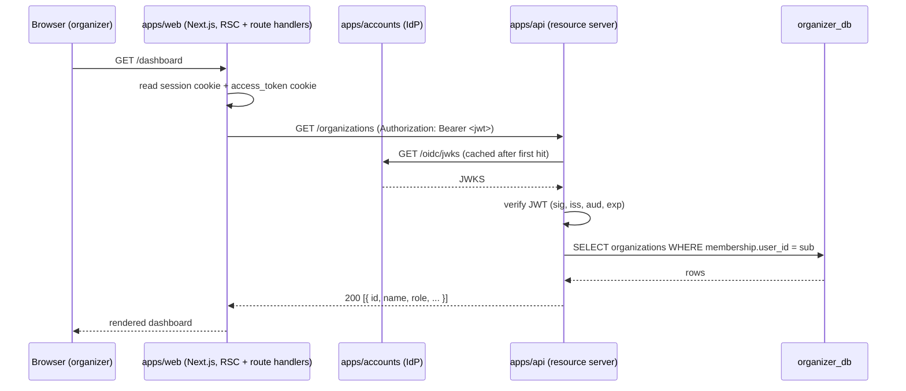

# feat: Phase 2 — API events + organizer onboarding

## Context

OrganizerHub is a multi-phase portfolio build. Phase 0 stood up the Turborepo monorepo with three apps and shared packages. Phase 1 (commit `78c017b`) landed a real OAuth2/OIDC Identity Provider in `apps/accounts` (node-oidc-provider + Prisma adapter) plus the BFF auth flow in `apps/web` — a user can now sign up, sign in, and the web app holds an httpOnly session cookie containing the id_token.

`apps/api` was scaffolded in Phase 0 but is still the default NestJS "Hello World!" — no models, no auth integration, no domain code. `packages/db/api/schema.prisma` has only the datasource/generator blocks. `organizer_db` exists in Postgres but is empty.

Phase 2's job is to turn `apps/api` into a real resource server: validate IdP-issued JWTs, model organizations and events with role-based access, and expose REST endpoints for the dashboard to consume. The web side gains a dashboard for organizers (create org, create event) and public pages (list/detail) for anyone to browse. By end-of-phase, an organizer can sign in, create an organization, publish an event, and that event shows up on a public listing.

Stripe checkout, ticket purchase, and memberships are explicitly Phase 3 — Phase 2 is the foundation those phases ride on.

---

## Summary

Wire `apps/api` to validate access tokens from `apps/accounts` (via JWKS), model orgs/memberships/events in `organizer_db`, and expose authenticated CRUD endpoints. Add an `/dashboard` shell in `apps/web` for organizers and `/events` (list) + `/events/[id]` (detail) for the public. Carry the access token from web to api via server-side fetch with `Authorization: Bearer`, keeping all tokens off the browser per the BFF pattern established in Phase 1.

---

## Problem Frame

- **Who's affected:** logged-in organizers (need a place to create orgs/events) and anonymous visitors (need to browse what's available).
- **Constraint:** every authenticated request must be authorized against a JWT issued by `apps/accounts` — no shared secrets, no service-to-service magic. JWKS rotation must work without redeploys.
- **Constraint:** multi-tenancy from day one. A user can belong to multiple organizations with different roles. Phase 2 ships owner/admin/member.
- **Out of scope (Phase 3):** Stripe checkout, ticket issuance, memberships (attendee-side subscriptions), refunds, payouts.
- **Out of scope (Phase 2+):** real-time updates, search, image uploads, email notifications, RP-initiated logout, refresh-token rotation on the web side.

---

## Requirements

| ID | Requirement |
|---|---|
| R1 | `apps/api` rejects any request to a protected route without a valid JWT signed by `apps/accounts`. |
| R2 | A signed-in user can create an organization; they automatically become its `owner` membership. |
| R3 | An owner can create events in their organization; events have a status workflow `draft → published → cancelled`. |
| R4 | Only `owner` or `admin` members can mutate org or event resources. Members can read. |
| R5 | Anyone (including unauthenticated visitors) can list `published` events at `/events` and view `/events/[id]`. Drafts and cancelled events are not exposed. |
| R6 | The web dashboard at `/dashboard` shows the logged-in user's organizations and lets them create/manage events scoped to one. |
| R7 | All API ↔ Web communication uses the access token already minted by `apps/accounts` — no new auth path, no new secret. |

---

## Scope Boundaries

### In scope

- API: auth guard, organizations, memberships, events, public read endpoints.
- DB: `organizer_db` schema with `Organization`, `Membership`, `Event` models and the initial migration.
- Web: access-token cookie plumbing, API client wrapper, dashboard (org/event UI), public `/events` and `/events/[id]`.

### Deferred to follow-up work

- Refresh-token rotation when access token expires (web kicks user back to `/auth/login` for now).
- Inviting/removing organization members beyond the creator. (Schema supports it; UI doesn't.)
- Event capacity, ticket tiers, pricing — these live in Phase 3 alongside Stripe.
- JWKS caching policy tuning (jose's `createRemoteJWKSet` default cooldown is fine for dev).

### Outside this product's identity

- Calendar/iCal export, social sharing widgets, embeddable event cards. OrganizerHub is a dashboard, not a marketing surface.

---

## Key Technical Decisions

1. **JWT validation: `jose` + `createRemoteJWKSet`.** Already a dep of `apps/web`. Resolves and caches the IdP's JWKS via the discovery URL. Verifies `iss`, `aud`, and signature on every protected request. Custom NestJS `JwtAuthGuard` extracts `sub` and puts a typed `CurrentUser` on the request.

2. **Audience claim.** `apps/accounts` is configured to issue access tokens without an explicit `aud` by default. We'll add `audiences` resource indicator config to accounts so it stamps `aud=organizer-api` on access tokens, and the api guard verifies it. Prevents id_token-as-access-token confusion.

3. **Roles as a Postgres enum.** `MembershipRole { OWNER | ADMIN | MEMBER }`. Enforced at the DB level via Prisma enum, checked at the API layer via a small `@Roles(...)` decorator + guard combo.

4. **Server-only token handling on the web.** `apps/web` reads the access token from an httpOnly cookie set in `/auth/callback`, and uses it server-side (route handlers, server components) to call `apps/api` with `Authorization: Bearer`. Browser JS never touches a token. Continues Phase 1's BFF posture.

5. **Public endpoints separated by path, not by guard exception.** Public read routes live under `/public/events/*`. Cleaner than letting the auth guard short-circuit per route — easier to reason about, easier to rate-limit later.

6. **Event status workflow.** Three states: `draft` (only owners/admins of the org see it), `published` (public), `cancelled` (visible in dashboard, hidden from public). Status transitions enforced in the service layer, not via a state machine library (overkill for three states).

7. **CORS allowlist.** Phase 2 calls api only server-side from web — no browser-direct requests. CORS allowlists `http://localhost:3000` defensively but isn't load-bearing for the demo.

---

## High-Level Technical Design

The phase introduces one new trust relationship: `apps/api` becomes a relying party of `apps/accounts`. Every authenticated request follows the same shape.



**Directional guidance, not implementation specification.** The guard's exact code and the JWKS client's caching knobs are decided in code, not here.

---

## Output Structure

New directories created in this phase:

```
apps/api/src/
├── auth/
│   ├── auth.module.ts
│   ├── jwt-auth.guard.ts
│   ├── jwks.service.ts
│   ├── current-user.decorator.ts
│   └── roles.decorator.ts, roles.guard.ts
├── organizations/
│   ├── organizations.module.ts
│   ├── organizations.controller.ts
│   ├── organizations.service.ts
│   └── dto/ { create-organization.dto.ts }
├── events/
│   ├── events.module.ts
│   ├── events.controller.ts
│   ├── events.service.ts
│   └── dto/ { create-event.dto.ts, update-event.dto.ts }
├── public/
│   ├── public.module.ts
│   └── public-events.controller.ts
└── prisma/
    ├── prisma.module.ts
    └── prisma.service.ts

apps/web/src/
├── app/
│   ├── dashboard/
│   │   ├── layout.tsx           (auth gate; redirects to /auth/login if no session)
│   │   ├── page.tsx             (org list + "Create organization" CTA)
│   │   └── organizations/
│   │       ├── new/page.tsx     (create-org form)
│   │       └── [orgId]/
│   │           ├── page.tsx     (org dashboard: events list)
│   │           └── events/
│   │               ├── new/page.tsx
│   │               └── [eventId]/page.tsx   (edit + publish)
│   └── events/
│       ├── page.tsx             (public list)
│       └── [eventId]/page.tsx   (public detail)
└── lib/api/
    ├── client.ts                (typed fetch wrapper with bearer injection)
    └── session.ts               (read access_token + claims from cookies)
```

This is the **expected** shape, not a constraint — adjust during implementation if a cleaner layout surfaces. Per-unit `**Files:**` sections below are authoritative.

---

## Implementation Units

### U1. API auth: JWT verification guard + current-user decorator

**Goal:** Protected routes in `apps/api` accept only requests with a valid access token issued by `apps/accounts`.

**Requirements:** R1, R7.

**Dependencies:** none (foundational).

**Files:**
- `apps/api/src/auth/jwks.service.ts` (new) — wraps `jose.createRemoteJWKSet` pointing at `${ACCOUNTS_ISSUER_URL}/oidc/jwks`
- `apps/api/src/auth/jwt-auth.guard.ts` (new)
- `apps/api/src/auth/current-user.decorator.ts` (new) — `@CurrentUser()` returns `{ sub, email?: string }`
- `apps/api/src/auth/auth.module.ts` (new)
- `apps/api/src/app.module.ts` (modify — import AuthModule)
- `apps/api/src/main.ts` (modify — same dotenv find-up pattern as `apps/accounts/src/main.ts`)
- `apps/api/test/auth.e2e-spec.ts` (new)

**Approach:**
- Add `jose`, `@nestjs/config` to apps/api deps.
- `JwksService` holds a singleton `jwks = createRemoteJWKSet(new URL(`${issuer}/oidc/jwks`))`.
- Guard pulls `Authorization: Bearer <token>`, calls `jwtVerify(token, jwks, { issuer, audience: 'organizer-api' })`.
- On success, attach `{ sub, claims }` to `req.user`.
- Add `audiences` config to `apps/accounts/src/oidc/oidc.service.ts` so access tokens carry `aud: 'organizer-api'`.

**Patterns to follow:**
- Env loading: copy the `findUp` helper at the top of `apps/accounts/src/main.ts:5-21`.
- Module shape: mirror `apps/accounts/src/prisma/prisma.module.ts` (Global module).

**Test scenarios:**
- Happy path: request with valid JWT → 200, `req.user.sub` matches `sub` claim.
- Missing Authorization header → 401.
- Malformed token → 401.
- Wrong issuer → 401.
- Wrong audience (e.g., id_token used as access token) → 401.
- Expired token → 401.
- Key rotation: when accounts rotates JWKS, the guard verifies new-key tokens without restart (test by reseeding accounts JWKS file mid-run).

**Verification:** With accounts running, curl `apps/api` health endpoint with no token (401), with a token minted by manually completing the OIDC dance (200), with `aud=wrong-value` (401).

---

### U2. API data model: Organization, Membership, Event + first migration

**Goal:** `organizer_db` has the schema needed for org-scoped events with role-based membership.

**Requirements:** R2, R3, R4, R5.

**Dependencies:** U1 (so the model uses the same `sub` shape the guard supplies).

**Files:**
- `packages/db/api/schema.prisma` (modify)
- `packages/db/api/migrations/<timestamp>_init_api/migration.sql` (generated)
- `apps/api/src/prisma/prisma.service.ts` (new — same pattern as `apps/accounts/src/prisma/prisma.service.ts`)
- `apps/api/src/prisma/prisma.module.ts` (new — `@Global()`)

**Approach (Prisma sketch — directional, not final):**

```prisma
enum MembershipRole { OWNER ADMIN MEMBER }
enum EventStatus { DRAFT PUBLISHED CANCELLED }

model Organization {
  id          String   @id @default(cuid())
  name        String
  slug        String   @unique
  description String?
  createdBy   String   // sub from accounts; not a FK (different bounded context)
  // memberships, events relations
}

model Membership {
  id             String         @id @default(cuid())
  organizationId String
  userId         String         // sub
  role           MembershipRole
  @@unique([organizationId, userId])
}

model Event {
  id             String      @id @default(cuid())
  organizationId String
  title          String
  slug           String      // unique within org
  description    String?
  startsAt       DateTime
  endsAt         DateTime?
  venue          String?
  status         EventStatus @default(DRAFT)
  publishedAt    DateTime?
  // ... timestamps
  @@unique([organizationId, slug])
  @@index([status, startsAt])
}
```

Critical: `userId` references `User.id` in **the accounts DB** — different bounded context, deliberately no FK. Validated only via JWT `sub`.

**Patterns to follow:**
- Snake_case `@map` on every field (mirror `packages/db/accounts/schema.prisma`).
- Generator output `../client/api` (already configured).

**Test scenarios:**
- Migration applies cleanly to a fresh `organizer_db`.
- Generated client compiles and `@organizer-hub/db/api` exports resolve in `apps/api`.
- Unique constraints enforced: two memberships for same `(orgId, userId)` fails; two events with same `(orgId, slug)` fails.
- Index on `(status, startsAt)` exists in the generated SQL.

**Verification:** `pnpm --filter @organizer-hub/db migrate:api:dev --name init_api` succeeds. `psql organizer_db -c "\dt"` shows the three tables. `psql organizer_db -c "\dT+ MembershipRole"` shows the enum.

---

### U3. Organizations + memberships REST module

**Goal:** Authenticated organizers can create organizations and list the ones they belong to. Creator gets an `OWNER` membership atomically.

**Requirements:** R2, R4.

**Dependencies:** U1, U2.

**Files:**
- `apps/api/src/organizations/organizations.module.ts` (new)
- `apps/api/src/organizations/organizations.controller.ts` (new — `POST /organizations`, `GET /organizations`, `GET /organizations/:id`)
- `apps/api/src/organizations/organizations.service.ts` (new)
- `apps/api/src/organizations/dto/create-organization.dto.ts` (new — `class-validator` decorators)
- `apps/api/src/auth/roles.decorator.ts` (new — `@Roles(OWNER, ADMIN)`)
- `apps/api/src/auth/roles.guard.ts` (new — looks up membership for current user + path orgId, checks against required roles)
- `apps/api/src/app.module.ts` (modify)
- `apps/api/test/organizations.e2e-spec.ts` (new)

**Approach:**
- `POST /organizations` is wrapped in a `prisma.$transaction([...])` that creates the Organization and the OWNER Membership in one shot.
- `GET /organizations` returns orgs where current user has any membership, joined with their role.
- `GET /organizations/:id` returns the org if current user is a member, 404 otherwise (don't leak existence to non-members).
- Slug auto-derived from name; rejected if collision.

**Patterns to follow:**
- DTO + ValidationPipe — install `class-validator` + `class-transformer` (standard Nest combo) and enable `app.useGlobalPipes(new ValidationPipe(...))` in main.ts.

**Test scenarios:**
- Happy: authed POST with `{name: "Acme"}` → 201, org returned with auto slug, membership row exists with role=OWNER.
- Empty name → 400 with validation error.
- Slug collision → 409.
- GET /organizations as a user with 2 memberships → 2 orgs returned with their roles.
- GET /organizations/:id as non-member → 404 (not 403, to avoid existence leak).
- Unauthenticated request → 401 (from U1 guard).

**Verification:** With a real JWT, `curl -X POST localhost:3001/organizations -H "Authorization: Bearer ..." -H "Content-Type: application/json" -d '{"name":"Acme"}'` returns the new org. Repeated `GET` returns it. `psql organizer_db -c "select * from memberships;"` shows the OWNER row.

---

### U4. Events REST module (scoped to organization)

**Goal:** Org members can CRUD events within their org. Status workflow enforces `draft → published → cancelled` transitions.

**Requirements:** R3, R4.

**Dependencies:** U1, U2, U3.

**Files:**
- `apps/api/src/events/events.module.ts` (new)
- `apps/api/src/events/events.controller.ts` (new — nested under `/organizations/:orgId/events`)
- `apps/api/src/events/events.service.ts` (new)
- `apps/api/src/events/dto/{create-event,update-event}.dto.ts` (new)
- `apps/api/test/events.e2e-spec.ts` (new)

**Approach:**
- Routes: `POST /organizations/:orgId/events`, `GET /organizations/:orgId/events`, `GET /organizations/:orgId/events/:id`, `PATCH /organizations/:orgId/events/:id`.
- `@Roles(OWNER, ADMIN)` on mutating routes; member-or-above on read.
- Status transitions live in `EventsService.transition(...)`:
  - `DRAFT → PUBLISHED`: stamps `publishedAt`.
  - `PUBLISHED → CANCELLED`: allowed.
  - `CANCELLED → ANY`: rejected (events can't un-cancel; create a new one).
  - `DRAFT → CANCELLED`: allowed (deletes a never-shipped draft conceptually).
- Slug auto-derived from title, unique within org.

**Test scenarios:**
- Happy path: owner creates draft event, lists it, edits title, publishes it.
- Admin can edit; member gets 403 on PATCH but 200 on GET.
- Non-member of the org gets 404 on every event under that org.
- Transition: PUBLISHED → CANCELLED OK; CANCELLED → PUBLISHED rejected with clear error.
- Slug collision within org → 409. Same slug in different org → OK.
- Required fields enforced (`title`, `startsAt`); `endsAt` optional and must be > `startsAt` when provided.
- Unauthenticated → 401.

**Verification:** Through the dashboard once U8/U9 land, but in this unit verified by integration tests.

---

### U5. Public events endpoints (anonymous read)

**Goal:** Anonymous visitors can list and view `published` events without any auth.

**Requirements:** R5.

**Dependencies:** U2.

**Files:**
- `apps/api/src/public/public.module.ts` (new)
- `apps/api/src/public/public-events.controller.ts` (new — `GET /public/events`, `GET /public/events/:id`)
- `apps/api/test/public-events.e2e-spec.ts` (new)

**Approach:**
- Module is not protected by the global guard — it sits outside `AuthModule` use.
- List endpoint paginates by cursor on `(startsAt, id)`; defaults to upcoming events (`startsAt >= now`).
- Detail endpoint returns 404 for `DRAFT` and `CANCELLED` — never leak existence.

**Test scenarios:**
- GET /public/events with no token → 200, only `PUBLISHED` rows returned, sorted by `startsAt` ASC.
- GET /public/events/:id for draft → 404.
- GET /public/events/:id for cancelled → 404.
- GET /public/events/:id for published → 200 with org name embedded but no internal IDs leaked.
- Cursor pagination: `?cursor=...&limit=10` returns the next page; no cursor returns first page.

**Verification:** `curl localhost:3001/public/events` (no auth header) returns 200 with array. Same for detail.

---

### U6. Web: access token plumbing + API client wrapper

**Goal:** `apps/web` can call `apps/api` server-side with the user's access token automatically attached.

**Requirements:** R6, R7.

**Dependencies:** U1 (api must accept the tokens we send).

**Files:**
- `apps/web/src/app/auth/callback/route.ts` (modify — also set `access_token` httpOnly cookie alongside the existing `session` cookie)
- `apps/web/src/lib/api/session.ts` (new — `readSession()` returns `{ sub, email, accessToken } | null` from cookies)
- `apps/web/src/lib/api/client.ts` (new — `apiFetch(path, init?)` wraps `fetch` with bearer injection and JSON parse)
- `apps/web/src/app/auth/logout/route.ts` (modify — clear `access_token` cookie too)

**Approach:**
- Callback already receives `tokens.access_token` from the token exchange — currently unused. Store it in an httpOnly cookie with `maxAge = tokens.expires_in`.
- `apiFetch` reads cookies via `cookies()` from `next/headers`, attaches `Authorization: Bearer ${accessToken}`, throws on non-2xx with the response body.
- When access token is missing or 401 comes back, throw a tagged error that the layout converts to a redirect to `/auth/login`.

**Patterns to follow:**
- httpOnly cookie shape: mirror the existing `session` cookie setup in `apps/web/src/app/auth/callback/route.ts:46-58`.

**Test scenarios:**
- After a fresh login, `cookies()` contains both `session` and `access_token`.
- `apiFetch('/organizations')` returns parsed JSON when the api is up.
- `apiFetch` throws a typed `UnauthorizedError` on 401 from the api.
- Logout clears both cookies.

**Verification:** From `/dashboard` route handler, calling `apiFetch('/organizations')` returns the user's orgs.

---

### U7. Web: dashboard shell (org list, create, switch)

**Goal:** Logged-in organizers land on `/dashboard`, see their organizations, create new ones, and pick one to drill into.

**Requirements:** R6.

**Dependencies:** U3, U6.

**Files:**
- `apps/web/src/app/dashboard/layout.tsx` (new — auth gate; redirect to `/auth/login` if `readSession()` returns null)
- `apps/web/src/app/dashboard/page.tsx` (new — server component, calls `apiFetch('/organizations')`)
- `apps/web/src/app/dashboard/organizations/new/page.tsx` (new — form)
- `apps/web/src/app/dashboard/organizations/new/actions.ts` (new — server action POSTing to api)
- `apps/web/src/app/dashboard/organizations/[orgId]/page.tsx` (new — org overview)

**Approach:**
- Use Next.js server actions for the create-org submission (no client JS needed beyond the form post).
- Layout reads session in the server component, redirects via `next/navigation.redirect` if unauthenticated.
- Active org isn't tracked in a cookie this phase — it's purely path-based (`/dashboard/organizations/:orgId/...`).

**Test scenarios:**
- Unauthenticated visit to `/dashboard` → redirects to `/auth/login`.
- Authenticated with 0 orgs → empty state with "Create your first organization" CTA.
- Submitting create form with valid name → 302 to `/dashboard/organizations/[orgId]`.
- Submitting with empty name → form re-renders with error.
- After creation, GET /dashboard shows the new org in the list.

**Verification:** Browser flow — sign in, hit /dashboard, create "Test Org", see it land in the list.

---

### U8. Web: event create / edit / publish UI

**Goal:** Within an organization, owners/admins can draft an event, edit it, and publish it.

**Requirements:** R3, R6.

**Dependencies:** U4, U7.

**Files:**
- `apps/web/src/app/dashboard/organizations/[orgId]/page.tsx` (modify — list events, "New event" link)
- `apps/web/src/app/dashboard/organizations/[orgId]/events/new/page.tsx` (new)
- `apps/web/src/app/dashboard/organizations/[orgId]/events/new/actions.ts` (new)
- `apps/web/src/app/dashboard/organizations/[orgId]/events/[eventId]/page.tsx` (new — edit + publish button)
- `apps/web/src/app/dashboard/organizations/[orgId]/events/[eventId]/actions.ts` (new — update + publish)

**Approach:**
- All mutations via server actions calling `apiFetch` with PATCH/POST.
- Publish is a separate `publishEvent(eventId)` action that calls `PATCH /events/:id { status: 'PUBLISHED' }`.
- Form fields: title, description, startsAt (`datetime-local`), endsAt (optional), venue.

**Test scenarios:**
- Owner of org can create + publish.
- Member of org sees the event list but doesn't see the "New event" button.
- Publish action flips status, shows "Published" badge, surfaces the public URL.
- Validation: `endsAt < startsAt` rejected with inline error.

**Verification:** Browser flow.

---

### U9. Web: public events list + detail

**Goal:** Anyone, signed in or not, can browse `/events` and read `/events/[id]`.

**Requirements:** R5.

**Dependencies:** U5.

**Files:**
- `apps/web/src/app/events/page.tsx` (new — calls public api, lists upcoming events)
- `apps/web/src/app/events/[eventId]/page.tsx` (new — event detail)
- `apps/web/src/app/page.tsx` (modify — add a "Browse events" link next to "Sign in")
- `apps/web/src/lib/api/client.ts` (modify — add `publicApiFetch` that omits the auth header)

**Approach:**
- Both pages are server components — no client interactivity needed in Phase 2.
- Detail page shows org name, dates, venue, description, and a placeholder "Get tickets" button that's disabled with a "coming soon" tooltip (Phase 3 wires Stripe here).
- 404 on draft/cancelled propagates from api → Next.js `notFound()`.

**Test scenarios:**
- `/events` shows only published events, sorted by date.
- `/events/[draftId]` → 404.
- `/events/[publishedId]` renders full detail.
- Anonymous browse works with no cookies at all.
- An organizer who is also signed in still sees the same public view.

**Verification:** Browser flow as both anonymous and signed-in user.

---

### U10. E2E smoke + Phase 2 commit

**Goal:** Confirm the full path works end-to-end in a browser, then commit Phase 2 as one feat commit.

**Requirements:** all.

**Dependencies:** U1–U9.

**Files:** none (verification + git).

**Approach:**
- Manual flow: sign up → /dashboard → create org → create event → publish → open private browsing window → /events shows it → /events/[id] renders.
- Capture any rough edges in a "Phase 3 hardening" note appended to the README.
- `git add` explicit paths (avoid `-A`), commit message `feat: ship API + dashboard for organizations and events`.

**Test scenarios:** This unit is verification-only; component test coverage came in U1–U9.

**Verification:** All five flow steps above complete without console errors or 4xx/5xx in either app's log.

---

## System-Wide Impact

- **`apps/accounts`** gains one config change: `audiences` resource indicator so access tokens carry `aud: 'organizer-api'`. Documented in U1.
- **`packages/db`** gets the api-side schema fleshed out; its existing `accounts` schema is untouched.
- **`.env.example`** needs a new var: `API_AUDIENCE=organizer-api` (consumed by both accounts and api).
- **Existing Phase 1 web routes** (`/`, `/auth/*`) unchanged except for the additional `access_token` cookie write in `/auth/callback`.

---

## Risks

| Risk | Likelihood | Mitigation |
|---|---|---|
| Access token expires mid-session; user hits a 401 in dashboard | High (default TTL is 1h) | U6 catches 401 → redirects to `/auth/login`. Real refresh-token rotation is deferred. |
| JWKS endpoint unreachable from api at boot | Low (same host) | `createRemoteJWKSet` lazy-fetches on first verify; first request returns 503 cleanly instead of crashing on boot. |
| Sub claim is opaque cuid; harder to reason about during debugging | Low | Add `email` to the access token via accounts' `findAccount` claims, log both in api request middleware. |
| Slug collisions block creation when names look similar | Medium | Append a 4-char suffix when a collision is detected, surface the final slug back to the user. |
| Server actions in Next.js silently swallow thrown errors | Medium | Wrap actions in a small `withFormState` helper that converts thrown errors to `useFormState` results. |

---

## Verification

**End-to-end smoke (browser):**

1. Start everything: `pnpm dev` from repo root, wait for all three apps.
2. `psql accounts_db -c "DELETE FROM users;"` if you want a clean slate.
3. http://localhost:3000 → Sign in → create a new account (e.g., `owner@test.com`).
4. Should redirect back to `/` with a "Browse events" link visible.
5. Navigate to `/dashboard` → empty state.
6. Create organization "Acme Events" → land on `/dashboard/organizations/<id>`.
7. New event → fill form → save as draft. Should appear in the org's event list with status "Draft".
8. Publish it. Status flips to "Published", public URL visible.
9. Open a private/incognito window: visit `/events` → see "Acme Events" published event. Click through → detail page loads.
10. As anonymous, hit `/dashboard` directly → redirects to `/auth/login`.

**API-level smoke (curl):**

After completing one signup in browser, copy the access token from the cookie (or mint one via the OIDC flow):

```text
GET /public/events                 → 200, empty array initially
POST /organizations + Bearer       → 201, org returned
GET  /organizations + Bearer       → 200, [{role: 'OWNER', ...}]
GET  /organizations/<id>           → 401 without Bearer
POST /events with status=draft     → 201
PATCH /events/<id> {status:'PUBLISHED'} → 200
GET /public/events                 → 200, the event appears
```

**Migrations:**
```text
pnpm --filter @organizer-hub/db migrate:api:dev --name init_api
psql organizer_db -c "\dt"          # shows organizations, memberships, events
psql organizer_db -c "\dT+ MembershipRole"   # shows OWNER, ADMIN, MEMBER
```

---

## Open Questions

None blocking. The two scope forks (RBAC + public list) were resolved with the user at planning time.
