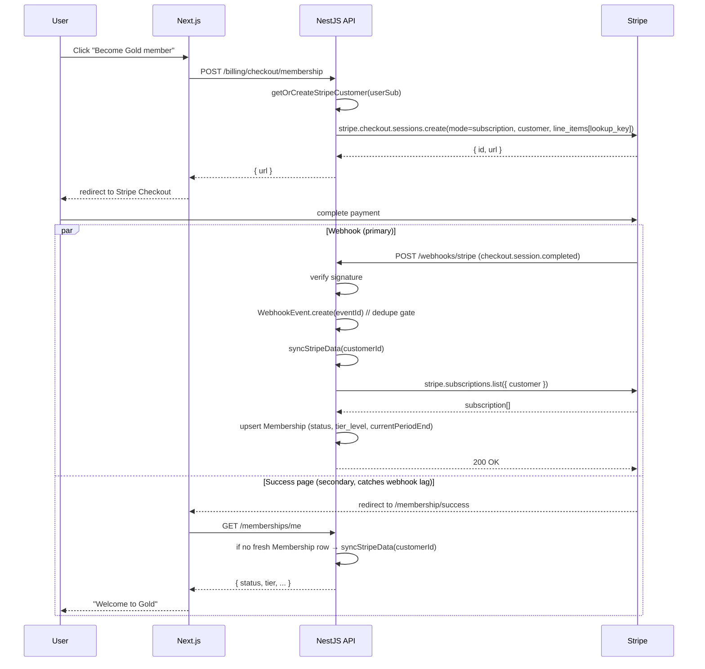

# feat: Phase 3 — Stripe billing (tiered tickets + memberships)

## Summary

Layer Stripe-powered billing onto OrganizerHub as a thin mirror ledger: Stripe owns every transactional object (Customer, Product, Price, Subscription, PaymentIntent, Invoice) and OrganizerHub's database stores only the references (`stripeCustomerId`, `stripeSubscriptionId`, `stripePriceId`, `stripePaymentIntentId`, `stripeEventId`) plus the read-side caches needed for fast coverage checks and ticket-list rendering. Implementation lands in 10 dependency-ordered units across four phases: foundation (Phase 2 `Membership` rename + Stripe infra), memberships (subscriptions end-to-end), tickets (TicketType CRUD, paid purchase, free claim), and wrap-up (browser smoke + docs).

---

## Problem Frame

At the end of Phase 2 OrganizerHub has events end-to-end but no money path — every "Get tickets" surface is a placeholder. The brainstorm at `docs/brainstorms/2026-05-20-001-phase-3-billing-requirements.md` settled the product shape (platform-wide tiered memberships + tiered one-time tickets + per-event coverage override + platform-collected merchant of record) and the open questions left for planning are all technical: how to layer Stripe onto the existing NestJS + Next.js + Prisma stack without inventing a parallel transactional system.

---

## Requirements

The plan satisfies all 17 origin requirements end-to-end. R-IDs match origin. R14 is extended during planning to additionally handle `invoice.paid` (rationale in Key Technical Decisions); the rest are carried forward as originally written:

- R1. Platform-defined Bronze / Silver / Gold tiers × monthly / yearly = six Stripe Prices. Not organizer-configurable.
- R2. Subscription via Stripe Checkout (subscription mode); active until `current_period_end`.
- R3. Cancellation takes effect at `current_period_end`.
- R4. Subscription lifecycle webhook events sync member tier + active status.
- R5. Each event has zero+ TicketTypes with `name`, `priceCents`, `min_tier_level`.
- R6. One-time tickets via Stripe Checkout (payment mode); issues one Ticket per successful checkout.
- R7. Each Event has `members_excluded: boolean` (default `false`).
- R8. Active member sees "Claim free ticket" iff event not excluded AND member tier ≥ ticket-type min_tier AND no prior claim.
- R9. Free claim bypasses Stripe — direct API issuance with provenance recorded.
- R10. Free claim is idempotent per `(member, event, TicketType)`.
- R11. Tickets stay valid after membership cancel / downgrade / event excluded-toggle.
- R12. Webhook handlers are idempotent across redelivery.
- R13. Webhook signature verified per request; bad signature → 400.
- R14. Handles `checkout.session.completed`, `customer.subscription.{created,updated,deleted}`, `invoice.payment_failed`, plus `invoice.paid` (added during planning — see Key Technical Decisions).
- R15. Organizer dashboard CRUD for TicketTypes (OWNER/ADMIN).
- R16. Organizer dashboard toggle for `members_excluded` (OWNER/ADMIN).
- R17. Phase 2 `Membership` (user↔org role) renamed to `OrganizationMember` as the first migration.

**Origin actors:** A1 (Platform), A2 (Organizer), A3 (Attendee/Member), A4 (Stripe).
**Origin flows:** F1 (new member subscribes), F2 (member claims free ticket), F3 (non-member buys paid ticket), F4 (subscription lapses or cancels), F5 (organizer marks event members-excluded).
**Origin acceptance examples:** AE1–AE8. Each AE is exercised by at least one e2e test in U4, U7, U8, or U10 below.

---

## Scope Boundaries

Carried from origin (all Phase 4+ unless noted):

- Sponsor packages (B2B event sponsorships)
- Refunds, chargebacks, dispute handling
- Organizer payouts / revenue-share
- Event capacity, sold-out states, waitlists, per-tier inventory
- Coupons / promo codes / discount codes
- Multi-currency support
- Custom receipt emails beyond Stripe defaults
- Discount-percentage coverage (Phase 3 coverage stays binary)
- Membership gift, family plans, transferable subscriptions
- Organizer-configurable membership tiers
- Stripe Connect / connected organizer accounts
- Member-side ticket cancellation / self-refund

Plan-local additions:

- **Anonymous (logged-out) ticket purchase** — origin was silent; this plan requires login to buy a ticket. Anonymous checkout deferred to Phase 4+ if usage signals demand.
- **Eager Stripe Customer creation at signup** — deferred. This plan creates Stripe Customers lazily on first checkout (avoids modifying the `accounts` IdP signup flow). Eager creation can be added in Phase 4 if metadata-on-creation becomes important.

### Deferred to Follow-Up Work

- **`docs/solutions/` learnings capture** — after Phase 3 lands, write `docs/solutions/billing/` notes covering the syncStripeData pattern, the rename-before-reuse migration ordering, and the NestJS Stripe testing seam. Out of scope for this plan but flagged because the institutional-learnings researcher noted the absence as a gap worth filling.

---

## Context & Research

### Relevant Code and Patterns

- **Feature module pattern (mirror):** `apps/api/src/events/{events.module.ts, events.controller.ts, events.service.ts, dto/}`. Thin controllers, services expose `*View` shapes via private `toView()` mappers, DTOs use `class-validator` + `class-transformer`, domain rules live as private service methods.
- **Auth + roles (extend):** `apps/api/src/auth/{jwt-auth.guard.ts, roles.guard.ts, roles.decorator.ts, current-user.decorator.ts}`. `RolesGuard` reads `req.params.orgId ?? req.params.id` and queries `prisma.membership` — this query is the rename touchpoint in U1.
- **Hide existence:** `OrganizationsService.getForUser` + `RolesGuard` return 404 for non-members, not 403. Phase 3 endpoints follow the same convention.
- **Public anonymous endpoints:** `apps/api/src/public/{public.module.ts, public-events.controller.ts}` — no guards. Coverage check + membership pricing read endpoints can sit here.
- **Cursor pagination:** `apps/api/src/common/cursor.ts` (`TupleCursor { at, id }`) — reusable for any future paginated billing endpoints.
- **E2E test bootstrap:** `apps/api/test/helpers/boot-test-app.ts` — `bootTestApp(guard)`, `stubJwtAuthGuard(holder)`, `DenyAllGuard`. Extends in U2 to accept `providerOverrides` for stubbing the Stripe seam.
- **Server actions:** `apps/web/src/app/dashboard/organizations/[orgId]/events/[eventId]/actions.ts` is the canonical template — `"use server"`, FormData → primitives → field-error state, `apiFetch` in try/catch with `UnauthorizedError` → `redirect("/auth/login")`, `revalidatePath` then `redirect` on success.
- **API client:** `apps/web/src/lib/api/client.ts` exposes `apiFetch` (Bearer-injecting, server-only) and `publicApiFetch`. Both already handle the JSON envelope. Phase 3 adds new view types in `apps/web/src/lib/api/types.ts`.
- **Prisma schema location:** `packages/db/api/schema.prisma` (not `apps/api/prisma/`). Generated client at `packages/db/client/api`. Sibling `packages/db/accounts/schema.prisma` is identity-only and untouched in Phase 3.
- **Migration naming:** `<timestamp>_<snake_case_name>` (no `_migration` suffix). Existing: `init_api`, `event_org_starts_idx`. Scripts in `packages/db/package.json`: `pnpm migrate:api:dev`, `pnpm generate:api`.

### Institutional Learnings

`docs/solutions/` does not exist in this repo. Phase 3 is greenfield from an institutional-knowledge standpoint. Capture notes during execution and seed `docs/solutions/billing/` as the deferred follow-up above.

### External References

- **stripe-node 22.1.1** — pin `apiVersion: '2026-04-22.dahlia'`. https://github.com/stripe/stripe-node/blob/master/CHANGELOG.md
- **NestJS raw-body recipe** — `NestFactory.create({ rawBody: true })` + `@Req() req: RawBodyRequest<Request>` reads `req.rawBody`. https://docs.nestjs.com/faq/raw-body
- **Stripe webhook idempotency** — track `stripeEventId` in a dedupe table, INSERT-first-then-process pattern. https://docs.stripe.com/webhooks and https://hookdeck.com/webhooks/guides/implement-webhook-idempotency
- **`syncStripeData(customerId)` pattern** (Theo Browne) — single function called from `/success` redirect AND every relevant webhook; pulls fresh subscription state from Stripe and upserts into Prisma. Avoids event-ordering bugs. https://github.com/t3dotgg/stripe-recommendations
- **Stripe Checkout in Next.js App Router** — server action creates session, calls `redirect(session.url!)`. https://docs.stripe.com/checkout/embedded/quickstart
- **Stripe CLI for local dev** — `stripe listen --forward-to http://localhost:3001/webhooks/stripe` prints a fresh `whsec_…` per session. https://docs.stripe.com/cli/listen

---

## Key Technical Decisions

The mirror-ledger architecture is the spine; every other decision flows from it.

- **Mirror Stripe ledger; OrganizerHub DB stores references + read caches only.** Stripe owns Customer, Product, Price, Subscription, PaymentIntent, Invoice as the source of truth. The DB stores `stripeXxxId` refs plus the minimal fields needed for fast read-side rendering (member tier, ticket display price, ticket-issued audit). The implication: there is exactly one place subscription state can come from — Stripe — and it gets pulled via `syncStripeData(customerId)` from both the `/success` redirect and every relevant webhook handler. No event-specific diffing in handlers.
- **Stripe Price ID resolution via `lookup_key`.** MembershipPlan stores `lookup_key` (`membership_bronze_monthly`, `membership_silver_yearly`, etc.); the runtime resolves to Stripe Price IDs via `stripe.prices.list({ lookup_keys: [...] })`. Portable across test/staging/prod Stripe accounts. No env var per Price ID. (User-confirmed at Phase 5.1.5.)
- **Lazy Stripe Customer creation on first checkout.** `getOrCreateStripeCustomer(userSub)` upserts `BillingCustomer { userId @unique, stripeCustomerId @unique }` and creates the Stripe Customer if absent, populating `metadata.userId = userSub`. Trade-off accepted: no Stripe Customer until the user transacts (trivial cost; eager mode can layer on later without breaking the lazy path).
- **Subscription tier-change UX: upgrade immediate (prorated, invoiced now); downgrade at next renewal.** Industry-standard SaaS pattern. Implementation: `proration_behavior: 'always_invoice'` for upgrades, `proration_behavior: 'none'` for downgrades (price change applied at next billing cycle). Coverage read still resolves to "what tier is the user RIGHT NOW per the cached Membership row," which Stripe updates via `customer.subscription.updated` webhooks.
- **Webhook idempotency via a `WebhookEvent` dedupe table.** `stripeEventId @id` (primary key, never `@unique` on a `cuid`). Handler: INSERT first → catch `P2002` → if collision, return 200 without re-processing; else proceed inside the same transaction. Stripe re-emits the same `evt_...` on retries, so the unique constraint is the durable dedupe key.
- **Stripe SDK behind an injectable seam.** `StripeClient` (thin `Stripe` wrapper) + `StripeWebhookVerifier` (wraps `stripe.webhooks.constructEvent`) registered as NestJS providers. E2E tests stub both via `overrideProvider`, avoiding real Stripe calls in CI. `bootTestApp` is extended to accept `providerOverrides` (signature change scoped to U2).
- **NestJS `rawBody: true` globally** — keeps parsed body AND raw bytes available. Webhook controller reads `req.rawBody` for signature verification; every other controller is unaffected. No scoped middleware needed.
- **Add `invoice.paid` to webhook handlers (extends R14).** Stripe's explicit recommendation for "provision access on `invoice.paid` when subscription status is active." Beyond the brainstorm's minimum but cheap to add and prevents a class of access-gating bugs.
- **TicketType has `priceCents` as a read-side cache; canonical price lives in Stripe.** On TicketType create, the api creates a Stripe Product + Price and stores `stripePriceId` + `stripeProductId` + `priceCents` locally. On update, archive old Stripe Price + create new one (Stripe Prices are immutable) and update the local cache. This is the standard Stripe pattern and keeps the mirror-ledger honest: the *truth* is in Stripe, the local cache is for fast event-page rendering.
- **MembershipPlan does NOT cache `priceCents`.** Only six SKUs, low-traffic pricing page, can fetch from Stripe on render with server-side caching if needed.
- **Free-claim idempotency via DB unique constraint `(userId, eventId, ticketTypeId)`.** P2002 → 409 Conflict. No client-supplied idempotency key needed.
- **Phase 2 `Membership` table renamed via standalone migration ahead of any new billing tables.** Avoids `MembershipPlan` / `Membership` naming collision in the schema and forces the `RolesGuard` + `OrganizationsService.createForUser` + e2e test refactors to land cleanly before new code references the term "Membership" in its new sense.
- **Rename strategy: `Membership` → `OrganizationMember`; enum `MembershipRole` → `OrganizationRole`.** The role enum name was also colliding (it was named after the table). Renaming both keeps the domain vocabulary clean — `OrganizationMember.role: OrganizationRole`, and the new `Membership.tier: MembershipTier`.
- **Webhook controller in a dedicated `webhooks/` module under `apps/api/src/webhooks/`.** Not inside `BillingModule`. Reason: keeps the raw-body-consuming surface visibly separate so reviewers (and future-Phase-N additions) can audit it without touching billing logic.
- **`/membership` is a public (anonymous) marketing page; checkout requires login.** Browse-anonymously / buy-with-account matches industry expectations and avoids the anonymous-purchase scope (deferred).

---

## Open Questions

### Resolved During Planning

- **Where do Stripe Price IDs live?** → Resolved by `lookup_key` (see Key Technical Decisions).
- **Webhook controller placement and local-dev story?** → Resolved: dedicated `apps/api/src/webhooks/` module; `stripe listen --forward-to http://localhost:3001/webhooks/stripe` in dev (documented in U10).
- **Free-claim idempotency mechanism?** → Resolved: DB unique constraint on `(userId, eventId, ticketTypeId)`, no client key.
- **Rename migration bundling?** → Resolved: standalone migration in U1, ahead of any new billing tables.
- **Stripe Checkout abandonment cleanup?** → Resolved: Stripe Sessions expire at 24h by default; this plan stores no pre-redirect pending records (Phase 3 has no capacity model, so nothing to release). Webhook is the only fulfillment trigger.
- **Pending-checkout record vs. webhook-as-source-of-truth?** → Resolved: webhook is the source of truth; `/success` redirect optionally calls `syncStripeData` to catch users who return before the webhook fires.
- **`invoice.payment_failed` grace policy?** → Resolved: defer to Stripe Smart Retries (8 attempts over 2 weeks). Don't revoke on first failure. Revoke when Stripe transitions to `canceled`. Show a "your card failed, please update" banner during `past_due` (Phase 3 ships the banner; sophisticated dunning UX in Phase 4+).

### Deferred to Implementation

- **Exact TicketType edit-flow when changing price:** Stripe Prices are immutable, so a price edit becomes "archive old Price, create new Price, update local cache." Decide during U6 whether to mark the old Price `active: false` in Stripe or leave it (Stripe-side; cost is nominal).
- **Subscription Schedule vs. direct subscription update for downgrades:** both work; Subscription Schedule is more Stripe-native but adds API surface. Decide during U4 after writing the first happy-path subscription handler.
- **Membership "current tier" read shape:** field name on the `Membership` row (`tier_level` vs. `effective_tier_level`) and how the coverage check resolves it. Probably just `tier_level` (cached from Stripe via syncStripeData); revisit if downgrade-at-period-end semantics need a second field.
- **Whether `/membership/success` re-renders status server-side or trusts the webhook race:** decide during U5 after running it locally with `stripe listen` and observing the actual webhook lag.

### From 2026-05-21 review

These were flagged by `ce-doc-review` and deferred during interactive routing because each is a real tradeoff that benefits from explicit user input before implementation. Resolve before the corresponding unit lands.

- **[P0] Webhook endpoint rate-limit / IP-allowlist strategy** *(Affects U2, U4)* — Signature verification is the primary defense, but invalid-signature floods still consume CPU on HMAC computation. Decide: rate-limit at the application layer (e.g., NestJS throttler scoped to `/webhooks/stripe`) or restrict to Stripe's published egress CIDR list at the LB/ingress layer. For Phase 3 portfolio scope, the simpler app-layer throttler may suffice; document either way in `docs/phase-3-stripe-setup.md`.
- **[P0] Spoofed-event-ID threat model documentation** *(Affects U2)* — Webhook dedupe via `WebhookEvent.stripeEventId @id` prevents legitimate Stripe redelivery but NOT adversarial novel-event forgery in the (unlikely) case `STRIPE_WEBHOOK_SECRET` leaks. The security model rests entirely on secret confidentiality. Partially addressed by the U10 setup-doc additions covering rotation + the security-model note; final acknowledgement is whether the doc-level note is sufficient or warrants a dedicated runbook.
- **[P1] Platform-wide membership coverage intent** *(Affects U8)* — Is a Gold member intended to claim free tickets on ANY published event across ANY organization on the platform, or only events at organizations they have a relationship with? Plan currently reads as the former (no org-scoping check on `/tickets/claim`). The default matches "platform-wide" intent from the brainstorm but should be explicitly confirmed and surfaced as a design decision (with implications for the `members_excluded` toggle being the organizer's only override).
- **[P1] Cross-surface upsell on event detail** *(Affects U9)* — The hybrid-monetization premise depends on tickets and memberships reinforcing each other. Plan currently shows insufficient-tier members and non-members a flat "Buy" button with no "Upgrade to <tier> from $X/mo to claim free" affordance. Decide: add an upsell affordance to U9 in Phase 3, or accept Phase 3 ships the rails without the cross-sell and surface that as a known portfolio-conversion gap.
- **[P1] Tier-change UX policy declared but no implementation unit ships flow** *(Affects U4, U5, Key Technical Decisions)* — KTD documents `proration_behavior: 'always_invoice'` for upgrades and `proration_behavior: 'none'` for downgrades, but no unit implements the `POST /billing/membership/change-plan` endpoint or web action. Decide: add a minimal change-plan endpoint + server action to U4/U5 in Phase 3, or move the tier-change UX bullet out of KTD into Scope Boundaries → "tier-change flow deferred to Phase 4+".
- **[P1] Payment-succeeded-but-Ticket-INSERT-fails refund path** *(Affects U7)* — If the webhook handler verifies + dedupes but the Ticket INSERT throws (FK violation on deleted TicketType, P2002 race against a concurrent free claim), the user paid Stripe with no Ticket issued. Plan currently logs warning + acks 200. Decide: auto-refund via `stripe.refunds.create({ payment_intent })` inside the handler (closes the loop) or document a manual-cleanup runbook in `docs/phase-3-stripe-setup.md`. The metadata cross-validation already calls for auto-refund on tampering (U7); extending it to FK / P2002 cases is consistent.
- **[P2] syncStripeData multi-subscription guard** *(Affects U3)* — Defensive `matching.length > 1` check is now in place (P1 log + highest-tier tiebreaker). Open question: should the agent additionally throw to force operator attention rather than silently pick? Probably not for Phase 3 portfolio scope, but worth a confirm before U3 ships.
- **[P2] Past-due banner Stripe Customer Portal endpoint** *(Affects U4, U5, setup doc)* — `/dashboard/membership` describes a "Your payment failed — update card" banner, but no `POST /billing/portal/session` endpoint is defined to mint the portal URL via `stripe.billingPortal.sessions.create`. Decide: add the portal-session endpoint to U4/U5 (and document the Stripe Dashboard portal-enable step in setup doc) or drop the banner from Phase 3 and let users re-subscribe after a `CANCELED` transition. The former is ~30 minutes of work; the latter is honest about Phase 3 scope.
- **[P2] UI copy + accessibility details for new surfaces** *(Affects U5, U9)* — Specific items: `minTierLevel` select option labels (numeric vs. human-readable like "Bronze or higher"), `priceCents` validation error copy for `< 0` / `> $10,000` / `> 4 decimals`, the `members_excluded` toggle accessibility pattern (checkbox vs. `role="switch"` vs. button), and the exact two-click confirm copy for destructive actions. Implementer to resolve during U5/U9; Phase 3 browser smoke (U10) is the verification gate.

---

## Output Structure

New files / directories landing in Phase 3:

    apps/api/src/
      billing/                      # Stripe seam + checkout + sync
        billing.module.ts
        billing.service.ts          # getOrCreateStripeCustomer, syncStripeData
        billing.controller.ts       # POST /billing/checkout/{membership,ticket} ; GET /billing/me
        stripe.client.ts            # StripeClient provider (thin SDK wrapper)
        stripe-webhook.verifier.ts  # StripeWebhookVerifier provider
        dto/
          create-membership-checkout.dto.ts
          create-ticket-checkout.dto.ts
      memberships/                  # Subscription mirror + tier read
        memberships.module.ts
        memberships.service.ts      # tier resolution, coverage check
        memberships.controller.ts   # GET /memberships/me
        public-memberships.controller.ts  # GET /public/memberships  (tier catalog for /membership page)
      tickets/                      # TicketType CRUD + Ticket issuance + claim
        tickets.module.ts
        tickets.controller.ts       # nested under /organizations/:orgId/events/:eventId
        tickets.service.ts          # issuance (paid + claim), coverage check
        ticket-types.controller.ts
        ticket-types.service.ts
        public-tickets.controller.ts  # GET /public/events/:id/ticket-types
        dto/
          create-ticket-type.dto.ts
          update-ticket-type.dto.ts
          claim-ticket.dto.ts
      webhooks/                     # Stripe webhook endpoint (raw body)
        webhooks.module.ts
        stripe-webhook.controller.ts
        stripe-webhook.service.ts   # dispatches events to billing / memberships / tickets services
        webhook-event.repository.ts # WebhookEvent INSERT-first dedup

    packages/db/api/
      schema.prisma                 # MODIFIED: rename + new models
      migrations/
        20260521xxxxxx_rename_membership_to_organization_member/
        20260521xxxxxx_add_billing_customer/
        20260521xxxxxx_add_membership_plan_seed/
        20260521xxxxxx_add_membership_mirror/
        20260521xxxxxx_add_ticket_type_and_ticket/
        20260521xxxxxx_add_webhook_event_dedupe/
      seed/
        seed-membership-plans.ts    # Bronze/Silver/Gold × monthly/yearly via lookup_keys

    apps/web/src/
      app/
        membership/                  # PUBLIC pricing page
          page.tsx                   # browse tiers, anonymous OK
          actions.ts                 # subscribeToTier server action (gated by readSession)
          success/page.tsx           # post-Stripe-redirect landing
        dashboard/
          membership/                # PRIVATE: my membership status
            page.tsx
            actions.ts               # cancelMembership, upgradeMembership server actions
          organizations/[orgId]/events/[eventId]/
            ticket-types/            # MODIFIED: TicketType CRUD UI
              page.tsx
              actions.ts
              TicketTypeEditor.tsx
            EventEditor.tsx          # MODIFIED: add members_excluded toggle
        events/[eventId]/
          page.tsx                   # MODIFIED: render claim/buy buttons per coverage check
          actions.ts                 # buyTicket, claimFreeTicket server actions
      lib/
        api/
          types.ts                   # MODIFIED: add view types for new endpoints

    docs/
      phase-3-browser-smoke.md       # NEW: Phase 3 manual click-through checklist
      README.md                      # MODIFIED: Phase 3 setup + stripe listen recipe

The per-unit `**Files:**` fields below are authoritative for what each unit creates or modifies; the tree above is a scope declaration.

---

## High-Level Technical Design

> *This illustrates the intended approach and is directional guidance for review, not implementation specification. The implementing agent should treat it as context, not code to reproduce.*

### Mirror-ledger storage map

The architectural spine is "Stripe owns the transactional ledger; OrganizerHub stores refs + minimal read caches."

| Domain concept | Lives in Stripe | Lives in OrganizerHub DB (mirror) |
|---|---|---|
| Customer (the payer) | `Customer` object (`cus_…`) + payment methods, email, metadata | `BillingCustomer { userId @unique, stripeCustomerId @unique }` |
| Membership SKU (catalog) | `Product` + `Price` (one Price per tier × cadence; six total). Stable `lookup_key` per Price | `MembershipPlan { lookup_key @unique, tier_level Int, display_name }` — no price/cadence stored locally |
| Subscription (active state) | `Subscription` object — status, `items.data[].current_period_end`, items.price. **Important:** Stripe API version `2025-03-31.basil`+ moved the period off the top-level Subscription onto each item; the plan pins `2026-04-22.dahlia` so reads must come from `subscription.items.data[0].current_period_end` (we assert single-item-per-subscription via the Stripe Dashboard "Limit customers to one subscription" toggle). | `Membership { userId @unique, stripeCustomerId, stripeSubscriptionId @unique, status, tier_level, currentPeriodEnd }` — cached from item zero, refreshed via syncStripeData |
| Ticket SKU (per event) | `Product` + immutable `Price` per TicketType | `TicketType { eventId, stripeProductId @unique, stripePriceId @unique, name, priceCents, min_tier_level }` — priceCents is display cache |
| Paid ticket (transaction) | `PaymentIntent` (+ `CheckoutSession`) | `Ticket { userId, eventId, ticketTypeId, source: PAID, stripeCheckoutSessionId, stripePaymentIntentId }` |
| Member-claimed ticket | (no Stripe object) | `Ticket { userId, eventId, ticketTypeId, source: MEMBERSHIP_CLAIM, no Stripe refs }` |
| Webhook event | Event log in Stripe (`evt_…`) | `WebhookEvent { stripeEventId @id, type, receivedAt }` — dedupe only, payload not stored |
| User identity | (lives in `accounts_db`, separate bounded context) | Phase 3 does NOT add a User table to `api_db` — every billing model keys on `userId String` (the OIDC `sub`) without a FK |

The rule of thumb: if a field can be reconstructed from Stripe by calling `stripe.X.retrieve(id)`, it does not live in our DB unless we need it for a coverage check or a list view.

### Sync flow (the load-bearing pattern)



`syncStripeData(customerId)` is one function called from both paths. It re-fetches subscription state from Stripe and upserts our Membership row. No event-specific diffing in handlers — every relevant webhook (`customer.subscription.{created,updated,deleted}`, `invoice.paid`, `invoice.payment_failed`) reduces to "extract customerId, call syncStripeData." Event ordering becomes irrelevant: whichever event arrives last produces the correct end state.

### Coverage check (R8)

```
function canClaimFree(member, event, ticketType):
  if member is null or member.status not in {active, trialing}: return false
  if event.members_excluded:                                    return false
  if member.tier_level < ticketType.min_tier_level:             return false
  if exists Ticket(userId=member.userId, eventId, ticketTypeId): return false
  return true
```

UI renders "Claim free ticket" iff `canClaimFree` returns true; otherwise renders "Buy ($price)". The function lives in `memberships.service.ts` and is called by both the public event-detail server component and the `POST /tickets/:eventId/:ticketTypeId/claim` endpoint (defense-in-depth — never trust the UI's read).

---

## Design State Conventions

Every new server-action surface introduced in Phase 3 follows the established `apps/web/src/app/dashboard/organizations/[orgId]/events/[eventId]/actions.ts` + `EventEditor.tsx` pattern:

- **Pending state** — `useActionState` returns `pending` while the action runs; the submitting button label changes (e.g., "Subscribe Gold/Monthly" → "Redirecting to Stripe…"); other inputs in the form are not auto-disabled (matches existing precedent).
- **Field errors** — server action returns `{ fieldErrors: { [fieldName]: string }, values }` on validation failure; the form repopulates inputs from `values` and renders inline field errors via the existing `Field` helper pattern.
- **Generic error** — server action returns `{ error: string, values }` on non-validation api error (e.g., 5xx from Stripe). UI renders a top-of-form red banner with the error string.
- **Success state for in-place mutations** — server action returns `{ ok: true, values }` and calls `revalidatePath(...)` for affected pages; UI shows an inline confirmation (e.g., "Saved") that fades after a few seconds.
- **Success state for mutate-then-navigate** — server action calls `redirect(...)` AFTER the try/catch (per `redirect()` throwing `NEXT_REDIRECT`); no in-page state needed.
- **Stripe Checkout redirect actions** — same as mutate-then-navigate; the action calls `redirect(stripeCheckoutSession.url)` after the api call succeeds.

**Per-page empty / loading / success / error specifications:**

- **`/membership`** (U5) — empty state (catalog empty, seed not run): render "Membership plans are being set up. Check back soon." with no purchase buttons. Loading: server component; Next.js default suspense is the UX. Error: try/catch the `publicApiFetch`; on `ApiError`, render "Couldn't load plans. Refresh to try again."
- **`/membership/success`** (U5) — race state: page is a server component that fetches `apiFetch('/memberships/me')`. If a Membership row exists, render "Welcome to <tier>!" with period-end date. If null, render "Your subscription is being confirmed — refresh in a moment." with an explicit "Refresh" button (a `<form action={refresh}>` calling a no-op server action that just `revalidatePath('/membership/success')`). No client-side polling in Phase 3.
- **`/membership/cancel`** (U5) — cancel-url landing copy: "Subscription not started — no charge was made. [Return to membership plans](/membership)."
- **`/dashboard/membership`** (U5) — empty state (`apiFetch('/memberships/me')` returns null): render "You don't have an active membership yet." with a "Browse plans" CTA linking to `/membership`. Status states: `ACTIVE` → green "Active <tier> through <period_end>" + Cancel button; cancelAtPeriodEnd=true + ACTIVE → amber "Canceling on <period_end>" (no Reactivate button — reactivation is out of scope per U4 Approach); `PAST_DUE` → red banner "Your payment failed — update your card to keep <tier> access" (the portal-link target is an Open Question — see Deferred / Open Questions); `CANCELED` → "Your membership ended on <period_end>" + "Renew membership" CTA linking to `/membership`.
- **TicketType list page** (U9) — empty state (zero ticket types for the event): render "No ticket tiers yet. Add one below to start selling." above the "Add ticket type" form. Delete confirmation: each row's Delete button uses a two-click confirm pattern — first click changes label to "Confirm delete?" and arms the action; second click within 5 seconds fires the server action; clicking elsewhere or waiting 5 seconds reverts.
- **`TicketTypeEditor.tsx`** (U9) — uses the EventEditor state pattern. Pending: submit button label changes to "Saving…"; error: top-of-form red banner OR per-field inline error.
- **Event detail page** (U9) — coverage button states per the table in R8, plus a fourth `OWNED` state: when `GET /memberships/me/coverage` returns `OWNED` for a TicketType, render a disabled button labeled "Ticket claimed" linked to `/dashboard/membership` (which post-Phase-3 will surface issued tickets — Phase 4+ may add a dedicated tickets page).
- **`claimFreeTicket` result** — `revalidatePath('/events/${eventId}')` after a successful claim; the button re-renders as the OWNED state. On 409 conflict (coverage changed between page load and click), the action returns `{ error: "Coverage changed — refresh to see updated options." }` and the UI surfaces an inline error.

These specifications are authoritative for U5 and U9. The implementer follows them unless a specific UX better matches the established codebase pattern (in which case it must match an existing precedent in `apps/web/src/`).

---

## Implementation Units

### U1. Rename Phase 2 `Membership` → `OrganizationMember`

**Goal:** Rename the Phase 2 user↔org role table and its enum so the term "Membership" can be reused in its new platform-tier sense without collision. Single migration, code refactor, e2e tests still green.

**Requirements:** R17.

**Dependencies:** none — this is the first unit.

**Files:**
- Modify: `packages/db/api/schema.prisma` (rename model `Membership` → `OrganizationMember`, table `memberships` → `organization_members`; rename enum `MembershipRole` → `OrganizationRole`; rename relation field `Organization.memberships` → `Organization.members`; preserve all FKs / indexes / `@@unique`)
- Create: `packages/db/api/migrations/<timestamp>_rename_membership_to_organization_member/migration.sql` (uses `ALTER TABLE ... RENAME TO` + `ALTER TYPE ... RENAME TO` + index renames; **not** a drop-and-recreate)
- Modify: `apps/api/src/auth/roles.guard.ts` — `prisma.membership.findUnique` → `prisma.organizationMember.findUnique`; rename composite key reference `organizationId_userId`
- Modify: `apps/api/src/auth/roles.decorator.ts` — import `OrganizationRole` instead of `MembershipRole`
- Modify: `apps/api/src/organizations/organizations.service.ts` — nested-write `memberships: { create: ... }` → `members: { create: ... }` (or whatever the relation field is renamed to); `MembershipRole.OWNER` → `OrganizationRole.OWNER`
- Modify: `apps/api/src/events/events.controller.ts` — `@Roles(MembershipRole.OWNER, MembershipRole.ADMIN)` → `@Roles(OrganizationRole.OWNER, OrganizationRole.ADMIN)`
- Modify: `apps/api/test/helpers/boot-test-app.ts` — any references to the old name
- Modify: `apps/api/test/{events,organizations,public-events,app}.e2e-spec.ts` — fixture helpers, `prisma.membership.create` → `prisma.organizationMember.create`
- Modify: `apps/api/src/organizations/organizations.controller.spec.ts` (and any other unit specs that touch the enum)
- Modify: `apps/web/src/lib/api/types.ts` — rename `MembershipRole` → `OrganizationRole`; update `OrganizationView.role` annotation. Grep for any web-side consumers (likely the `/dashboard` org-list page that reads `org.role`).

**Approach:**
- **Prisma rename is mandatorily `--create-only`-then-hand-edit; the diff engine has no rename concept and will emit drop+create by default.** Execute as an explicit step list:
  1. Edit `packages/db/api/schema.prisma` to rename `Membership` → `OrganizationMember`, the enum `MembershipRole` → `OrganizationRole`, the relation field on `Organization` from `memberships` → `members`, and add `@@map("organization_members")`.
  2. Run `pnpm -F db migrate:api:dev --create-only --name rename_membership_to_organization_member` to generate the destructive draft.
  3. **REPLACE** the generated SQL file's contents with the full set of ALTER statements:
     ```sql
     ALTER TABLE memberships RENAME TO organization_members;
     ALTER TYPE "MembershipRole" RENAME TO "OrganizationRole";
     ALTER INDEX memberships_pkey RENAME TO organization_members_pkey;
     ALTER INDEX memberships_user_id_idx RENAME TO organization_members_user_id_idx;
     ALTER INDEX memberships_organization_id_user_id_key RENAME TO organization_members_organization_id_user_id_key;
     ALTER TABLE organization_members RENAME CONSTRAINT memberships_organization_id_fkey TO organization_members_organization_id_fkey;
     ```
  4. Run `pnpm -F db migrate:api:dev` to apply.
  5. Run `pnpm -F db generate:api` to regenerate the Prisma client.
  6. Run a single project-wide search for `Membership` (case-sensitive) and `membership` (case-insensitive) to find every reference; refactor each hit (the api-side touchpoints are listed above; the web-side is the new types.ts entry; tests will need fixture renames).
  7. Verify with `pnpm -F api test:e2e` — must stay green before any U2 work begins.
- Land in a single commit.

**Patterns to follow:**
- Existing migration `packages/db/api/migrations/20260519212309_event_org_starts_idx/` is the precedent for hand-edited migration files.
- The relation-naming pattern: `Organization.events` (plural) → `Organization.members` (plural). Match.

**Test scenarios:**
- Integration: existing `organizations.e2e-spec.ts` (10 cases) and `events.e2e-spec.ts` (28 cases) all stay green after the rename — no new tests, this is a pure refactor.
- Edge case: `RolesGuard` still returns 404 for a non-member visiting an org route (already covered by existing tests, but worth confirming by name).

**Verification:**
- `pnpm migrate:api:dev` applies cleanly on a fresh local DB.
- `pnpm -F api lint && pnpm -F api typecheck && pnpm -F api test:e2e` all green.
- `grep -ri "membership" apps/api/src/` returns no hits referring to the old role concept (only mentions of the *new* Membership concept that U3 will add, which aren't present yet — so this U1 grep should be empty).

---

### U2. Stripe SDK seam + raw-body wiring + WebhookEvent dedupe + BillingCustomer

**Goal:** Stand up the Stripe integration infrastructure shared by every other Phase 3 unit: an injectable `StripeClient`, a `StripeWebhookVerifier`, raw-body parsing on the webhook route, a `WebhookEvent` dedupe table, a `BillingCustomer` mapping table, and a `bootTestApp` extension that lets e2e tests stub Stripe.

**Requirements:** R12, R13 (signature verification + dedupe); foundation for R1–R11 and R14.

**Dependencies:** U1.

**Files:**
- Modify: `apps/api/package.json` (add `stripe@^22.1.1`)
- Modify: `apps/api/src/main.ts` (`NestFactory.create<NestExpressApplication>(AppModule, { rawBody: true })`)
- Create: `apps/api/src/billing/billing.module.ts` (exports `StripeClient`, `StripeWebhookVerifier`, `BillingService`)
- Create: `apps/api/src/billing/stripe.client.ts` (provider wrapping `new Stripe(secret, { apiVersion: '2026-04-22.dahlia' })`)
- Create: `apps/api/src/billing/stripe-webhook.verifier.ts` (provider wrapping `stripe.webhooks.constructEvent`)
- Create: `apps/api/src/billing/billing.service.ts` (initial: `getOrCreateStripeCustomer(userSub: string, email?: string)`)
- Modify: `packages/db/api/schema.prisma` — add `model BillingCustomer { id String @id @default(cuid()); userId String @unique; stripeCustomerId String @unique; createdAt DateTime @default(now()); @@map("billing_customers") }` and `model WebhookEvent { stripeEventId String @id; type String; receivedAt DateTime @default(now()); @@map("webhook_events"); @@index([type]) }`
- Create: `packages/db/api/migrations/<timestamp>_add_billing_customer/migration.sql`
- Create: `packages/db/api/migrations/<timestamp>_add_webhook_event_dedupe/migration.sql`
- Modify: `apps/api/src/app.module.ts` (register `BillingModule`)
- Modify: `apps/api/test/helpers/boot-test-app.ts` — change signature to `bootTestApp(guard: Type<CanActivate>, providerOverrides?: ProviderOverride[])` where `ProviderOverride = { token: Type | string; useValue?: unknown; useClass?: Type }`; loop and call `.overrideProvider(token).useValue(...)` accordingly. Additionally: pass `{ rawBody: true }` as the second argument to `moduleFixture.createNestApplication({ rawBody: true })` so the test app mirrors production's raw-body wiring. This makes `req.rawBody` available in e2e webhook tests and lets the real `StripeWebhookVerifier` path be exercised end-to-end (rather than only the stub).
- Create: `apps/api/test/helpers/fake-stripe.ts` — `class FakeStripeClient` and `class FakeStripeWebhookVerifier` with controllable return values for tests
- Modify: `.env.example` (annotate Stripe vars with comments so the next developer knows where they come from; they already exist as empty placeholders)

**Approach:**
- `StripeClient` is a class with one public field `stripe: Stripe`. The class wrapping (rather than direct provider) gives the `overrideProvider` token a stable identity for tests.
- `StripeWebhookVerifier.construct(rawBody: Buffer | string, signature: string): Stripe.Event` — single method; signature failure logs the underlying Stripe SDK error internally and throws `BadRequestException('Invalid webhook signature')` with a generic message (do not return the Stripe SDK error string in the response body, and never echo `req.rawBody`).
- `BillingService.getOrCreateStripeCustomer(userSub, email?)`:
  - `prisma.billingCustomer.findUnique({ where: { userId: userSub } })` → if found, return.
  - Else `stripe.customers.create({ metadata: { userId: userSub }, email }, { idempotencyKey: \`billing-customer-create-\${userSub}\` })` → `prisma.billingCustomer.create({ data: { userId: userSub, stripeCustomerId: customer.id } })` → return.
  - The Stripe idempotency key (deterministic on `userSub`) means concurrent first-checkouts for the same user produce a single Stripe Customer rather than orphaning duplicates. The `prisma.billingCustomer.create` P2002 path is then a true no-op race recovery (re-read the winning row and proceed).
  - **Convention for all outbound Stripe POSTs**: every `stripe.X.create(...)` call in `apps/api/src/billing/` passes an idempotency key as the second argument, derived deterministically from domain identifiers (e.g., `\`billing-customer-create-\${userSub}\``, `\`checkout-membership-\${userSub}-\${lookupKey}-\${minuteBucket}\``, `\`checkout-ticket-\${userSub}-\${ticketTypeId}-\${minuteBucket}\``). Document this convention in `stripe.client.ts`.
- Webhook idempotency: **process-first-then-INSERT pattern, NOT insert-first-then-process** (which can drop work permanently if a handler crashes after the WebhookEvent row commits but before the side effect lands). The webhook handler (a) verifies signature, (b) runs the business side effect (e.g., upsert Membership via syncStripeData, or create Ticket), then (c) INSERTs the WebhookEvent row inside the same Prisma transaction as (b). On Stripe redelivery: the second attempt's (b) is idempotent (upsert / unique-constraint catch), then (c) hits `P2002` on `stripeEventId @id` → swallow the duplicate, return 200. The helper signature becomes: `recordProcessedWebhookEvent(tx: Prisma.TransactionClient, stripeEventId, type): Promise<void>` — caller invokes it inside their transaction after the durable write. The `tx`-scoped signature makes the transaction boundary explicit and prevents the wrong pattern from being silently re-introduced.
- `bootTestApp` extension: keep the existing single-arg signature working by defaulting `providerOverrides = []`. All existing tests pass unchanged.

**Patterns to follow:**
- `apps/api/src/prisma/prisma.service.ts` for how to expose a constructed external client as a Nest provider.
- `apps/api/src/auth/jwks.service.ts` for how to read env vars via `ConfigService` and pin SDK options.

**Test scenarios:**
- Integration: `BillingService.getOrCreateStripeCustomer` creates a `BillingCustomer` row and a Stripe Customer the first time, returns the existing row on the second call (uses FakeStripeClient).
- Integration: `tryRecordWebhookEvent` returns `'new'` on first call, `'already_processed'` on second call with the same `stripeEventId`.
- Edge case: `StripeWebhookVerifier.construct(rawBody, badSignature)` throws — covered by the verifier unit test, exercised end-to-end in U4 once a webhook route exists.
- Edge case (deferred to U4): a webhook posted with no `Stripe-Signature` header → 400. (Verifier handles it but no route exists yet.)

**Verification:**
- `pnpm -F api typecheck` green.
- New helper specs pass: `pnpm -F api test`.
- `bootTestApp` change is backward compatible (existing e2e specs that call `bootTestApp(stub)` keep working).

---

### U3. Membership models (MembershipPlan + Membership mirror) + seed + syncStripeData

**Goal:** Add the two membership tables (`MembershipPlan` — six seeded SKUs; `Membership` — subscription state mirror keyed by user), the seed script, and the `syncStripeData(customerId)` core function. No HTTP endpoints yet.

**Requirements:** R1, R2, R3, R4. Lays the foundation for R8 (coverage read needs `Membership.tier_level`).

**Dependencies:** U2.

**Files:**
- Modify: `packages/db/api/schema.prisma` — add `enum MembershipTier { BRONZE SILVER GOLD }` and `enum SubscriptionStatus { ACTIVE TRIALING PAST_DUE CANCELED UNPAID INCOMPLETE INCOMPLETE_EXPIRED PAUSED }` and `model MembershipPlan { id String @id @default(cuid()); lookupKey String @unique; tier MembershipTier; tierLevel Int; displayName String; cadence String; @@map("membership_plans"); @@unique([tier, cadence]) }` and `model Membership { id String @id @default(cuid()); userId String @unique; stripeCustomerId String; stripeSubscriptionId String @unique; status SubscriptionStatus; tier MembershipTier; tierLevel Int; currentPeriodEnd DateTime; cancelAtPeriodEnd Boolean @default(false); updatedAt DateTime @updatedAt; @@map("memberships"); @@index([stripeCustomerId]) }`
- Create: `packages/db/api/migrations/<timestamp>_add_membership_plan_seed/migration.sql`
- Create: `packages/db/api/migrations/<timestamp>_add_membership_mirror/migration.sql`
- Create: `packages/db/seed/seed-membership-plans.ts` — idempotent script that ensures the 6 `MembershipPlan` rows exist with `lookup_key`s `membership_bronze_monthly`, `membership_bronze_yearly`, `membership_silver_monthly`, `membership_silver_yearly`, `membership_gold_monthly`, `membership_gold_yearly` and tier_levels 1/1/2/2/3/3
- Modify: `packages/db/package.json` — add `"seed:api": "tsx seed/seed-membership-plans.ts"` script
- Create: `apps/api/src/memberships/memberships.module.ts`
- Create: `apps/api/src/memberships/memberships.service.ts` — `syncStripeData(stripeCustomerId): Promise<MembershipView | null>`, `getActiveMembershipForUser(userId): Promise<MembershipView | null>`, `canClaimFree(userId, eventId, ticketTypeId): Promise<boolean>` (stub for now; real impl in U7)
- Create: `apps/api/test/memberships.e2e-spec.ts`
- Modify: `apps/api/src/app.module.ts` (register `MembershipsModule`)
- Create: `docs/phase-3-stripe-setup.md` — instructions for creating the six Products + Prices in Stripe with the matching lookup_keys (test mode and prod)

**Approach:**
- `syncStripeData(stripeCustomerId)`:
  - **Resolve userId from customer first.** Query `prisma.billingCustomer.findUnique({ where: { stripeCustomerId } })`; if found, use its `userId`. On null (orphan Stripe Customer — possible from the lazy-create race in U2, even with idempotency keys), fall back to `stripe.customers.retrieve(stripeCustomerId)` and read `metadata.userId`. On still-null, log P1 warning and return without upserting (don't crash the webhook — the customer is not bound to a platform user and we have no row to attach to).
  - `subs = stripe.subscriptions.list({ customer: stripeCustomerId, status: 'all', limit: 10 })`.
  - Filter to subscriptions in `{active, trialing, past_due, paused}`.
  - **Defensive multi-subscription guard:** if `matching.length > 1`, log P1 warning and pick highest `tier_level` as deterministic tiebreaker. The Stripe Dashboard's "Limit customers to one subscription" toggle is the documented invariant (see setup doc), but a misconfiguration must not produce nondeterministic coverage reads across page renders.
  - If zero matches: if a local Membership row exists, update its status to `CANCELED`; otherwise no-op.
  - Map Stripe `Subscription` → local fields. Tier derived from the subscription's first item's `price.lookup_key` (parse `membership_gold_monthly` → tier GOLD, tier_level 3). **Read `currentPeriodEnd` from `subscription.items.data[0].current_period_end`** (multiplied by 1000 → `new Date(...)`); the field moved off the top-level Subscription in Stripe API `2025-03-31.basil`+, and the plan pins `2026-04-22.dahlia` so the top-level path would return `undefined`.
  - `prisma.membership.upsert({ where: { userId }, create: {...}, update: {...} })`.
  - Return the local view shape.
- "Limit customers to one subscription" toggle in the Stripe Dashboard is documented in `docs/phase-3-stripe-setup.md` as a required configuration. It's not enforceable from code without that setting, but documenting it is part of this unit.
- Seed script reads from a static config (the 6 lookup_keys → tier + cadence mapping) so the seed itself doesn't call Stripe. Stripe-side products + prices are created manually in the dashboard per the setup doc, using the matching lookup_keys.

**Patterns to follow:**
- `apps/api/src/events/events.service.ts` for the View-type-and-toView pattern.
- `apps/api/src/prisma/prisma.service.ts` for transactional upserts via `prisma.$transaction`.

**Test scenarios:**
- Happy path (Integration): seed script run twice → only 6 `MembershipPlan` rows exist, no duplicates.
- Happy path (Integration): `syncStripeData(customerId)` with a FakeStripeClient returning a `subscription = { status: 'active', items: { data: [{ price: { lookup_key: 'membership_gold_monthly' }, current_period_end: <unix-seconds> }] } }` → creates Membership row with `tier=GOLD, tierLevel=3, status=ACTIVE`, and `currentPeriodEnd` matches the item's timestamp (× 1000 for ms).
- Happy path (Integration): re-running `syncStripeData` with an updated subscription (tier changed to SILVER) → existing Membership row is updated, not duplicated.
- Edge case (Integration): `syncStripeData` with no active subscription → no row created (or existing row marked CANCELED if previously ACTIVE).
- Edge case (Integration): `syncStripeData` with a subscription whose `lookup_key` doesn't match the seeded set → throws / logs; does not create a row with `tier=null`. The mapper is strict.
- **Covers AE6.** Integration: monthly subscription, `cancel_at_period_end: true` set → Membership row has `cancelAtPeriodEnd=true, status=ACTIVE, currentPeriodEnd=<future>` (read from `items.data[0].current_period_end`). Subsequent sync after that timestamp passes → status flips to CANCELED.

**Verification:**
- All Phase 2 e2e specs still green.
- New `memberships.e2e-spec.ts` passes.
- `pnpm seed:api` produces 6 plan rows on a fresh DB; running again is a no-op.

---

### U4. Membership checkout flow + Stripe webhook handlers (subscription lifecycle)

**Goal:** Wire the membership-purchase end-to-end on the api side. Adds `POST /billing/checkout/membership`, the webhook controller, and the webhook handler that dispatches subscription / invoice events to `syncStripeData`.

**Requirements:** R2, R3, R4, R12, R13, R14.

**Dependencies:** U2, U3.

**Files:**
- Create: `apps/api/src/webhooks/webhooks.module.ts`
- Create: `apps/api/src/webhooks/stripe-webhook.controller.ts` — `@Post('webhooks/stripe')`, reads `req.rawBody` and `Stripe-Signature` header, verifies, calls `tryRecordWebhookEvent`, dispatches to `stripeWebhookService.handle(event)`. Returns 200 on processed-or-dup, 400 on bad signature, 500 on handler exception (Stripe will retry).
- Create: `apps/api/src/webhooks/stripe-webhook.service.ts` — switch on `event.type`, route to `memberships.service.syncStripeData(...)` for the subscription/invoice events.
- Modify: `apps/api/src/billing/billing.controller.ts` (create in this unit) — `@Post('billing/checkout/membership')` body `{ lookupKey }`, guarded by `JwtAuthGuard`. Builds Stripe Checkout Session via `getOrCreateStripeCustomer` + `stripe.checkout.sessions.create({ mode: 'subscription', customer, line_items: [{ price: priceId, quantity: 1 }], success_url, cancel_url, client_reference_id: userSub })`. Returns `{ url }`.
- Modify: `apps/api/src/billing/billing.service.ts` — `createMembershipCheckoutSession(userSub, lookupKey)` — resolves lookup_key to Price ID via `stripe.prices.list({ lookup_keys: [lookupKey], active: true, limit: 1 })`, throws 404 if not found.
- Create: `apps/api/src/billing/dto/create-membership-checkout.dto.ts` — `@IsIn(['membership_bronze_monthly', 'membership_bronze_yearly', 'membership_silver_monthly', 'membership_silver_yearly', 'membership_gold_monthly', 'membership_gold_yearly']) lookupKey` (validate against the six known keys at the DTO layer rather than firing a Stripe API call for arbitrary input)
- Create: `apps/api/test/webhooks.e2e-spec.ts`
- Create: `apps/api/test/billing-checkout.e2e-spec.ts`
- Modify: `apps/api/src/app.module.ts` (register `WebhooksModule`)
- Modify: `apps/api/src/main.ts` — confirm `rawBody: true` is set; webhook controller does not need a `ValidationPipe` exception (it doesn't use DTO validation).

**Approach:**
- Webhook controller is intentionally tiny — verify → dedupe → dispatch. Errors are surfaced as HTTP status; processing happens in `stripe-webhook.service.ts`.
- Dispatch switch handles: `customer.subscription.created`, `customer.subscription.updated`, `customer.subscription.deleted`, `invoice.paid`, `invoice.payment_failed`, `checkout.session.completed`. Unknown event types are acknowledged with 200 (no-op).
- For `checkout.session.completed`: pull `session.customer` (cast to string), call `syncStripeData(customerId)`. The customer ID is the same regardless of mode (subscription vs. payment); the tickets unit (U7) handles the payment-mode branch by switching on `session.mode`.
- E2E test for webhook idempotency: post the same signed event twice; both return 200; only one DB side effect.
- E2E test for bad signature: post with a `Stripe-Signature` of `t=123,v1=garbage`; expect 400.
- Decision: Subscription Schedule vs. direct update for downgrades is deferred to when the upgrade/downgrade endpoint lands (Phase 4+ for in-app upgrade — Phase 3 only handles fresh sign-up and cancellation through Stripe's own customer portal or our cancel endpoint).
- Cancel endpoint is intentionally simple: `POST /billing/membership/cancel` calls `stripe.subscriptions.update(id, { cancel_at_period_end: true })`, then `syncStripeData` (which will pick up the new state). Reactivation (reversing `cancel_at_period_end` before the period ends) is NOT in Phase 3 — origin's R3 covers cancellation only; reactivation has no requirement backing and is deferred. A cancelled-and-then-expired subscription is handled by starting a fresh subscription via the existing checkout flow.

**Patterns to follow:**
- `apps/api/src/events/events.controller.ts` for guard wiring + DTO usage.
- `apps/api/test/events.e2e-spec.ts` for the e2e setup pattern.
- Stripe official docs for `constructEvent` signature shape: https://docs.stripe.com/webhooks/signature

**Test scenarios:**
- **Covers AE1.** Integration: stub the Stripe Checkout Session creation to return `{ id, url }`; POST `/billing/checkout/membership { lookupKey: 'membership_gold_monthly' }` returns `{ url }`. Then deliver a signed `checkout.session.completed` webhook with that session's customer; assert a Membership row exists with `tier=GOLD, status=ACTIVE`.
- **Covers AE6.** Integration: a sequence of webhooks (subscription.created → subscription.updated with `cancel_at_period_end=true` → subscription.deleted) maps to the Membership row transitioning ACTIVE → ACTIVE+cancelAtPeriodEnd=true → CANCELED.
- **Covers AE7.** Integration: post the same `checkout.session.completed` webhook twice; both return 200; `prisma.webhookEvent.count` is exactly 1; `prisma.membership.count` is exactly 1.
- **Covers AE8.** Integration: post a webhook with an invalid `Stripe-Signature` header; response is 400; no `WebhookEvent` row created.
- Edge case (Integration): POST `/billing/checkout/membership { lookupKey: 'membership_diamond_monthly' }` (unseeded) → 404.
- Error path (Integration): missing `Stripe-Signature` header → 400.
- Error path (Integration): `invoice.payment_failed` webhook with `attempt_count: 1` → Membership row's `status` reflects whatever Stripe says (likely `PAST_DUE` if accompanied by a subscription.updated, but Phase 3 doesn't require a banner — that's the web-side concern in U5).
- Happy path (Integration): cancel endpoint sets `cancelAtPeriodEnd=true` and syncs.

**Verification:**
- `pnpm -F api test:e2e` green; `webhooks.e2e-spec.ts` + `billing-checkout.e2e-spec.ts` together cover ≥ 10 cases.
- Local dev sanity: with `stripe listen --forward-to http://localhost:3001/webhooks/stripe` running, manually create a test-mode subscription in Stripe Dashboard → observe `Membership` row appearing in `psql`.

---

### U5. Web: `/membership` public pricing page + `/dashboard/membership` status page + cancel flow

**Goal:** Build the web-side membership experience: a public pricing page that lets anyone browse the six tier × cadence combos, a server action that requires login and creates the Stripe Checkout session via the api, the post-Stripe success / cancel landing pages, and the dashboard "my membership" view with cancel + reactivate actions.

**Requirements:** R2, R3 (membership UX surface).

**Dependencies:** U4.

**Files:**
- Create: `apps/web/src/app/membership/page.tsx` — server component, fetches plan catalog via `publicApiFetch('/public/memberships')`, renders six cards (Bronze/Silver/Gold × monthly/yearly). Each card has a form that POSTs to a server action.
- Create: `apps/web/src/app/membership/actions.ts` — `subscribeToTier({ lookupKey })` server action. Reads `readSession()`; if null → `redirect('/auth/login?next=/membership')`. Else `apiFetch('/billing/checkout/membership', { method: 'POST', body: { lookupKey } })` → `redirect(response.url)`.
- Create: `apps/web/src/app/membership/success/page.tsx` — reads `?session_id=...`, calls `apiFetch('/memberships/me')` (which internally calls `syncStripeData` if no fresh local row exists), renders "Welcome to <tier>" or fallback "Your payment is processing".
- Create: `apps/web/src/app/membership/cancel/page.tsx` — Stripe's cancel_url landing; "No charge — return to /membership."
- Create: `apps/web/src/app/dashboard/membership/page.tsx` — server component, fetches `apiFetch('/memberships/me')`. Renders status (Active / Past Due / Canceling on <date> / Canceled), tier, current_period_end. Past_due → red banner "Your payment failed — update card via [Stripe portal link]".
- Create: `apps/web/src/app/dashboard/membership/actions.ts` — `cancelMembership()` server action. Reactivation is out of scope for Phase 3 (see U4 Approach).
- Create: `apps/api/src/memberships/memberships.controller.ts` — `GET /memberships/me` (authenticated; returns `MembershipView | null`). On miss, optionally call `syncStripeData` if `BillingCustomer` exists.
- Create: `apps/api/src/memberships/public-memberships.controller.ts` — `GET /public/memberships` (anonymous; returns the seeded plan catalog with display name + tier + cadence + lookup_key; **omits** Stripe Price IDs).
- Create: `apps/api/src/memberships/dto/...` if needed.
- Modify: `apps/web/src/lib/api/types.ts` — add `MembershipPlanView`, `MembershipView`.
- Modify: `apps/web/src/app/page.tsx` and `apps/web/src/app/layout.tsx` — add "Become a member" nav link.

**Approach:**
- The public pricing page fetches the catalog from `/public/memberships`; it does NOT call Stripe directly. Server-side caching (`unstable_cache` or no-store + ISR) is up to the implementer based on how often plans change (rarely — they're seeded).
- Server action pattern follows `apps/web/src/app/dashboard/organizations/[orgId]/events/[eventId]/actions.ts`: try/catch around `apiFetch`, redirect on success.
- `subscribeToTier` server action: on Stripe Checkout creation success, return the `url` and let the action `redirect(url)`. Since `redirect()` throws `NEXT_REDIRECT`, do it AFTER the try block (the established pattern in the codebase).
- Past-due banner is UI-only in Phase 3; Phase 4+ can add email dunning.

**Patterns to follow:**
- `apps/web/src/app/dashboard/organizations/new/actions.ts` — createOrganization server action pattern.
- `apps/web/src/app/dashboard/page.tsx` — auth-gated server component pattern using `readSession`.

**Test scenarios:**
- Test expectation: web has no test runner today; rely on Phase 3 browser smoke (U10).
- Manual: log out → visit `/membership` → see all six plans listed → click "Subscribe Gold/Monthly" → redirected to `/auth/login?next=/membership`.
- Manual: log in → return to `/membership` → click Subscribe → redirected to Stripe Checkout (test mode card 4242 4242 4242 4242) → completes → lands on `/membership/success` showing "Welcome to Gold".
- Manual: visit `/dashboard/membership` → shows tier + period_end + cancel button.
- Manual: click cancel → confirm dialog → status changes to "Canceling on <date>".

**Verification:**
- `pnpm -F web build` clean.
- Browser smoke checklist for membership flow passes (U10).

---

### U6. TicketType model + organizer-facing CRUD endpoints (api side)

**Goal:** Add the `TicketType` table and the api endpoints organizers use to manage ticket tiers per event. Each TicketType create/update mirrors to Stripe (creates a Stripe Product on first save; creates a new Stripe Price on every price change; archives the previous Price).

**Requirements:** R5, R7 (the `members_excluded` column already exists conceptually on Event, see Approach), R15, R16.

**Dependencies:** U2.

**Files:**
- Modify: `packages/db/api/schema.prisma` — add `model TicketType { id String @id @default(cuid()); eventId String; event Event @relation(fields: [eventId], references: [id], onDelete: Cascade); name String; priceCents Int; minTierLevel Int @default(0); stripeProductId String @unique; stripePriceId String @unique; createdAt DateTime @default(now()); updatedAt DateTime @updatedAt; @@map("ticket_types"); @@index([eventId]) }` and `members_excluded Boolean @default(false) @map("members_excluded")` on Event.
- Create: `packages/db/api/migrations/<timestamp>_add_ticket_type_and_event_members_excluded/migration.sql`
- Create: `apps/api/src/tickets/ticket-types.module.ts` (or shared with `tickets.module.ts`; decide at unit time)
- Create: `apps/api/src/tickets/ticket-types.controller.ts` — `@Controller('organizations/:orgId/events/:eventId/ticket-types')`, `@UseGuards(JwtAuthGuard, RolesGuard)`. Routes: `GET /` (list), `POST /` (create, `@Roles(OWNER, ADMIN)`), `PATCH /:typeId`, `DELETE /:typeId`.
- Create: `apps/api/src/tickets/ticket-types.service.ts` — `create()`: validate; create Stripe Product + Price; create local row. `update()`: if price changed, archive old Stripe Price + create new + update local. If name only, update local + update Stripe Product. `delete()`: archive Stripe Product + delete local row. `listForEvent(eventId)`.
- Create: `apps/api/src/tickets/public-tickets.controller.ts` — `@Controller('public/events/:eventId/ticket-types')`, no guards. Returns `TicketTypePublicView` (no Stripe IDs, just `id, name, priceCents, minTierLevel`).
- Create: `apps/api/src/tickets/dto/{create-ticket-type,update-ticket-type}.dto.ts`
- Modify: `apps/api/src/events/events.controller.ts` — `PATCH /organizations/:orgId/events/:eventId` accepts `members_excluded` in its DTO.
- Modify: `apps/api/src/events/dto/update-event.dto.ts` — add `@IsOptional() @IsBoolean() membersExcluded?: boolean`.
- Modify: `apps/api/src/events/events.service.ts` — propagate `membersExcluded` to the update path.
- Create: `apps/api/test/ticket-types.e2e-spec.ts`
- Modify: `apps/api/test/events.e2e-spec.ts` — add a case for toggling `members_excluded` on an event.

**Approach:**
- Stripe Product + Price creation happens synchronously inside the create endpoint. If Stripe fails, the local row is NOT created (the Stripe call is outside the Prisma transaction). On Stripe success but Prisma failure (rare), we leak a Stripe Product — acceptable in Phase 3, document as a known case.
- Price change: Stripe Prices are immutable. The pattern is `stripe.prices.update(oldId, { active: false })` then `stripe.prices.create({ product, unit_amount, currency: 'usd' })` then `prisma.ticketType.update({ where: { id }, data: { stripePriceId: newId, priceCents } })`. Document the immutability inside the service.
- `members_excluded` field lives on `Event`, not on individual TicketTypes — toggling at the event level applies to all of its ticket types.
- Permissions: OWNER + ADMIN can mutate; MEMBER (now OrganizationMember role MEMBER) can read via the api (but the public endpoint is for anonymous reads; this is the authenticated org-scoped read).
- **Cross-org event substitution guard:** every TicketType service mutation (`create`, `update`, `delete`) fetches the parent Event by `eventId` and asserts `event.organizationId === params.orgId` before any Stripe call or DB write. `RolesGuard` only checks that the user is OWNER/ADMIN of `:orgId`; it does NOT verify that `:eventId` belongs to `:orgId`. Without this assertion, an OWNER of Org A could supply their `orgId` + an Org-B `eventId` and mutate Org B's ticket types. Throw `NotFoundException` on mismatch (hide-existence pattern).
- Public ticket-type endpoint: anonymous, returns only the data the public event page needs. Strips `stripeProductId / stripePriceId`.

**Patterns to follow:**
- `apps/api/src/events/events.service.ts` for the View + toView pattern.
- `apps/api/src/events/events.controller.ts` for the nested route shape under `/organizations/:orgId/events/:eventId`.
- `apps/api/src/public/public-events.controller.ts` for the public no-guard module pattern.

**Test scenarios:**
- Happy path (Integration): OWNER creates a TicketType with `{ name: 'GA', priceCents: 5000, minTierLevel: 1 }` → returns view with id + Stripe refs. FakeStripeClient records that `products.create` + `prices.create` were called.
- Happy path (Integration): GET `/public/events/:id/ticket-types` returns the list without Stripe IDs.
- Error path (Integration): MEMBER attempts to POST a TicketType → 403 (RolesGuard enforces OWNER/ADMIN).
- Error path (Integration): non-member attempts to GET the authenticated list → 404 (hide-existence pattern).
- Edge case (Integration): update TicketType's `priceCents` → FakeStripeClient records `prices.update(old, { active: false })` and `prices.create({ ... })`; local row reflects new `stripePriceId` and `priceCents`.
- Edge case (Integration): delete a TicketType that has issued tickets → returns 409 or soft-deletes? Decision: hard delete blocked by FK constraint from Ticket; service returns 409 with message "ticket type has issued tickets; cannot delete." Document.
- **Covers AE3 (the toggle that triggers it).** Integration: OWNER PATCHes event with `{ membersExcluded: true }` → row reflects it.

**Verification:**
- `pnpm -F api test:e2e` green; new ticket-types spec covers ≥ 8 cases.

---

### U7. Ticket model + paid purchase flow (Stripe Checkout payment mode + webhook → Ticket issuance)

**Goal:** Wire the one-time paid ticket purchase end-to-end. Adds `Ticket` model, `POST /billing/checkout/ticket` (creates Stripe Checkout in payment mode), extends the webhook handler to issue a `Ticket` row on `checkout.session.completed` when `mode === 'payment'`.

**Requirements:** R6, R12 (idempotency carries through).

**Dependencies:** U4, U6.

**Files:**
- Modify: `packages/db/api/schema.prisma` — add `enum TicketSource { PAID MEMBERSHIP_CLAIM }` and `model Ticket { id String @id @default(cuid()); userId String; eventId String; ticketTypeId String; ticketType TicketType @relation(fields: [ticketTypeId], references: [id]); event Event @relation(fields: [eventId], references: [id]); source TicketSource; stripeCheckoutSessionId String? @unique; stripePaymentIntentId String? @unique; issuedAt DateTime @default(now()); @@map("tickets"); @@index([userId]); @@index([eventId]); @@index([userId, eventId, ticketTypeId, source]) }`. **Scope idempotency by ticket source**: free-claim uniqueness (R10) is enforced at the service layer by checking `prisma.ticket.findFirst({ where: { userId, eventId, ticketTypeId, source: 'MEMBERSHIP_CLAIM' } })` before issuance; paid-ticket idempotency (R12 / webhook replay) is enforced by the `stripeCheckoutSessionId @unique` constraint catching P2002 on redelivered `checkout.session.completed` events. This lets a single user legitimately buy multiple paid tickets of the same tier (e.g., family of four buying GA from one account) without forbidding it at the schema layer.
- Create: `packages/db/api/migrations/<timestamp>_add_tickets/migration.sql`
- Modify: `apps/api/src/billing/billing.controller.ts` — `@Post('billing/checkout/ticket')` body `{ ticketTypeId }`, guarded by `JwtAuthGuard`. Builds Stripe Checkout Session in payment mode with `line_items: [{ price: ticketType.stripePriceId, quantity: 1 }]`, `client_reference_id: userSub`, `metadata: { ticketTypeId, eventId, userId: userSub }`. Returns `{ url }`.
- Modify: `apps/api/src/billing/billing.service.ts` — `createTicketCheckoutSession(userSub, ticketTypeId)`. Pre-flight: fetch the TicketType + parent Event, throw `NotFoundException` if either is missing; assert `event.status === 'PUBLISHED'` (refuse purchases against DRAFT / CANCELLED events — return `NotFoundException` per hide-existence pattern); refuse with `ConflictException` if a paid Ticket already exists with `stripeCheckoutSessionId` resolved to this user + ticket type pair.
- Modify: `apps/api/src/webhooks/stripe-webhook.service.ts` — `checkout.session.completed` handler branches on `session.mode`. For `'payment'`: read `session.metadata.{ticketTypeId, eventId, userId}` + `session.payment_intent` + `session.client_reference_id`; **cross-validate** `session.metadata.userId === session.client_reference_id` (refuse with logged error + ack 200 + auto-refund if they disagree — the session was tampered with); **re-fetch** the TicketType from the DB and assert `ticketType.eventId === session.metadata.eventId` (refuse with logged error + ack 200 + auto-refund on mismatch); then `prisma.ticket.create({ data: { userId, eventId, ticketTypeId, source: 'PAID', stripeCheckoutSessionId, stripePaymentIntentId } })`. Wrap in try/catch P2002 (already-issued) for safety against webhook retry races.
- Modify: `apps/api/src/billing/dto/create-ticket-checkout.dto.ts`
- Create: `apps/api/test/billing-ticket-checkout.e2e-spec.ts`
- Modify: `apps/api/test/webhooks.e2e-spec.ts` — add cases for the payment-mode branch.

**Approach:**
- The Ticket unique constraint `(userId, eventId, ticketTypeId)` enforces one ticket per attendee per type per event. This applies to both paid and free claim — a user cannot hold two of the same ticket type. Discussion: this might be too strict (some events sell multiple of same tier), but for Phase 3 it's the right default; revisit when org demand shows up.
- Issuance happens inside the webhook, not at Checkout creation. Stripe is the source of truth for "did they actually pay."
- Metadata on the session is the canonical way to thread our domain IDs through. `client_reference_id` is also set but limited to 200 chars; metadata is preferable for structured payload.
- `member_excluded` and tier coverage do NOT short-circuit the paid path. A Gold member CAN still pay for a covered ticket if they want (e.g., gifting). This is consistent with R6 (R8 only describes the UI path).

**Patterns to follow:**
- U4's checkout creation pattern.
- U4's webhook dispatch + idempotency.

**Test scenarios:**
- **Covers AE3 (the buy half).** Integration: logged-in user POSTs `/billing/checkout/ticket { ticketTypeId }` → returns `{ url }`. Then a signed `checkout.session.completed` webhook with `mode=payment` and matching metadata → a Ticket row is created with `source=PAID` and matching Stripe refs.
- Edge case (Integration): pre-flight: user already holds a paid Ticket for the same (event, ticketType) → POST `/billing/checkout/ticket` returns 409.
- Edge case (Integration): paid webhook delivered twice → still only one Ticket row (P2002 caught + ack 200).
- Edge case (Integration): paid webhook for a TicketType that was deleted between checkout-create and webhook → log warning, do not create Ticket (FK would fail anyway). Acceptable handling: ack 200 (no retry).
- Error path (Integration): POST `/billing/checkout/ticket` while logged out → 401.

**Verification:**
- `pnpm -F api test:e2e` green; new spec covers ≥ 5 cases.

---

### U8. Free ticket claim endpoint + coverage check fully wired

**Goal:** Add the API surface for active members to claim free tickets on covered events. Wires the real `canClaimFree(userId, eventId, ticketTypeId)` and replaces U3's stub.

**Requirements:** R8, R9, R10, R11.

**Dependencies:** U3, U6, U7.

**Files:**
- Create: `apps/api/src/tickets/tickets.controller.ts` — `@Post('tickets/claim')`, body `{ ticketTypeId }`, guarded by `JwtAuthGuard`. Calls `ticketsService.claimFree(userSub, ticketTypeId)`.
- Create: `apps/api/src/tickets/tickets.service.ts` — `claimFree(userId, ticketTypeId)`: fetches TicketType + parent Event in one query; verifies (active membership, tier coverage, event not excluded, no prior claim of `source=MEMBERSHIP_CLAIM` for this (user, event, ticketType)); creates Ticket with `source=MEMBERSHIP_CLAIM`, no Stripe refs. Returns `TicketView`. Concurrent-claim race is caught at the service-layer findFirst + create transaction (use `prisma.$transaction` with isolation `'Serializable'` to prevent TOCTOU on `members_excluded` flips mid-claim).
- Modify: `apps/api/src/memberships/memberships.service.ts` — replace U3's `canClaimFree` stub with the real implementation: read Membership row + check `status in {ACTIVE, TRIALING}` + `tier_level >= ticketType.min_tier_level` + `event.members_excluded === false` + no existing `MEMBERSHIP_CLAIM` Ticket for this user+event+ticketType.
- Modify: `apps/api/src/memberships/memberships.controller.ts` — add `GET /memberships/me/coverage?ticketTypeIds=t1,t2,...` endpoint returning `{ [ticketTypeId]: 'CLAIMABLE' | 'OWNED' | 'BUY' }`. Authenticated. Centralizes coverage rule logic so the web event-detail page doesn't recompute.
- Create: `apps/api/test/ticket-claim.e2e-spec.ts`

**Approach:**
- The coverage check is the single source of truth and lives in `memberships.service.ts` (the "membership owns the rules" placement). `tickets.service.claimFree` calls it; the public event-detail page (U9 web side) calls a `GET /memberships/me/coverage?ticketTypeIds=...` endpoint or computes locally via the membership and ticket-type views.
- Decision: add `GET /memberships/me/coverage?ticketTypeIds=t1,t2` that returns `{ t1: 'CLAIMABLE'|'OWNED'|'BUY', t2: ... }` rather than expecting the web to recompute. Simpler for the web, and the rule logic stays in one place. Implementation: ranged endpoint on the membership controller.
- The Ticket creation is one transaction — coverage check + insert. P2002 catches the race where two concurrent claims arrive.
- "Cancelled membership keeps issued tickets" (R11) is enforced by the fact that the Ticket row has no reference to the Membership row; once issued, it persists independent of subscription state. Existence of a Ticket row IS the entitlement.

**Patterns to follow:**
- `apps/api/src/events/events.service.ts` for the service-level domain-rule pattern.
- U7's webhook idempotency for the P2002-on-race pattern.

**Test scenarios:**
- **Covers AE2.** Integration: GOLD member with no prior claim → POST `/tickets/claim { ticketTypeId }` where ticketType has `minTierLevel=3` and event has `members_excluded=false` → Ticket created with `source=MEMBERSHIP_CLAIM`, no Stripe refs.
- **Covers AE3 (members-excluded branch).** Integration: same setup but event has `members_excluded=true` → 409 "not covered."
- Edge case (Integration): SILVER member (tier_level=2) tries to claim a VIP ticket (`minTierLevel=3`) → 409 "tier not covered."
- Edge case (Integration): no active membership → 409 "no active membership."
- **Covers AE4.** Integration: member already holds a free ticket for the same (event, ticketType) → POST claim returns 409 "already issued."
- **Covers AE5.** Integration: claim ticket while ACTIVE → cancel membership (sets `cancelAtPeriodEnd=true`) → fast-forward Membership row to CANCELED → assert the Ticket row still exists in `prisma.ticket.findFirst({ where: { userId, eventId, ticketTypeId, source: 'MEMBERSHIP_CLAIM' } })`.
- Error path (Integration): POST `/tickets/claim` while logged out → 401.
- Integration: coverage endpoint `GET /memberships/me/coverage?ticketTypeIds=t1,t2,t3` returns correct verdicts across mixed scenarios.

**Verification:**
- `pnpm -F api test:e2e` green; new spec covers ≥ 8 cases.

---

### U9. Web: TicketType CRUD UI + members_excluded toggle + public event detail claim/buy buttons

**Goal:** Build the organizer-facing dashboard UI for managing ticket types and toggling members-excluded, and the attendee-facing public event detail with the conditional Claim/Buy buttons per the coverage rule.

**Requirements:** R15, R16; UX for R8.

**Dependencies:** U6, U7, U8.

**Files:**
- Create: `apps/web/src/app/dashboard/organizations/[orgId]/events/[eventId]/ticket-types/page.tsx` — list of TicketTypes for the event, with row-level edit/delete.
- Create: `apps/web/src/app/dashboard/organizations/[orgId]/events/[eventId]/ticket-types/actions.ts` — `createTicketType`, `updateTicketType`, `deleteTicketType` server actions.
- Create: `apps/web/src/app/dashboard/organizations/[orgId]/events/[eventId]/ticket-types/TicketTypeEditor.tsx` — client component for the inline form (name, priceCents in dollars, minTierLevel select).
- Modify: `apps/web/src/app/dashboard/organizations/[orgId]/events/[eventId]/EventEditor.tsx` — add "Exclude this event from membership coverage" toggle.
- Modify: `apps/web/src/app/dashboard/organizations/[orgId]/events/[eventId]/actions.ts` — extend `updateEvent` to include `membersExcluded`.
- Modify: `apps/web/src/app/events/[eventId]/page.tsx` — for each TicketType, fetch coverage verdict from `apiFetch('/memberships/me/coverage?ticketTypeIds=...')` (if logged in) or `publicApiFetch` for public events list (no coverage). Render: "Claim free ticket" → `claimFreeTicket` server action; "Buy ($X)" → `buyTicket` server action.
- Create: `apps/web/src/app/events/[eventId]/actions.ts` — `claimFreeTicket(ticketTypeId)`, `buyTicket(ticketTypeId)` server actions. Both require login; `buyTicket` redirects to Stripe Checkout, `claimFreeTicket` POSTs to `/tickets/claim` and revalidates.
- Modify: `apps/web/src/lib/api/types.ts` — `TicketTypeView`, `TicketView`, `CoverageView`.

**Approach:**
- TicketType editor uses the existing inline-form-server-action pattern (no client state library). One row per existing TicketType + an "Add ticket type" form at the bottom.
- Prices entered in dollars; converted to cents in the server action. Validation: positive number, ≤ 4 decimal places, < some sane cap (say $10,000.00).
- Coverage check on the public event detail: if `readSession()` is non-null, hit `/memberships/me/coverage`. If logged out, all TicketTypes show "Buy ($X) — log in to claim with membership."
- Defensive: server actions for claim/buy re-check coverage server-side via the api (defense in depth — never trust the client's button).

**Patterns to follow:**
- `apps/web/src/app/dashboard/organizations/[orgId]/events/new/actions.ts` for the create-via-server-action pattern.
- `apps/web/src/app/dashboard/organizations/[orgId]/events/[eventId]/EventEditor.tsx` for the inline-edit pattern.
- `apps/web/src/app/events/[eventId]/page.tsx` (existing placeholder with "coming soon" button) — replace the placeholder.

**Test scenarios:**
- Test expectation: web has no test runner today; rely on Phase 3 browser smoke (U10).
- Manual: as OWNER, create ticket types {GA $50 tier=0, Premium $100 tier=2, VIP $200 tier=3}; toggle members_excluded; remove it.
- Manual: as Silver member, view event detail; expect Claim on Premium, Buy on VIP, Claim on GA.
- Manual: as logged-out, view event detail; expect Buy on all + a "Sign up to claim with membership" link.

**Verification:**
- `pnpm -F web build` clean.
- Phase 3 browser smoke (U10) passes the full organizer-to-attendee path.

---

### U10. Browser smoke checklist + README + .env updates + Phase 3 wrap

**Goal:** Document the manual click-through (the Phase 2 pattern), update the README with Phase 3 setup recipe (env, Stripe products + prices + lookup_keys, `stripe listen`), confirm all three apps build cleanly, commit Phase 3 as the canonical phase commit.

**Requirements:** All success criteria — produces the durable manual-verification artifact and the developer-setup recipe.

**Dependencies:** U1 through U9.

**Files:**
- Create: `docs/phase-3-browser-smoke.md` — paralleling `docs/phase-2-browser-smoke.md`. Sections: setup checklist (Stripe CLI installed, six Products + Prices seeded with lookup_keys, env vars set, `stripe listen` running), organizer happy path (create event → create three ticket types → toggle members_excluded → untoggle), member happy path (subscribe via /membership → claim free ticket → buy upgrade ticket), failure paths (bad signature, duplicate claim, payment_failed).
- Modify: `README.md` — add Phase 3 ✅ status; section "What Phase 3 ships"; section "Phase 3 local setup" with `stripe listen` recipe and seed instructions; deferred items list.
- Modify: `.env.example` — confirm comments next to `STRIPE_*` vars are descriptive (was annotated lightly in U2; finalize here).
- Create: `docs/phase-3-stripe-setup.md` (created in U3; finalize here with step-by-step CLI recipe). Must include: (a) the six Products + Prices with their lookup_keys, (b) the `stripe listen` local-dev recipe, (c) the **"Limit customers to one subscription" Stripe Dashboard toggle as a required setup step**, (d) the **`STRIPE_WEBHOOK_SECRET` rotation procedure** (Stripe Dashboard supports two active secrets during rotation: add the new one, redeploy with the new env var, deactivate the old one in the Dashboard), (e) the **security model note** that webhook authenticity rests on `STRIPE_WEBHOOK_SECRET` confidentiality — the `WebhookEvent` dedupe table only prevents legitimate Stripe redelivery, not adversarial novel-event-ID forgery, so the secret must not be checked into source control and should be rotated on suspected compromise.

**Approach:**
- Smoke checklist is the manual gate for Phase 3, matching Phase 2's pattern.
- README update follows the same shape as the Phase 2 update (`c53a55d`).
- Commit Phase 3 as a single `feat: ...` commit at the end of U10, per the Phase 1/2 precedent and the CLAUDE.local.md style rules. Body is a multi-bullet list.

**Patterns to follow:**
- `docs/phase-2-browser-smoke.md` — verbatim shape.
- The Phase 2 wrap commit `c53a55d` (`docs: wrap up Phase 2 with what-ships and browser smoke checklist`) as the structural model.

**Test scenarios:**
- Test expectation: none — this is documentation + manual verification.
- Manual: walk the entire smoke checklist top-to-bottom on a fresh local DB.
- Manual: `pnpm -r build` produces clean output for `accounts`, `api`, and `web`.

**Verification:**
- Smoke checklist runs to the bottom with no defects.
- `pnpm -r build` clean.
- Final commit lands.

---

## System-Wide Impact

- **Interaction graph:** New surfaces touch the request/response path (controllers + DTOs), the persistence layer (six new models, two renames, two new enums), and the auth layer (`RolesGuard` is updated for the rename but its enforcement contract is unchanged). The webhook surface (`POST /webhooks/stripe`) is a net-new bypass of every existing auth + validation guard — explicit by design but worth calling out as a new ingress to audit.
- **Error propagation:** All new endpoints follow the existing pattern — `NotFoundException` for hide-existence, `ForbiddenException` for role failures, `BadRequestException` for invalid input. Webhook handler exceptions surface as 500 (Stripe retries); invalid signature surfaces as 400 (Stripe gives up). Stripe SDK errors are caught at the service layer and translated to local exceptions before reaching the controller.
- **State lifecycle risks:**
  - **Subscription mirror drift.** The DB is a cache; if Stripe is updated out of band (e.g., manually in the dashboard), our Membership row stays stale until the next webhook or `syncStripeData` call. Mitigation: the `/dashboard/membership` page calls `syncStripeData` on render, so users self-heal by visiting their dashboard. A periodic reconciliation job is Phase 4+.
  - **Orphaned Stripe Products/Prices.** TicketType create that succeeds in Stripe but fails locally leaks a Stripe Product. Mitigation: log warning + manual cleanup; reconciliation script is Phase 4+.
  - **Webhook race vs. /success page race.** Both call `syncStripeData`; whichever lands second is a no-op (upsert). Safe.
  - **Ticket issuance race on duplicate webhooks.** Covered by unique constraint + P2002 catch.
- **API surface parity:**
  - `apps/accounts` is untouched. The accounts service has its own user table and its own bounded context; Phase 3 explicitly does not modify it.
  - `apps/web`'s `apiFetch` and `publicApiFetch` envelopes are reused — no change to the client wrapper itself.
- **Integration coverage:** The webhook → service → Prisma path cannot be proven by unit tests alone — covered by `webhooks.e2e-spec.ts` end-to-end with FakeStripeWebhookVerifier returning a hand-crafted `Stripe.Event` and assertions on Prisma side effects. AE7 (replay) and AE8 (bad signature) live here.
- **Unchanged invariants:** Phase 2's organizer + event APIs keep their request/response shapes (the only addition is `membersExcluded: boolean` on the event PATCH DTO, which is optional). The OIDC IdP, JWKS auth flow, and the public events list/detail API stay byte-identical except for the new TicketType-aware payload on the detail endpoint (a new optional field).

---

## Risks & Dependencies

| Risk | Mitigation |
|------|------------|
| Stripe is the source of truth; subscription mirror drift is possible if events are missed | `syncStripeData` is idempotent and called from both webhook and `/success` page render; users self-heal by visiting `/dashboard/membership`. Phase 4+ adds a periodic reconciler. |
| Webhook signature verification depends on exact raw body match — easy to break with a future middleware addition | `rawBody: true` is set globally in `main.ts`; webhook controller has a comment block explaining the constraint. AE8 test verifies the bad-signature path so regressions surface in CI. |
| Stripe Price immutability means TicketType price edits create new Prices; old Prices accumulate | Old Prices are marked `active: false` on update. Stripe's archival doesn't delete; orphan accumulation is bounded by organizer edit volume (negligible in Phase 3 scale). Phase 4+ archival cleanup if needed. |
| `Membership` rename touches every file referencing `MembershipRole` or `prisma.membership` — easy to miss a spot and ship a runtime null reference | Project-wide grep is a U1 verification step; all e2e tests must stay green after the rename before U2 begins. |
| The `bootTestApp` signature change risks breaking every existing e2e spec | The new arg is optional with `providerOverrides = []` default; existing single-arg calls keep working. Verified in U2. |
| Stripe-SDK upgrades silently change behavior if `apiVersion` isn't pinned | `StripeClient` constructor pins `apiVersion: '2026-04-22.dahlia'`; SDK version pinned at `^22.1.1` in `package.json`. Documented in `docs/phase-3-stripe-setup.md`. |
| No async work infrastructure → webhook handlers must complete synchronously, capping their work | Each handler does one Stripe API call (`syncStripeData`) + one Prisma upsert. P95 well under Stripe's 30s timeout. If a future event type needs more work, that's the trigger to introduce a queue (Phase 4+). |
| Local-dev forgetting `stripe listen` will silently fail webhooks | `docs/phase-3-stripe-setup.md` includes a "verify webhooks are arriving" sanity check. Smoke checklist includes a `stripe trigger checkout.session.completed` step. |
| The `(userId, eventId, ticketTypeId)` unique constraint forbids holding two of the same tier — might be wrong for some real organizer use cases | Accepted for Phase 3 — current product brainstorm doesn't ask for multi-quantity. Revisit when org demand surfaces (Phase 4+ might add `quantity: Int` and relax the constraint). |
| Anonymous purchase deferred — risk of organizer pushback if they expected guest checkout | Documented as scope boundary; can be added in Phase 4+ without schema changes (just a new endpoint accepting `email` for the Customer creation). |

---

## Documentation / Operational Notes

- README marks Phase 3 ✅ with a "What Phase 3 ships" section.
- `docs/phase-3-browser-smoke.md` — manual click-through checklist.
- `docs/phase-3-stripe-setup.md` — Stripe Dashboard setup recipe + `stripe listen` instructions + the six lookup_keys.
- `docs/solutions/billing/` — deferred (see Scope Boundaries → Deferred to Follow-Up Work).
- Operationally: `stripe listen` is a developer-machine requirement; staging and prod will register a real webhook endpoint in the Stripe Dashboard (out of scope for this plan but documented in the setup doc).

---

## Phased Delivery

Phase 3 lands in 10 implementation units across four logical phases. Each unit is one commit (per the CLAUDE.local.md conventions). Phase 3 itself is one feature branch (or 10 incremental commits on main, depending on the team workflow — Phase 1/2 precedent was main).

### Phase A — Foundation (U1, U2)

- U1: Rename Phase 2 `Membership` → `OrganizationMember`. Blocks everything; lands first.
- U2: Stripe SDK seam, raw-body wiring, dedupe table, `BillingCustomer`. No user-visible behavior change yet.

### Phase B — Memberships (U3, U4, U5)

- U3: Membership models + seed + `syncStripeData`. Schema is fully migrated by end of U3 (subscription side).
- U4: Membership checkout + webhook handlers. End-to-end subscription works at the api level.
- U5: Web UI for `/membership`, `/membership/success`, `/dashboard/membership`.

### Phase C — Tickets (U6, U7, U8, U9)

- U6: TicketType CRUD + members_excluded toggle (api). Schema fully migrated by end of U6.
- U7: Ticket model + paid purchase. Webhook extended.
- U8: Free claim + coverage check. End-to-end tickets work at the api level.
- U9: Web UI for ticket-type management + public event-detail buttons.

### Phase D — Wrap (U10)

- U10: Browser smoke checklist, README, setup doc, final commit.

---

## Sources & References

- **Origin document:** [docs/brainstorms/2026-05-20-001-phase-3-billing-requirements.md](docs/brainstorms/2026-05-20-001-phase-3-billing-requirements.md)
- **Phase 2 baseline:** commit `c53a55d` — `docs: wrap up Phase 2 with what-ships and browser smoke checklist`
- **Stripe webhook signature verification:** https://docs.stripe.com/webhooks/signature
- **Stripe Checkout subscription mode:** https://docs.stripe.com/payments/checkout/build-subscriptions
- **stripe-node SDK changelog (apiVersion `2026-04-22.dahlia`):** https://github.com/stripe/stripe-node/blob/master/CHANGELOG.md
- **NestJS raw-body recipe:** https://docs.nestjs.com/faq/raw-body
- **Theo Browne's `syncStripeData` pattern:** https://github.com/t3dotgg/stripe-recommendations
- **Stripe CLI for local dev:** https://docs.stripe.com/cli/listen
- **Stripe idempotency keys (outbound):** https://docs.stripe.com/api/idempotent_requests
- **Stripe Smart Retries (invoice.payment_failed handling):** https://docs.stripe.com/billing/revenue-recovery/smart-retries
- **Stripe Prices immutability + lookup_keys:** https://docs.stripe.com/products-prices/manage-prices
- **Phase 2 plan precedent:** [docs/plans/2026-05-19-001-feat-api-events-organizer-onboarding-plan.md](docs/plans/2026-05-19-001-feat-api-events-organizer-onboarding-plan.md)
