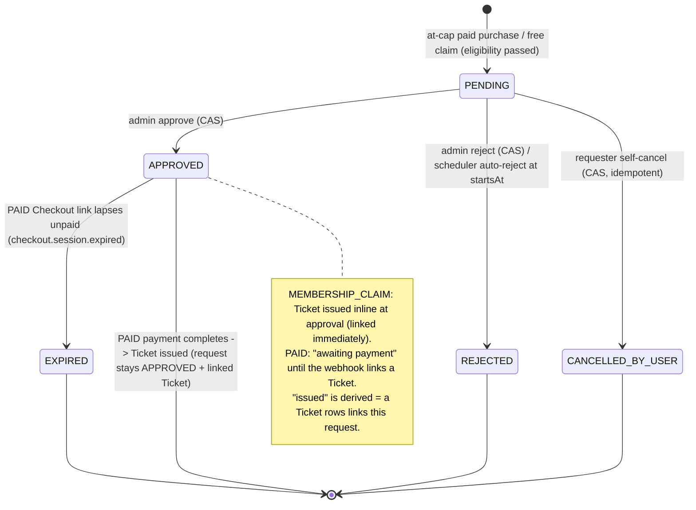
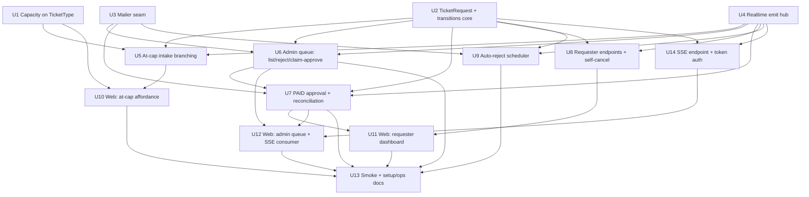
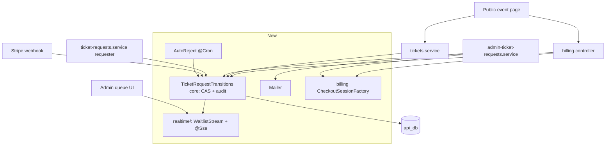

# feat: Phase 4 — Per-TicketType capacity + admin-moderated waitlist

## Summary

Add an optional soft cap to each `TicketType`. Under cap, Phase 3's instant ticket flow is untouched; at cap, paid purchases and free member claims become `TicketRequest` rows in a per-org admin queue that streams over SSE, where an organizer approves (over-cap allowed, audit-trailed) or rejects. Approved `MEMBERSHIP_CLAIM` requests issue a Ticket inline; approved `PAID` requests receive an emailed, expiring Stripe Checkout link whose payment is reconciled against current request state by the existing Phase 3 webhook. The phase introduces two net-new infra seams — a transactional mailer (Resend behind an injectable provider) and a scheduled-job runner (`@nestjs/schedule`) — plus a dedicated `realtime/` module for the SSE surface, and closes the concurrency gaps (CAS transitions + DB constraints + a row-locked webhook re-check) that the soft-cap-with-no-hold model exposes. Lands in 14 dependency-ordered units across five phases: foundation (capacity, request model, mailer, realtime emit hub), intake & moderation, lifecycle, web surfaces, and wrap-up.

---

## Problem Frame

Phase 3 ships ticketing as an instant-issue model with no capacity enforcement: a paid checkout completes and the webhook stamps a Ticket; a coverage-eligible member POSTs `/tickets/claim` and gets a Ticket in the same request. An organizer running a small-venue event therefore has no way to enforce a cap or consciously admit the marginal attendee, and a member who tries to claim a free ticket for a full tier gets a silent failure rather than an "ask the organizer" path. The full pain narrative, actors, flows, and acceptance examples live in the origin requirements doc (see Sources & References). This plan is the technical realization of that doc against the Phase 3 codebase — and a chunk of its work is dictated by what the Phase 3 webhook and schema actually do today, not by the requirements alone.

---

## Requirements

The plan satisfies all 27 origin requirements end-to-end. R-IDs match origin. Five acceptance examples (AE13–AE17) are **added during planning** to cover concurrency races the requirements-level review did not reach (rationale in Key Technical Decisions and the per-unit test scenarios).

**Capacity model** — R1 (nullable soft cap; null = Phase 3 behavior), R2 (under cap unmodified), R3 (at cap → `TicketRequest` in place of the Phase 3 success response), R17 (set/clear cap from the TicketType form; `0` rejected, below-`issuedCount` permitted + warned).

**Request lifecycle** — R4 (`TicketRequest` fields + 5-state status), R5 (eligibility gates run before request creation), R6 (idempotent self-cancel of own `PENDING`), R7 (auto-reject `PENDING` at event `startsAt`).

**Admin queue** — R8 (per-org pending queue, live via SSE), R9 (`OWNER`/`ADMIN` approve/reject).

**Approval outcomes** — R10 (approve `MEMBERSHIP_CLAIM` → issue inline + email), R11 (approve `PAID` → emailed Checkout link; Ticket materializes on payment), R12 (over-cap approve permitted; non-blocking warning; audit captures cap state), R13 (reject → email; no Stripe).

**Audit trail** — R14 (one audit row per admin decision: admin identity, request, cap-at-decision, `issuedCount` before/after, verb).

**Realtime + notifications** — R15 (queue updates without refresh; SSE), R16 (approve / reject / auto-reject trigger transactional email; phase introduces the mailer).

**Approval expiry** — R18 (`PAID` Checkout session carries explicit 24h expiry; lapse → `APPROVED`→`EXPIRED`, reflected in dashboard; no inventory release since no hold).

**Requester surface** — R19 (`/dashboard/requests` list + detail, all states), R20 (public event page renders an `AT_CAP` "Request a spot" affordance).

**Email content** — R21 (three templates: PAID-approved w/ Checkout CTA + expiry, CLAIM-approved, rejected — reused for admin reject and auto-reject).

**Accessibility** — R22 (SSE queue announces arrivals/removals/transitions via an ARIA live region).

**Security & authorization** — R23 (SSE authenticates at connect → 401 before any stream; org-scoped at connect; mid-stream expiry closes the stream), R24 (Checkout session customer-scoped + expiring; completed Checkout for a no-longer-`APPROVED` request must not issue), R25 (atomic transitions; at most one Ticket per request; races resolve to one success + a 409), R26 (mail security: env secrets, SPF/DKIM, non-blocking delivery, direct Stripe-hosted link), R27 (requester endpoints verify ownership; 404 hides existence).

**Origin actors:** A1 (Buyer/non-member), A2 (Member), A3 (Organizer Admin — `OWNER`/`ADMIN`), A4 (Stripe — passive), A5 (Scheduler).
**Origin flows:** F1 (paid request over cap), F2 (free claim over cap), F3 (admin reject), F4 (requester self-cancel), F5 (auto-reject at event start).
**Origin acceptance examples:** AE1–AE12, each exercised by at least one e2e test in U5–U9. **Plan-added:** AE13 (two-admin approve race), AE14 (self-cancel vs approve race), AE15 (approve vs auto-reject race), AE16 (redelivered payment after fulfillment), AE17 (double-queue blocked by partial unique index).

---

## Scope Boundaries

Carried from origin (all Phase 5+ unless noted):

- Refunds, chargebacks, dispute handling — deferred to Phase 5, **with one deliberate exception** (see Key Technical Decisions → "Auto-refund the dead-request payment race"): the webhook auto-refunds a Checkout that completes against a no-longer-payable request, reusing the existing Phase 3 `tryRefund` integrity path. No other refund surface is built.
- Hard caps that block over-cap approval — the cap is soft; admin always has the override.
- Stripe auth-and-capture / SetupIntent / "charge later" — the emailed Checkout link is the chosen pattern.
- WebSocket or polling realtime — SSE is the chosen channel.
- Per-Event total cap (single cap across all TicketTypes) — different shape; not this phase.
- Soft hold of capacity while a request is `PENDING` — inventory tracks only issued tickets.
- Aggregate over-cap visibility — a projected "approving all N pending puts you X over cap" rollup is deferred; Phase 4 shows per-decision `cap` / `issuedCount` only (and that count does not move for `PAID` approvals — see Open Questions).
- Admin-side notifications on queue arrival — organizers learn of pending requests by viewing the live dashboard; a proactive admin email/digest is deferred.
- Auto-promotion from queue to instant-issue when an admin raises the cap — every queued item still requires explicit admin decision.
- Bulk approve/reject — single-item only.
- Queue reordering / prioritization — FIFO default; no VIP-first logic.
- Non-admin audit rows (capacity edits, user cancellations, scheduler auto-rejects) — only admin approve/reject is captured; the schema is **not** pre-generalized for other sources.
- In-app inbox / push notifications — email is the only outbound channel.

### Deferred to Follow-Up Work

- **Per-request rate limiting / concurrent-`PENDING` cap beyond the one-open-request constraint** — `@nestjs/throttler` is already available to opt in per-route if a flood becomes a concern; not a Phase 4 blocker (see Open Questions → Deferred to Implementation).
- **Production reverse-proxy / LB config for SSE** (nginx `proxy_buffering off`, idle-timeout, HTTP/2) — captured as an operational note in U13's setup doc, not app code.
- **`docs/solutions/` learnings capture** — after Phase 4 lands, write notes covering the query-token SSE pattern, the CAS-transition + partial-unique-index concurrency model, the mailer seam, and the webhook reconciliation guard. Flagged because three of these are the team's first documented patterns in those areas.

---

## Context & Research

### Relevant Code and Patterns

- **Feature module pattern (mirror):** `apps/api/src/events/{events.module.ts,events.controller.ts,events.service.ts,dto/}` and `apps/api/src/tickets/` — thin controllers, services expose `*View` shapes via private `toView()` mappers, `Create*Dto` strict / `Update*Dto` all-`@IsOptional`.
- **Paid-checkout endpoint (branch point):** `apps/api/src/billing/billing.controller.ts` `createTicketCheckout` returns `Promise<{ url: string }>` (200, `@HttpCode(OK)`); `apps/api/src/billing/billing.service.ts` `createTicketCheckoutSession` does 404-if-missing/not-PUBLISHED → 409-if-existing-PAID-ticket → `getOrCreateStripeCustomer` → `stripe.checkout.sessions.create` with `metadata:{userId,eventId,ticketTypeId}` + `client_reference_id`. **No `expires_at` and no idempotency key on the session today.**
- **Free-claim endpoint (branch point):** `apps/api/src/tickets/tickets.service.ts` `claimFree` runs eligibility gates (TicketType exists→404, event PUBLISHED→404, `membersExcluded`→409, `minTierLevel<=0`→409, membership ACTIVE/TRIALING→409, tier→409) then a `prisma.$transaction({ isolationLevel: Serializable })` re-check + `ticket.create`. **Idempotency is service-layer only — there is no unique DB constraint on the claim tuple.**
- **Webhook (reconciliation seam):** `apps/api/src/webhooks/stripe-webhook.service.ts` `handle()` → `issueTicketFromSession` issues a Ticket unconditionally on `checkout.session.completed` (payment mode), with a tamper-check (`client_reference_id === metadata.userId`) + `tryRefund` on integrity failure, P2002 → duplicate-ack. `apps/api/src/webhooks/stripe-webhook.controller.ts` runs the side-effect and `recordProcessedWebhookEvent` as **two separate awaits, not one transaction**. There is **no `checkout.session.expired` branch** today.
- **Auth + roles:** `apps/api/src/auth/jwt-auth.guard.ts` reads `Authorization: Bearer` only, verifies via remote JWKS (`apps/api/src/auth/jwks.service.ts`); `apps/api/src/auth/roles.guard.ts` reads org id from `req.params.orgId ?? req.params.id`, 404-hides for non-members, 403 for wrong role; `@CurrentUser` / `@Roles` decorators. `apps/api/src/tickets/ticket-types.service.ts` `assertEventInOrg` is the nested-resource belongs-to-org re-check to mirror.
- **Webhook dedupe + idempotency-key conventions:** `apps/api/src/webhooks/webhook-event.helper.ts` (`recordProcessedWebhookEvent`, process-first-then-INSERT), `apps/api/src/billing/stripe.client.ts` (deterministic idempotency keys on domain ids).
- **Web (App Router, Next 16 / React 19):** `apps/web/src/lib/api/client.ts` (`apiFetch`/`publicApiFetch`, `server-only`, `access_token` httpOnly cookie → Bearer; `NEXT_PUBLIC_API_URL`); `apps/web/src/lib/api/types.ts` (`CoverageVerdict = "OWNED" | "CLAIMABLE" | "BUY"`); event detail `apps/web/src/app/events/[eventId]/{page.tsx,TicketRow.tsx,actions.ts}`; ticket-type editor `apps/web/src/app/dashboard/organizations/[orgId]/events/[eventId]/ticket-types/{page.tsx,TicketTypeEditor.tsx,actions.ts}`; server-action state shape `{ error?, fieldErrors?, values?, ok? }`; **lint rule rejects `useEffect` on `state.ok` → use `useTransition`**. **No client-side fetching / EventSource exists today.**
- **Testing:** `apps/api/test/helpers/boot-test-app.ts` (`bootTestApp(guard, providerOverrides=[])`), `stubJwtAuthGuard(holder)` + `makeSubHolder`, `apps/api/test/helpers/fake-stripe.ts` (`FakeStripeClient` / `FakeStripeWebhookVerifier`). Real local Postgres; `beforeEach` `deleteMany`. **No web tests** — manual `docs/phase-N-browser-smoke.md`.
- **Schema + migrations:** `packages/db/api/schema.prisma`; migrations hand-authored under `packages/db/api/migrations/<UTC>_<snake>/migration.sql`; scripts `migrate:api:dev`, `generate:api`, `seed:api` (no `migrate:api:deploy`). Generated client is gitignored → run `generate:api` after schema edits.

### Institutional Learnings

- **`docs/solutions/billing/sync-stripe-data-pattern.md`** — single-write-path discipline; **carries a direct conflict flag**: Phase 3 needs no reconciliation because dashboard renders self-heal, so Phase 4's "don't issue a Ticket if the request is no longer `APPROVED`" is new ground — the issuance path must re-read request state at issue time, not trust the webhook.
- **`docs/solutions/billing/nestjs-stripe-testing-seam.md`** — inject every third-party SDK behind a provider, override with an in-memory fake in e2e. The doc explicitly names "Sendgrid" as the analog → clone the seam for the mailer (`FakeMailer`) and inject a clock/now-seam for the scheduler.
- **`docs/solutions/billing/rename-before-reuse-migration.md`** — `prisma migrate dev --create-only` then hand-edit `ALTER`/index SQL; gitignored client caveat; cross-grep call sites. Reused for the partial unique index and `CHECK` constraint that Prisma 6.x cannot express natively.
- **Gap (no learning exists):** SSE, scheduled jobs, transactional email, and DB-level concurrency/locking/409-on-race have no prior documented pattern in this repo. Captured as a Deferred-to-Follow-Up learnings task.

### External References

- **NestJS 11 SSE** — `@Sse()` returns `Observable<MessageEvent>`; per-org fan-out via a `Map<orgId, Subject<MessageEvent>>` hub; guards run **before** the handler (a guard `throw` → clean HTTP 401, never opens the stream — `nestjs/nest#12670` caveat applies only to throws *inside* the handler body); `finalize()` for teardown; heartbeat via `merge(stream, interval(25_000))`. https://docs.nestjs.com/techniques/server-sent-events · https://docs.nestjs.com/faq/request-lifecycle
- **`@nestjs/schedule@^6.1.3`** (Nest 11-compatible; depends on `cron@4` — use `CronJob.from({...})` if building jobs manually) — `ScheduleModule.forRoot()`, `@Cron(CronExpression…, { name, timeZone:'UTC', waitForCompletion:true })`, `SchedulerRegistry`. In-process / single-instance. https://docs.nestjs.com/techniques/task-scheduling
- **Stripe (stripe-node 22, API `2026-04-22.dahlia`)** — `expires_at` is Unix seconds, 30 min–24 h from creation; `checkout.session.expired` fires on unpaid lapse (`event.data.object` is a `checkout.session`); `stripe.checkout.sessions.retrieve` exposes `status`(`open|complete|expired`) + `payment_status`; `customer`-scoping + `client_reference_id`/`metadata` are the reconciliation handles; idempotency key as 2nd-arg `RequestOptions`. https://docs.stripe.com/api/checkout/sessions · https://docs.stripe.com/payments/checkout/managing-limited-inventory · https://docs.stripe.com/checkout/fulfillment
- **Prisma 6.19 concurrency** — interactive `$transaction(fn, { isolationLevel: Serializable })`, serialization failure → `P2034` (retry); `SELECT … FOR UPDATE` via `$queryRaw` for read-then-decide; **compare-and-set** via `updateMany({ where:{ id, status:'PENDING' }})` + `count` check; **partial unique indexes are NOT native on 6.x** (shipped in 7.4, which also has drift bugs) → hand-write the SQL. https://www.prisma.io/docs/orm/prisma-client/queries/transactions
- **SSE prod hardening** — server heartbeat 15–30 s defeats nginx/ALB 60 s idle timeouts; `X-Accel-Buffering: no` + `proxy_buffering off`; HTTP/2 dissolves the HTTP/1.1 6-connection-per-origin cap; `EventSource` auto-reconnects (set `id`/`retry`). (oneuptime nginx-SSE; textslashplain HTTP/1.1 pitfalls.)
- **Transactional email** — Resend (react-email first-party, usable free tier, low DKIM/SPF burden) for a portfolio app; **commit-then-send, best-effort, no queue, no retry**; DMARC `p=none` to start. (Postmark/SES/Mailtrap 2026 comparisons.)
- **Next 16 client `EventSource`** — `"use client"` leaf component, `new EventSource(url)` in `useEffect` + `es.close()` teardown; named events via `addEventListener`. https://nextjs.org/docs/app/getting-started/server-and-client-components

---

## Key Technical Decisions

These are plan-time architectural choices; product-level decisions (cap-on-TicketType, pay-after-approval, no-soft-hold, SSE-over-WebSocket, soft-cap-with-override, refunds-to-Phase-5, self-cancel, event-anchored auto-reject, audit-every-decision, email-only) live in the origin doc's Key Decisions and are carried forward unchanged.

- **SSE auth via short-lived single-use query token (user-confirmed).** `EventSource` cannot send an `Authorization` header, and the `access_token` httpOnly cookie is scoped to the web origin (`:3000`), not the API (`:3001`) — so the existing `JwtAuthGuard` cannot protect the stream as-is, and a cross-origin cookie path would fight the architecture. An authenticated `POST /orgs/:orgId/requests/stream-token` (normal `JwtAuthGuard` + `RolesGuard` `OWNER`/`ADMIN`, called via server-side `apiFetch`) mints a token bound to `{userId, orgId, scope:'sse'}`; the browser opens `EventSource(API/orgs/:orgId/requests/stream?token=…)`; a dedicated `SseStreamTokenGuard` validates + burns it at connect, asserting the token's `orgId` equals the path param. Guard runs before the `@Sse()` handler, so R23's "401 before stream" is satisfied natively. Keeps all realtime logic in the API, adds no Next.js streaming proxy.
  - **Token type is a hard decision (deepening H1): an opaque, single-use, 256-bit random token in an in-memory store with a ~60 s TTL** — it structurally cannot be replayed against `JwtAuthGuard`. If a JWT is ever chosen instead, it MUST carry a dedicated `SSE_TOKEN_SECRET` (the API has only a *remote* JWKS verifier today, no local signing material) and a distinct `aud` (`organizer-sse`) that `SseStreamTokenGuard` verifies and that `JwtAuthGuard` (pinned to `API_AUDIENCE`) rejects on every normal route. U4b carries the e2e: "an SSE token presented as a `Bearer` to a normal endpoint → 401."
  - **Mid-stream authorization (R23):** the guard runs once at connect and the token is burned, so R23's "mid-stream expiry closes the stream" is realized as (a) re-authorization on every reconnect via a fresh `RolesGuard`-gated mint, plus (b) a server-side **max stream-lifetime recycle** that bounds the window in which a just-demoted admin keeps receiving the org's queue (the payload carries requester PII, so the window must be bounded).
  - **Hardening:** `@Throttle` the mint route (it mints credentials); redact `?token=` from API request logs (and the proxy, per U13); per-org `Subject` keying is the payload-isolation invariant (no cross-org data on the hub). The in-memory token store shares the scheduler's single-instance posture (mint-on-A/connect-on-B fails under multi-instance) — documented in U13.
- **Concurrency = optimistic compare-and-set + DB constraints, mapped to 409 (user-confirmed shape).** Every state transition is `prisma.ticketRequest.updateMany({ where:{ id, status:'PENDING' }, data:{ status:… } })`; `count === 1` wins, `count === 0` means another actor moved it first → `ConflictException` (409). All external side-effects (Stripe session create, email) happen **only after** the CAS wins. Hard guarantees come from constraints, not application checks: `Ticket.ticketRequestId @unique` (at most one Ticket per request, R25), and a hand-written **partial unique index** `(userId, ticketTypeId) WHERE status IN ('PENDING','APPROVED')` (one open request per user per tier — the double-queue fix). Serialization (`P2034`) and unique (`P2002`) violations both centralize to 409. **Two places need a stronger guard than a bare CAS** (deepening C1/H1): (1) the webhook's "issue iff still `APPROVED`" re-check must `SELECT … FOR UPDATE` the request row (or make the Ticket insert itself a status-guarded conditional) before issuing — a plain READ COMMITTED read has a TOCTOU hole that would issue against a request another transaction is concurrently cancelling/expiring; (2) the claim-approve audit's `issuedCount` before/after runs at **Serializable** with `P2034`→retry→409 (you cannot `FOR UPDATE` a `COUNT(*)`; Serializable keeps the before/after honest under concurrent issuance — matches `claimFree`'s precedent). Issuance-vs-cap is left **intentionally unconstrained** at the DB layer (no CHECK/trigger coupling `count(Ticket)` to `cap`) so the accepted soft-cap over-issue never becomes a hard error that 500s a paying buyer.
- **Session↔request linkage + reconcile-inside-the-issue-transaction (forced by the reconciliation requirement).** Today nothing links a Checkout session back to a request, and the webhook issues unconditionally. Add `TicketRequest.stripeCheckoutSessionId @unique` (set at PAID approval) and also stamp `metadata.ticketRequestId` on the session. **Resolve the request by the server-written `stripeCheckoutSessionId @unique` back-link, not by `metadata.ticketRequestId` alone** (deepening sec-M1): metadata is attacker-influenced if the webhook secret leaks, so the back-link is authoritative and the metadata id is a cross-check; additionally re-validate `request.userId` against the existing tamper-checked `client_reference_id === metadata.userId`. Rework `issueTicketFromSession` to, inside one `prisma.$transaction`, **`SELECT … FOR UPDATE` the request row** (deepening C1) and issue a Ticket **only if it is still `APPROVED` and the event has not started** — otherwise issue nothing. **The transaction is scoped to the payment-mode issuance branch only** (deepening C3/arch-F4) — *not* the whole `handle()` dispatcher: wrapping all of `handle()` would put `syncStripeData`'s Stripe network calls inside a DB tx for unrelated subscription events and break the membership path's documented process-first-then-INSERT crash semantics. For the ticket branch, `recordProcessedWebhookEvent` moves inside this same tx so "Ticket issued + event recorded" is atomic (R24, R25, AE11, AE16). The re-check lives *inside* `issueTicketFromSession` so it runs on every (re)delivery; a waitlist session is identified by the presence of its `stripeCheckoutSessionId` back-link, so a metadata-stripped waitlist session can never fall through to the Phase 3 unconditional path (deepening sec-L5).
- **Add the `checkout.session.expired` handler (greenfield) for `APPROVED`→`EXPIRED`.** No such branch exists; without it an unpaid approved request is the one state with no exit. The handler reads `metadata.ticketRequestId` and CAS-flips `APPROVED`→`EXPIRED`, emitting the SSE update. No email on expiry (R16 lists only approve/reject/auto-reject); the requester sees `EXPIRED` on their dashboard (R18, R19). The scheduler (U9) is a backstop if Stripe's event is missed.
- **Auto-refund the dead-request payment race (user-confirmed; the one Phase-4 refund exception).** When a Checkout completes for a request that is no longer payable (cancelled/rejected in the approval→pay window, or the event already started — the `FOR UPDATE` re-check above sees a non-`APPROVED`/started request), the webhook issues no Ticket and refunds. **The refund runs *after* the issuance transaction commits (commit-then-refund), never inside it** (deepening C2): a `stripe.refunds.create` is a network call that must not pin a pooled DB connection, and its durability must not be coupled to the tx outcome. It carries a **deterministic idempotency key** (`waitlist-refund-${session.id}`) so a redelivered dead-request event refunds at most once (today's `tryRefund` has none). Each auto-refund writes a **durable record** (a `RefundLog` row or audit entry: `{requestId, sessionId, paymentIntentId, reason, amount}`) at a watch-level log the U13 ops note flags — logging-without-alerting is not sufficient for user-reachable automatic money movement. Documented explicitly as a conscious carve-out, not a contradiction of "refunds → Phase 5."
- **`issuedCount` stays derived (`count(Ticket)`) + add `@@index([ticketTypeId])`.** Consistent with the mirror-ledger ethos (no denormalized counter to keep honest across the webhook path). A shared predicate `atCap(ticketType, issuedCount) = ticketType.cap !== null && issuedCount >= ticketType.cap` is used identically by the public affordance, the paid endpoint, and the claim endpoint so the three surfaces cannot drift. `cap === null` short-circuits before any `COUNT`.
- **Soft cap means the under-cap instant-issue race is accepted, not prevented — and the magnitude differs by path (deepening adversarial).** `atCap` is a lock-free READ COMMITTED `count(Ticket)` checked at request time. On the **claim** path the cap check and the Ticket insert sit in the same synchronous Serializable window, so over-issue is at most a hair. On the **paid** path the cap is consulted only at Checkout *session creation*; the Ticket is written by the webhook later at payment completion, and an under-cap paid session carries no request back-link so it takes the unchanged Phase 3 unconditional issue path (no `atCap` re-check at issuance). So N buyers who each see `issuedCount = cap − 1` at session creation can all pay and all issue — the over-issue window is the full session-creation-to-payment span across all concurrent buyers, not one CAS. This is accepted under the soft-cap-with-override philosophy (closing it would require the hold/lock the product explicitly rejects), but it is stated honestly: the cap provides little backpressure against a concurrent paid rush at the boundary. The queue's own intake remains race-safe via the partial unique index.
- **`PAID` approval mints the session before the CAS persists it, atomically.** Order: guard request is `PENDING`+`PAID` → mint Checkout session (idempotency key `waitlist-checkout-${requestId}`, `expires_at` = now + 24 h) → `$transaction { CAS PENDING→APPROVED SET stripeCheckoutSessionId; write audit row }` → email (best-effort). So `APPROVED` always implies a persisted live session URL (no dead "approved with no link" state). The idempotency key means a two-admin race produces one shared session; the CAS loser returns 409 without touching it.
- **Mailer: Resend behind an injectable `Mailer` provider, commit-then-send best-effort (user-affirmed default).** The DB transition (+ audit + any Ticket) commits first; email sends **outside** the transaction and never blocks or rolls back the HTTP response — failures are logged, not retried, not queued (R26). `FakeMailer` overrides the provider in e2e. Templates via react-email; the PAID email carries the **direct** Stripe-hosted Checkout URL (never a redirect through our domain). Accepted, documented gap: a crash between commit and send drops that one email silently; the `/dashboard/requests` UI remains the system of record.
- **Scheduler: `@nestjs/schedule` in-process `@Cron` every 5 min, single-instance posture.** Per-row CAS (`WHERE status='PENDING'`) + `SELECT … FOR UPDATE SKIP LOCKED` batch + a re-entrancy guard (`waitForCompletion: true` plus an `isRunning` flag). The locked batch transaction does **only** the CAS flips and commits promptly; the rejection email + SSE emit happen **after** commit, never inside the `FOR UPDATE` window (deepening M2 — same commit-then-send discipline as the mailer). Idempotent by construction (re-running finds fewer `PENDING` rows). Stated assumption: one API instance runs the cron; the documented scale-up is `pg_try_advisory_lock` around the sweep. Testable by `app.get(AutoRejectJob).run()` directly.
- **Module boundaries: keep the graph acyclic and split realtime out (deepening arch-F1/F2/F5).** Three structural rules: (1) **A dedicated `realtime/` module** owns the SSE surface (`WaitlistStream` hub, `@Sse` endpoint, `SseStreamTokenGuard`, token service) — mirroring the Phase 3 precedent that pulled the raw-body webhook surface into its own `webhooks/` module rather than burying it in `billing/`. Every emitter (`ticket-requests`, `billing`, `tickets`, `webhooks`, `scheduler`) consumes only the `WaitlistStream` emit seam. (2) **No `billing ↔ ticket-requests` cycle.** Extract a `CheckoutSessionFactory` in `billing/` (session minting + customer scoping + `expires_at` + metadata); the admin orchestration's `approvePaid` consumes it via the already-`@Global` `BillingModule` (no import needed). The paid at-cap *intake* is orchestrated in the **billing controller** (which calls the `createPendingRequest` helper) so `BillingService` itself never imports `ticket-requests` — the one cross-module DI direction is `ticket-requests → billing`, with no `forwardRef` (the repo has no `forwardRef` precedent). (3) **Mechanism vs. orchestration:** a thin `TicketRequestTransitions` core holds the CAS + audit-write + view mapper (the single race chokepoint, R25); per-actor orchestration (admin `approve*`/`reject`, requester `list`/`get`/`cancel`) lives alongside its controller so no single service becomes the convergence point for billing + mail + realtime + DB.

---

## Open Questions

### Resolved During Planning

- **SSE connection & auth topology?** → Short-lived single-use query token (see Key Technical Decisions). *User-confirmed.*
- **Money disposition when a payment lands on a no-longer-payable request?** → Auto-refund via existing `tryRefund` + log; the single refund exception in Phase 4. *User-confirmed.*
- **Can a requester hold multiple open requests for the same tier?** → No; one open (`PENDING`/`APPROVED`) request per `(userId, ticketTypeId)`, enforced by a partial unique index; a repeat intake returns the existing request. *User-confirmed.*
- **Locking mechanism for atomic transitions (origin Deferred-to-Planning)?** → Optimistic CAS on `status` + unique constraints, 409 on loss, for the plain transitions. Two exceptions decided in Key Technical Decisions: the webhook issue path takes `SELECT … FOR UPDATE` on the request row before issuing (deepening C1), and claim-approve runs at Serializable for an honest audit count (next bullet).
- **Isolation level for the audit `issuedCount` before/after (was Deferred; resolved by deepening H1)?** → Decided now, not at implementation: claim-approve's count-read + Ticket-insert + audit-write run in one **Serializable** transaction with `P2034`→retry→409 (you cannot `FOR UPDATE` a `COUNT(*)`, so Serializable is what keeps before/after honest under concurrent issuance; matches `claimFree`'s precedent). PAID-approve audit needs no such guard — `issuedCount` is unchanged (before == after) until payment.
- **Discriminated paid-endpoint response shape (origin Deferred-to-Planning)?** → `{ kind: 'checkout', url } | { kind: 'request', requestId, status: 'PENDING' }`; callers switch on the explicit `kind` tag (not structural `url`-presence) so a future third outcome doesn't overload field-presence.
- **`@Sse()` composition with auth + heartbeat / proxy posture (origin Deferred-to-Planning + Needs-research)?** → Dedicated SSE guard runs pre-handler (clean 401); 25 s heartbeat merged into the stream; `X-Accel-Buffering: no`; HTTP/2 + nginx `proxy_buffering off` as an ops note (U13).
- **Scheduled-job runner + interval + idempotency (origin Deferred-to-Planning)?** → `@nestjs/schedule`, 5 min, per-row CAS + `SKIP LOCKED` + re-entrancy guard; single-instance.
- **Mail provider + send model (origin Deferred-to-Planning)?** → Resend, direct commit-then-send, best-effort, react-email templates.
- **`APPROVED` overloads "awaiting payment" vs "issued" (review finding I1)?** → No new status (R4 fixes the five); discriminate by whether a `Ticket` links to the request. `MEMBERSHIP_CLAIM`-`APPROVED` always has a linked Ticket; `PAID`-`APPROVED` has one only after payment.
- **PAID-path gate ordering (review finding I4)?** → 404-checks → existing-PAID-ticket 409 → existing-open-request 409 → `atCap` check → (under cap) session | (at cap) `TicketRequest`. Mirrors `claimFree`'s "gates before queue."

### Deferred to Implementation

- **Exact production nginx/LB directives and HTTP/2 termination** — deployment config, captured as an ops note in U13; not exercised by code or tests.
- **The three email bodies' final HTML/MJML** — react-email component content is implementation; the *contract* (which template, which fields, direct Stripe URL) is fixed in U3/R21.
- **Per-request rate-limit / concurrent-`PENDING` ceiling beyond the one-open constraint** — deferred (origin Deferred-to-Planning `[R3, RR]`); `@nestjs/throttler` can opt in per-route later. The one-open-request index already bounds the obvious self-flood.
- **Documented consequence, not a question (review finding C4):** the per-decision over-cap warning reads from issued count only, so for `PAID` approvals it shows the same `issuedCount`/`cap` across a batch (the count does not move until payment). The audit trail's before/after (equal for PAID) is the over-cap record. Stated so implementers don't "fix" it into an aggregate projection (which is out of scope).

---

## Output Structure

New / modified files landing in Phase 4 (per-unit `**Files:**` are authoritative; this is the scope shape):

    apps/api/src/
      ticket-requests/                      # NEW domain module — the waitlist lifecycle
        ticket-requests.module.ts
        ticket-request-transitions.ts       # mechanism core: CAS transitions + audit writes + view mapper
        ticket-requests.service.ts          # requester orchestration: list/get/cancel
        admin-ticket-requests.service.ts    # admin orchestration: approveClaim/approvePaid/reject
        create-pending-request.ts           # shared intake helper fn (no DI — avoids tickets<->ticket-requests cycle)
        ticket-requests.controller.ts       # requester: GET list/detail, POST :id/cancel
        admin-ticket-requests.controller.ts # admin (:orgId): GET queue, POST :id/{approve,reject}
        dto/{reject-request.dto.ts}
      realtime/                             # NEW — SSE surface, separately auditable (mirrors webhooks/ split)
        realtime.module.ts
        waitlist-stream.ts                  # per-org Subject hub + emit() (the foundational emit seam)
        sse.controller.ts                   # @Sse stream + POST stream-token (consume side)
        sse-stream-token.guard.ts           # validates+burns the query token
        sse-token.service.ts                # mint/verify single-use opaque stream tokens
      mail/                                 # NEW transactional-mail seam
        mail.module.ts
        mailer.ts                           # injectable Mailer provider (Resend)
        templates/{paid-approved,claim-approved,rejected}.tsx
      scheduler/                            # NEW scheduled-job runner
        scheduler.module.ts
        auto-reject.job.ts                  # @Cron sweep
      billing/
        checkout-session.factory.ts         # NEW: ticket Checkout session minting (shared by under-cap + PAID-approval)
        billing.{service,controller}.ts     # MODIFIED: controller orchestrates at-cap intake; factory extracted
      tickets/tickets.service.ts                # MODIFIED: claim at-cap branch
      tickets/capacity.ts                       # NEW: pure atCap() predicate (computeIssuedCount on TicketTypesService)
      tickets/ticket-types.{service,controller}.ts ; tickets/dto/*ticket-type.dto.ts  # MODIFIED: cap field
      memberships/memberships.service.ts        # MODIFIED: add AT_CAP coverage verdict
      webhooks/stripe-webhook.{service,controller}.ts  # MODIFIED: reconcile-in-tx (issuance branch only), session.expired
      app.module.ts                             # MODIFIED: register Realtime/Mail/Scheduler/TicketRequests modules
      main.ts                                   # MODIFIED: X-Accel-Buffering header pass-through if needed

    packages/db/api/
      schema.prisma                             # MODIFIED: TicketType.cap, TicketRequest, TicketRequestAudit, RefundLog, Ticket.ticketRequestId, enums, indexes
      migrations/
        <ts>_add_ticket_type_cap/               # cap column + CHECK + Ticket ticketTypeId index
        <ts>_add_ticket_request_and_audit/      # models, enums, FK (ticketRequestId @unique, ON DELETE SET NULL)
        <ts>_add_ticket_request_partial_unique/ # hand-written partial unique index (last; drift-asserted in CI)
        <ts>_add_refund_log/                    # RefundLog (stripeCheckoutSessionId @unique → idempotent record)

    apps/web/src/
      app/dashboard/requests/{page.tsx,RequestList.tsx,[requestId]/page.tsx,actions.ts}  # NEW requester dashboard
      app/dashboard/organizations/[orgId]/requests/                                      # NEW admin queue (org-level)
        {page.tsx,WaitlistQueue.tsx,actions.ts}            # actions.ts: approve/reject + remintStreamToken
      app/events/[eventId]/{TicketRow.tsx,actions.ts}     # MODIFIED: AT_CAP affordance + request action
      app/dashboard/organizations/[orgId]/events/[eventId]/ticket-types/{TicketTypeEditor.tsx,actions.ts}  # MODIFIED: cap input
      lib/api/types.ts                          # MODIFIED: TicketRequest* views, AT_CAP verdict

    docs/
      phase-4-browser-smoke.md                  # NEW manual click-through
      phase-4-setup.md                          # NEW: Resend + DNS, SSE prod, scheduler notes
      README.md ; .env.example                  # MODIFIED

---

## High-Level Technical Design

> *This illustrates the intended approach and is directional guidance for review, not implementation specification. The implementing agent should treat it as context, not code to reproduce.*

### TicketRequest lifecycle (state machine)



Illegal transitions (approve/reject/cancel on any non-`PENDING` state) resolve via CAS to `count=0`; the caller gets 409, except a duplicate self-cancel of an already-`CANCELLED_BY_USER` request, which re-reads and returns 200 (R6/AE8 idempotency vs AE10 conflict).

### PAID over-cap flow (sequence — the load-bearing chain)

```mermaid
sequenceDiagram
    participant Buyer
    participant Web as Next.js
    participant Api as NestJS
    participant Stripe
    participant Mail as Resend

    Buyer->>Web: "Request a spot" (tier at cap)
    Web->>Api: POST /billing/checkout/ticket
    Api->>Api: gates -> atCap -> create TicketRequest{PAID,PENDING} (partial-unique tx)
    Api-->>Web: { requestId, status:'PENDING' }   %% discriminated shape
    Api->>Api: waitlistStream.emit(orgId, request.created)
    Note over Api: Admin sees row appear via SSE
    Api->>Api: admin approve -> mint Checkout(expires_at 24h, metadata.ticketRequestId)
    Api->>Stripe: checkout.sessions.create (idempotencyKey=waitlist-checkout-<reqId>)
    Api->>Api: tx { CAS PENDING->APPROVED SET stripeCheckoutSessionId; audit row }
    Api->>Mail: send PAID-approved (direct Stripe URL)  %% best-effort, post-commit
    Buyer->>Stripe: complete Checkout
    Stripe->>Api: webhook checkout.session.completed
    Api->>Api: tx { re-read request by metadata.ticketRequestId; APPROVED & not started? -> Ticket(source=PAID, ticketRequestId); else tryRefund + log; dedupe insert }
    Api-->>Stripe: 200
```

### At-cap branching (decision matrix)

| `cap` | `issuedCount` | Endpoint | Outcome |
|---|---|---|---|
| `null` | any | paid / claim | Phase 3 behavior, instant (no `COUNT`, no request) — R1, R2, AE7 |
| set | `< cap` | paid / claim | Phase 3 behavior, instant (soft-boundary over-issue accepted) — R2 |
| set | `>= cap` | paid | gates → `TicketRequest{PAID,PENDING}`; response `{ requestId, status }` — R3, AE1 |
| set | `>= cap` | claim | eligibility gates first; if ineligible → Phase 3 error (no request); else `TicketRequest{MEMBERSHIP_CLAIM,PENDING}` — R3, R5, AE2 |

### Concurrency model (race → mechanism → resolution)

| Race | Mechanism | Resolution | Covers |
|---|---|---|---|
| Two admins approve same request | CAS `updateMany WHERE status='PENDING'` | one `count=1` wins; loser `count=0` → 409; one shared idempotent session | R25, AE13 |
| Self-cancel vs approve | same CAS on `status` | first flip wins; admin loser → 409; duplicate cancel → 200 | R6, R25, AE10, AE14 |
| Approve vs auto-reject at start | same CAS | one wins, other no-ops | R7, R25, AE15 |
| Double-queue same user/tier | partial unique index `(userId,ticketTypeId) WHERE status IN ('PENDING','APPROVED')` | P2002 → return existing request / 409 | R25, AE17 |
| Two Tickets for one request | `Ticket.ticketRequestId @unique` | second insert P2002 → ack 200 | R25 |
| Late payment on dead request | webhook `SELECT … FOR UPDATE`s the request **in** the issue tx (not a plain read) | issue iff `APPROVED` & event not started; else commit, then idempotent `tryRefund` + durable refund record | R24, AE11 |
| Redelivered completed after issue | `Ticket.stripeCheckoutSessionId @unique` + `WebhookEvent` dedupe | P2002 → ack 200, no 2nd Ticket | R12 (idemp.), AE16 |
| Exact cap boundary (under-cap Nth+1) | none (soft cap) | accepted hair-over-issue; stated | KTD |

---

## Design State Conventions

New web surfaces follow the established `apps/web/src/app/.../actions.ts` + editor-component patterns (server actions returning `{ error?, fieldErrors?, values?, ok? }`; `apiFetch` in try/catch; `UnauthorizedError`→`redirect("/auth/login")`; `useTransition` instead of `useEffect`-on-`ok` per the existing lint rule). Per-surface state specs (authoritative for U10–U12):

- **TicketType cap input (U1)** — numeric input alongside `name`/`price`/`minTierLevel`; empty = "no cap" (sends null); below-current-`issuedCount` save succeeds with an inline amber notice "N tickets already issued exceed this cap; existing tickets are not revoked" (R17); `0` and negatives → field error.
- **Public event detail (U10)** — extends the coverage-verdict button states with `AT_CAP`: when `atCap`, the Buy/Claim button becomes "Request a spot"; on submit success, the row shows "Request submitted — we'll email you when the organizer responds. Track it in your requests." linking to `/dashboard/requests`. **On submit error**, the row renders the `error` string inline below the button (matching the BUY/CLAIMABLE error pattern): a 409 "you already have an open request" resolves to the "Request pending" state; any other error shows "Something went wrong — please try again." No queue position / wait estimate (out of scope). If the requester already has an open request → the button reads "Request pending" linking to that request; the **`AT_CAP` verdict carries `openRequestId: string | null`** (populated by `getCoverageVerdicts` from the caller's `PENDING`/`APPROVED` request for that tier) so the link target needs no second API call.
- **Requester dashboard `/dashboard/requests` (U11)** — list + per-request detail. Each **list row** shows event name, ticket-tier name, request date, intent (Paid/Free), and a status badge (the `TicketRequestView` carries these denormalized display fields). Per-status states: `PENDING` (Cancel action), `APPROVED`-awaiting-payment (PAID, no linked Ticket — "Complete payment" primary CTA → direct Stripe URL + a human-readable expiry, e.g. "Payment link expires in 2h 14m"), `APPROVED`-with-ticket (linked Ticket exists — "Ticket issued"), `REJECTED` (reason if present), `CANCELLED_BY_USER`, `EXPIRED` ("Your payment window closed — request a new spot"). **Cancel outcome:** on success `redirect('/dashboard/requests')` (the cancelled request has no interactive value on its detail page); on 409 (already decided) stay on the detail page and revalidate to show the current status. Empty: "You haven't requested any tickets yet." Loading (list and detail): server-component suspense.
- **Admin queue (U12)** — org-level queue at `/dashboard/organizations/[orgId]/.../requests` showing all of the org's pending requests; per-row columns: requester (email/name), requested tier, intent (Paid/Free), request time; default sort FIFO (oldest first); rows grouped by event when several are active. **Empty state:** "No pending requests." (visually distinct from the loading skeleton). Approve/reject buttons show an in-flight "Approving…/Rejecting…" disabled state on **that row only** between click and confirmation. **Over-cap approve** uses an inline two-step confirm on the Approve button (mirroring the existing two-click delete pattern, not a thread-blocking `window.confirm`): the button transitions to "At cap (N/N) — confirm approve?" with inline Confirm/Cancel affordances. SSE connection states: a quiet "Live" indicator when connected, "Reconnecting…" between an `onerror` and a successful re-mint (see Realtime reconnect below). An ARIA `role="log"` `aria-live="polite"` region announces "Request from <name> added / removed / approved / rejected" on applied changes (R22) — announcements fire on the applied state change, not the raw frame, so a reconnect does not spam the screen reader; it also announces "Queue disconnected — reconnecting" once per disconnect and "Queue reconnected" on resume.
- **Realtime reconnect (U12 / U14)** — because the SSE token is single-use and burned at connect, native `EventSource` auto-reconnect (which reuses the same burned-token URL) cannot resume. The `"use client"` `WaitlistQueue` instead handles `onerror` by: (1) calling a `remintStreamToken(orgId)` **server action** (server-only `apiFetch` → `POST …/stream-token`) to obtain a fresh token, (2) opening a new `EventSource` with the new token URL, (3) `es.close()`-ing the old instance. If the re-mint returns 401/403 (the admin was demoted/removed), show a non-dismissible "Your access has changed — reload" notice instead of "Reconnecting…". A short debounce avoids a tight remint loop.

---

## Implementation Units

U-IDs are stable and listed in dependency order, not numeric order: the U4 realtime unit was split during the deepening pass into **U4 (emit hub, foundational)** and **U14 (SSE consume endpoint + token auth, gated by the web consumer)**; U14 keeps the next-unused number per the U-ID stability rule and is listed in Phase D where it belongs by dependency.



### Phase A — Foundation (U1–U4 can largely proceed in parallel)

### U1. Capacity on TicketType

**Goal:** Add an optional soft cap to `TicketType` end-to-end: schema column + supporting index + `CHECK`, the shared `atCap` predicate and `issuedCount` helper, DTO validation with below-issued warning, and the cap input on the TicketType form. No queue behavior yet — at cap the Phase 3 endpoints are unchanged until U5.

**Requirements:** R1, R17; provides the `atCap` predicate for R3/R20.

**Dependencies:** none.

**Files:**
- Modify: `packages/db/api/schema.prisma` — `TicketType.cap Int?`; add `@@index([ticketTypeId])` to `Ticket`.
- Create: `packages/db/api/migrations/<ts>_add_ticket_type_cap/migration.sql` — `ALTER TABLE ticket_types ADD COLUMN cap INTEGER;` + `ALTER TABLE ticket_types ADD CONSTRAINT ticket_types_cap_check CHECK (cap IS NULL OR cap >= 1);` + `CREATE INDEX tickets_ticket_type_id_idx ON tickets (ticket_type_id);` (hand-authored; `CHECK` is not Prisma-expressible). Note for scale: `CREATE INDEX CONCURRENTLY` is the production-safe variant, but it cannot run inside the transaction Prisma wraps migrations in — at portfolio scale the plain `CREATE INDEX` is fine; flag the CONCURRENTLY caveat in the migration header.
- Modify: `apps/api/src/tickets/dto/create-ticket-type.dto.ts`, `update-ticket-type.dto.ts` — `@IsOptional() @IsInt() @Min(1) cap?: number | null` (mirror `minTierLevel` validation; allow explicit `null` to clear).
- Create: `apps/api/src/tickets/capacity.ts` — `atCap(ticketType, issuedCount): boolean` as a **pure exported function** (no DB, no DI), imported directly by billing/tickets/memberships so the predicate cannot drift. `computeIssuedCount(ticketTypeId)` (`count(Ticket)`) needs Prisma, so it lives as a method on `TicketTypesService` (already has Prisma) rather than its own provider — a two-line predicate doesn't warrant a DI service (deepening scope finding).
- Modify: `apps/api/src/tickets/ticket-types.service.ts` — persist `cap`; add `assertCapValid`/`validateInvariant` for the below-`issuedCount` warning surfaced in the view.
- Modify: `apps/web/src/app/dashboard/organizations/[orgId]/events/[eventId]/ticket-types/TicketTypeEditor.tsx`, `actions.ts`, `apps/web/src/lib/api/types.ts` — cap input + view field.

**Approach:**
- `cap` is nullable; `null` is the only "no cap" representation (R17 rejects `0`). The `CHECK` is belt-and-suspenders behind the DTO `@Min(1)`.
- `atCap` short-circuits on `cap === null` before any `COUNT` (perf + correctness for uncapped types).
- Setting `cap < issuedCount` is permitted; the service returns the current `issuedCount` in the view so the form can warn. Never revoke tickets.

**Patterns to follow:** `ticket-types.service.ts` existing `validateInvariant`; `minTierLevel` DTO validation; the EventEditor/TicketTypeEditor field + `useTransition` pattern.

**Test scenarios:**
- Happy path (e2e): create TicketType with `cap=10` → persists; `GET` view returns `cap=10`.
- Happy path (e2e): update existing TicketType `cap` from `null`→`5` and `5`→`null` (clear).
- Edge (e2e): `cap=0` and `cap=-1` → 400 with field error.
- Edge (e2e): set `cap=3` when 5 tickets already issued → 2xx, view exposes `issuedCount=5` so the warning can render; no tickets deleted.
- Edge (unit): `atCap({cap:null}, 999) === false`; `atCap({cap:10}, 9) === false`; `atCap({cap:10}, 10) === true`.
- Frontend cap input: `Test expectation: none -- frontend, verified via browser smoke (U13)`.

**Verification:** `pnpm -F db migrate:api:dev` applies on a fresh DB; `pnpm -F api typecheck && pnpm -F api test:e2e` green; `cap` round-trips through create/edit.

---

### U2. TicketRequest + audit data model + transitions core

**Goal:** Add the `TicketRequest` model, its intent/status enums, the `TicketRequestAudit` model, the `Ticket.ticketRequestId @unique` link, and the partial unique index — plus a thin **`TicketRequestTransitions`** mechanism core (CAS transition helper, view mapper, audit-write helper). Per-actor orchestration lives in U6/U7 (admin) and U8 (requester), not here. No HTTP endpoints yet.

**Requirements:** R4; foundation for R25 (atomicity + at-most-one-Ticket) and R14 (audit shape).

**Dependencies:** none (schema + mechanism core).

**Files:**
- Modify: `packages/db/api/schema.prisma` — `enum TicketRequestIntent { PAID MEMBERSHIP_CLAIM }`, `enum TicketRequestStatus { PENDING APPROVED REJECTED CANCELLED_BY_USER EXPIRED }`, `enum TicketRequestDecision { APPROVE REJECT }`; `model TicketRequest { id, userId, ticketTypeId, eventId, intent, status @default(PENDING), stripeCheckoutSessionId String? @unique, createdAt, updatedAt, relations to TicketType/Event; @@index([eventId, status]); @@index([userId]) }`; `model TicketRequestAudit { id, ticketRequestId, adminUserId, decision TicketRequestDecision, capAtDecision Int?, issuedCountBefore Int, issuedCountAfter Int, createdAt; @@index([ticketRequestId]) }`; add `ticketRequestId String? @unique` + relation to `Ticket` with **`onDelete: SetNull`**.
- Create: `packages/db/api/migrations/<ts>_add_ticket_request_and_audit/migration.sql` (models, enums, FKs; `Ticket.ticket_request_id` column + unique + **`ON DELETE SET NULL`**).
- Create: `packages/db/api/migrations/<ts>_add_ticket_request_partial_unique/migration.sql` (must be the **last** of the three) — `CREATE UNIQUE INDEX ticket_requests_one_open_per_user_type ON ticket_requests (user_id, ticket_type_id) WHERE status IN ('PENDING','APPROVED');` (hand-written; documented header — Prisma 6.x cannot express partial indexes, so `migrate dev` output must be inspected and any auto-generated `DROP INDEX` of this index hand-deleted before applying).
- Create: `apps/api/src/ticket-requests/ticket-requests.module.ts`, `ticket-request-transitions.ts` — `transition(id, from, to, tx?)` CAS helper returning win/lose; `toView()`; `writeAudit(tx, …)`; `findOpenForUser(userId, ticketTypeId)`.
- Create: `apps/api/test/ticket-requests-core.e2e-spec.ts` (+ a migration/startup assertion that the partial index exists — see Approach); modify `beforeEach` `deleteMany` lists in affected specs to include the new tables (delete/​unlink Tickets before TicketRequests, or rely on `SET NULL`).
- Modify: `apps/api/src/app.module.ts` (register `TicketRequestsModule`).

**Approach:**
- The CAS helper is the single chokepoint for all transitions: `updateMany({ where:{ id, status: from }, data:{ status: to } })`; `count===0` → throw `ConflictException`. Accepts an optional `tx` so callers compose it with audit/Ticket writes in one `$transaction`. This is the mechanism only — orchestration (which actor, which side-effects) is the callers' concern (deepening arch-F5).
- **`Ticket.ticketRequestId` FK is `ON DELETE SET NULL`** (deepening data-H2): a purged/deleted `TicketRequest` must never cascade-delete an issued, paid Ticket (the Ticket is the durable artifact; the request is provenance). Contrast the existing `Ticket→ticket_types` (RESTRICT) and `Ticket→events` (CASCADE) FKs — this one is deliberately SET NULL.
- **Partial index semantics (deepening data-H2/sec-M2):** the predicate is `status IN ('PENDING','APPROVED')` — an `APPROVED`-awaiting-payment PAID request **intentionally holds the slot** until it `EXPIRED`s, so a user cannot re-request that tier while approved-unpaid (the documented recovery is the requester dashboard's "request a new spot" after expiry). The index is per-`userId`, so it can never lock a *different* user out of a tier. Do not narrow the predicate to `PENDING`-only — that reopens the double-queue hole on the approved side.
- **Drift detection (deepening data-H3):** because Prisma 6.x cannot represent the partial index in `schema.prisma`, a future `migrate dev`/`db push` can silently `DROP` it and reopen AE17 with no test failure. Add a startup/CI assertion (`SELECT 1 FROM pg_indexes WHERE indexname='ticket_requests_one_open_per_user_type'`) that fails loudly if the index is missing — a comment header alone does not prevent drift.
- `eventId` is denormalized onto `TicketRequest` (copied at creation) so the org-scoped admin query and SSE org resolution don't need a `TicketType`→`Event` join on every read.
- This `Ticket.ticketRequestId @unique` is the **first real DB-level issuance-uniqueness guarantee** on a request→ticket path (the existing `claimFree` P2002 catch is effectively dead — there is no unique on the claim tuple today, only the null-for-claims Stripe-id uniques). Note it so reviewers don't assume parity with a non-existent claim-tuple constraint.
- Audit rows are admin-decision-only (R14); the model is intentionally not generalized for scheduler/cancel sources (Scope Boundaries).

**Patterns to follow:** `rename-before-reuse-migration.md` (`--create-only` + hand-edit); `events.service.ts` `toView`; the `prisma.$transaction` usage in `claimFree`.

**Test scenarios:**
- Happy path (e2e): `transition` `PENDING`→`APPROVED` returns win and the row is updated.
- Edge (e2e): `transition` on an already-`APPROVED` row (`from:'PENDING'`) → `count=0` → `ConflictException`.
- Integration (e2e): inserting a second open `TicketRequest` for the same `(userId, ticketTypeId)` while one is `PENDING` → P2002 (partial unique index). **Covers AE17.**
- Integration (e2e): a `(userId, ticketTypeId)` with an `APPROVED` request → a new `PENDING` insert is also blocked (predicate includes APPROVED). **Covers AE17 (approved side).**
- Integration (e2e): inserting a second `Ticket` with the same `ticketRequestId` → P2002 (`ticketRequestId @unique`).
- Edge (e2e): a `(userId, ticketTypeId)` with an `EXPIRED`/`REJECTED`/`CANCELLED_BY_USER` request permits a new `PENDING` insert (predicate excludes terminal states).
- Integration (e2e/CI): the drift assertion fails when the partial index is absent and passes when present.
- Edge (e2e): deleting a `TicketRequest` that has a linked Ticket leaves the Ticket intact with `ticketRequestId` nulled (SET NULL).

**Verification:** migrations apply on a fresh DB; partial unique index present (`\d ticket_requests` shows the `WHERE`); drift assertion green; `pnpm -F api typecheck && test:e2e` green.

---

### U3. Transactional mailer seam

**Goal:** Stand up the email infrastructure shared by approve/reject/auto-reject: an injectable `Mailer` provider (Resend), three react-email templates, a commit-then-send best-effort helper, env wiring, and a `FakeMailer` test double registered through `bootTestApp`.

**Requirements:** R16 (mailer infra), R21 (three templates), R26 (mail security + non-blocking delivery).

**Dependencies:** none (pure infra; no callers until U6).

**Files:**
- Modify: `apps/api/package.json` — add `resend` + `react-email`/`@react-email/components` (and `react` if not transitively present for the API).
- Create: `apps/api/src/mail/mail.module.ts` (`@Global` or exported, mirroring `BillingModule`), `mailer.ts` (`Mailer.send(to, template, props): Promise<void>` — logs + swallows on failure; reads `RESEND_API_KEY`, `MAIL_FROM` via `ConfigService.get ?? warn`), `templates/{paid-approved,claim-approved,rejected}.tsx`.
- Create: `apps/api/test/helpers/fake-mailer.ts` — `FakeMailer` recording `.sent` (assert recipient + template + props), no network.
- Modify: `apps/api/src/app.module.ts` (register `MailModule`); `.env.example` (`RESEND_API_KEY`, `MAIL_FROM`, note DKIM/SPF/DMARC are a DNS prereq — documented in U13).

**Approach:**
- `Mailer.send` never throws and is always called **after** the DB commit by callers (commit-then-send). It catches + logs delivery errors (R26 non-blocking). The PAID-approved template embeds the **direct** Stripe Checkout URL (passed in as a prop) and the link-expiry timestamp; no platform redirect (R26). Dashboard deep-links are built from `WEB_ORIGIN`, which the `Mailer` **validates as a well-formed absolute URL at startup (throw on missing/malformed, not `?? warn`)** so a missing env never ships broken or relative hrefs in approval emails (deepening security finding).
- Templates take typed props (requester name, event/tier, checkout URL + expiry for PAID, reject reason for rejected). The rejected template is shared by admin reject and scheduler auto-reject (per R21, template c) and renders the reason when present. **The admin-supplied `reason` MUST be rendered as a JSX text node (`<Text>{reason}</Text>`), never via `dangerouslySetInnerHTML` or raw string concatenation**, so a crafted reason cannot inject HTML/links into the email sent from the trusted domain (deepening security finding).
- `FakeMailer` overrides the `Mailer` token via `providerOverrides` exactly as `FakeStripeClient` overrides `StripeClient`.

**Patterns to follow:** `nestjs-stripe-testing-seam.md` (inject + fake); `stripe.client.ts` (`ConfigService.get ?? warn` env reads, idempotency-key-style call convention).

**Test scenarios:**
- Happy path (unit): `Mailer.send` calls the Resend client with the rendered template + recipient (Resend client itself stubbed).
- Error path (unit): Resend client throws → `Mailer.send` logs and resolves (does not throw) — proves non-blocking (R26).
- Integration (e2e wiring, exercised in U6): `FakeMailer` records a send; asserted by recipient + template.
- Template (unit): PAID-approved renders the exact checkout URL passed in and the expiry; no internal/redirect URL appears in the output; dashboard deep-link href begins with the configured `WEB_ORIGIN`.
- Error path (unit): rejected template with `reason` containing `<script>alert(1)</script>` renders the literal escaped string, not executable HTML.
- Edge (unit): `Mailer` construction with missing/malformed `WEB_ORIGIN` throws at startup (fails fast in CI).

**Verification:** `pnpm -F api typecheck` green; mailer unit specs pass; `bootTestApp(..., [{ token: Mailer, useValue: fakeMailer }])` resolves.

---

### U4. Realtime emit hub (`WaitlistStream`)

**Goal:** The foundational per-org emit seam every transition fans out through — a `WaitlistStream` hub with `emit(orgId, event)`, a per-org `Subject` map, a 25 s heartbeat, and `finalize()`-based teardown so subjects don't leak. **No HTTP, no auth, no `@Sse()` endpoint** — that is U14. Split out (deepening arch-F3) so the intake/lifecycle units (U5–U9) depend only on this trivial seam, not on the SSE-auth research surface.

**Requirements:** R8 + R15 (emit side), R22 (typed event shape the client later announces).

**Dependencies:** U2 (emits `TicketRequest` views).

**Files:**
- Create: `apps/api/src/realtime/realtime.module.ts` (exports `WaitlistStream`), `waitlist-stream.ts` — `Map<orgId, Subject<MessageEvent>>`; `emit(orgId, event)`; `stream(orgId)` returning `merge(subject, interval(25_000).pipe(map(() => ({ type:'ping', data:'' })))).pipe(finalize(teardown))`; ref-counting so the `Map` entry is deleted on the last leaver (never `complete()` on one client's disconnect — that would kill the stream for all of an org's admins).
- Modify: `apps/api/src/app.module.ts` (register `RealtimeModule`).

**Approach:**
- Events carry `type` (`request.created|updated|removed`) + `id` (for client `addEventListener` + reconnect resume). The per-org `Subject` keying is the payload-isolation invariant — no cross-org data can ride the hub.
- This is the only realtime dependency U5–U9 take: they inject `WaitlistStream` and call `emit` after a committed transition. The consume-side auth machinery (U14) is irrelevant to them.

**Patterns to follow:** NestJS SSE docs (the `Observable<MessageEvent>` + `merge`/`finalize` shape); the `@Global`-style provider export so emitters consume it without tangling modules.

**Test scenarios:**
- Happy path (unit): `emit(orgA, e)` is observed by a subscriber of `stream(orgA)` and not by a subscriber of `stream(orgB)` (isolation).
- Integration (unit): a `ping` is emitted on `stream()` within ~25 s.
- Integration (unit): last subscriber unsubscribes → the org `Subject` is torn down (assert via the ref-count; no leak on re-subscribe).

**Verification:** `pnpm -F api typecheck` + emit-hub unit spec green; emitters in U5–U9 can inject `WaitlistStream` with no SSE-endpoint dependency.

---

### Phase B — Intake & moderation

### U5. At-cap intake branching (paid + claim)

**Goal:** Branch both Phase 3 issuance endpoints at cap: the paid-purchase endpoint returns a discriminated `{ requestId, status } | { url }`, and the free-claim endpoint creates a `MEMBERSHIP_CLAIM` request after its eligibility gates. Under cap (or `cap=null`), both behave exactly as Phase 3.

**Requirements:** R2, R3, R5; AE1, AE2, AE7 (and AE17 via the partial-unique catch).

**Dependencies:** U1 (`atCap`), U2 (`TicketRequest`), U4 (emit on create).

**Files:**
- Modify: `apps/api/src/billing/billing.controller.ts` — the `createTicketCheckout` handler orchestrates the at-cap branch: after the existing 404 + existing-PAID-ticket 409 checks, consult `atCap()` (from `tickets/capacity.ts`); under cap → `CheckoutSessionFactory`/`BillingService` (Phase 3 path) → `{ kind:'checkout', url }`; at cap → create `TicketRequest{PAID,PENDING}` via the shared `createPendingRequest` helper → `{ kind:'request', requestId, status:'PENDING' }`. **`BillingService` itself does not import `ticket-requests`** — the controller depends on both, keeping the module graph acyclic (deepening arch-F1).
- Create: `apps/api/src/ticket-requests/create-pending-request.ts` — a shared **helper function** (not a DI service — avoids a tickets↔ticket-requests constructor cycle) that does `prisma.ticketRequest.create` + partial-unique P2002 → return the caller's existing open request, then emits `request.created` post-commit. Called by both the billing controller (PAID) and `tickets.service` (claim).
- Modify: `apps/api/src/tickets/tickets.service.ts` (`claimFree`) — after all eligibility gates, if `atCap(...)`, call `createPendingRequest` for `MEMBERSHIP_CLAIM` (reuse the Serializable-tx + P2002 pattern) and return it instead of issuing. Controller returns a `kind`-tagged response discriminated from the `TicketView`.
- Modify: `apps/web/src/lib/api/types.ts` — discriminated response types keyed on `kind`.

**Approach:**
- **Gate ordering (PAID):** 404 (missing/not PUBLISHED) → existing-PAID-ticket 409 → existing-open-request (**return existing**) → `atCap` → session | request. **Claim:** all Phase 3 eligibility gates (so ineligible attempts get the Phase 3 error and never enter the queue, R5/AE2) → existing-open-request (**return existing — same as PAID**; the partial-unique P2002 maps to return-existing, not 409) → `atCap` → issue | request. Both paths treat a duplicate open request as idempotent return-existing so the user-facing affordance lands on "Request pending."
- **Discriminate on an explicit `kind: 'checkout' | 'request'` tag**, not on structural `url`-presence (deepening arch refinement) — so a future third outcome doesn't overload field-presence. `{ kind:'checkout', url }` is the Phase 3 arm; `{ kind:'request', requestId, status }` is the at-cap arm.
- Wrap the at-cap insert in a transaction with a P2002 catch on the partial unique index → return the existing open request (idempotent intake, AE17). Stripe is **not** called on the at-cap paid branch (no session until approval).
- Emit `request.created` to `WaitlistStream` **after** commit (avoid phantom rows if the tx rolls back).

**Patterns to follow:** `claimFree`'s Serializable tx + P2002; `assertEventInOrg`/hide-existence; the existing `{ url }` response (now the `kind:'checkout'` arm of the union).

**Test scenarios:**
- Happy path (e2e): `cap=10`, `issuedCount=10`, non-member paid purchase → `{ requestId, status:'PENDING' }`, a `TicketRequest{PAID,PENDING}` row, no Stripe session created. **Covers AE1.**
- Happy path (e2e): `cap=5`, `issuedCount=5`, eligible member claim → `TicketRequest{MEMBERSHIP_CLAIM,PENDING}`; below-tier member → Phase 3 403 and **no** request. **Covers AE2, R5.**
- Happy path (e2e): `cap=null` → every paid purchase and claim behaves as Phase 3; no request ever created. **Covers AE7.**
- Edge (e2e): under cap (`issuedCount < cap`) → Phase 3 instant flow, unchanged.
- Integration (e2e): two concurrent at-cap paid requests for the same user/tier → one `PENDING` row; the second returns the same `requestId` (partial unique). **Covers AE17.**
- Integration (e2e): SSE `request.created` is emitted to the request's org stream after a PENDING insert.
- Error path (e2e): paid purchase when the user already holds a PAID ticket → Phase 3 409 (gate precedes cap).

**Verification:** Phase 3 billing/claim e2e specs stay green for under-cap *behavior*, but the existing `billing-ticket-checkout.e2e-spec.ts` assertion must be updated for the new `{ kind:'checkout', url }` envelope (the under-cap response shape changed even though behavior didn't); new at-cap specs green; discriminated `kind` shape asserted on both arms.

---

### U6. Admin queue — list, reject, MEMBERSHIP_CLAIM approve

**Goal:** The org-scoped admin endpoints: list the pending queue, reject (→ email + audit), and approve a `MEMBERSHIP_CLAIM` (→ issue Ticket inline + email + audit). Over-cap approval permitted with the audit capturing cap state. Every transition emits an SSE update.

**Requirements:** R8, R9, R10, R12, R13, R14, R16; AE3, AE5 (claim), AE6, AE10 (reject/approve-after-cancel), AE13/AE15 (races).

**Dependencies:** U2 (CAS + audit), U3 (mailer), U4 (emit).

**Files:**
- Create: `apps/api/src/ticket-requests/admin-ticket-requests.controller.ts` — `@UseGuards(JwtAuthGuard, RolesGuard)`, routes under `/orgs/:orgId/requests`: `GET` (pending queue, FIFO, **cursor-paginated via the existing `common/cursor.ts` `TupleCursor` so a large burst doesn't return all requester PII in one unbounded payload**), `POST :id/reject` (`RejectRequestDto`), `POST :id/approve`. `assertRequestInOrg(id, orgId)` re-checks **request → event → `organizationId === orgId`** (the explicit predicate, mirroring `assertEventInOrg`) so an admin cannot act on another org's request even after `RolesGuard` proves org membership (deepening sec-L3).
- Create: `apps/api/src/ticket-requests/admin-ticket-requests.service.ts` — admin orchestration `reject(adminSub, id, reason?)`, `approveClaim(adminSub, id)` calling the U2 `TicketRequestTransitions` core; both compute `issuedCount` before/after, run the CAS + audit (+ Ticket for claim) in one `$transaction`, then email + emit post-commit.
- Create: `apps/api/src/ticket-requests/dto/reject-request.dto.ts` — `@IsOptional() @IsString() @MaxLength(500) reason?` (deepening sec-L2 — bound the free text that ships in every rejection email).
- Create: `apps/api/test/admin-ticket-requests.e2e-spec.ts`.

**Approach:**
- **Reject:** `$transaction { CAS PENDING→REJECTED; writeAudit(decision=REJECT, cap, before==after) }` → `Mailer.send(rejected)` → emit `request.updated`. No Stripe (R13).
- **Approve claim:** runs at **Serializable** isolation with `P2034`→retry→409 (deepening data-H1) so the audit's `issuedCount` before/after are honest under concurrent issuance (you cannot `FOR UPDATE` a `COUNT(*)`): `$transaction[Serializable] { read count (before); CAS PENDING→APPROVED; create Ticket(source=MEMBERSHIP_CLAIM, ticketRequestId); writeAudit(decision=APPROVE, cap, before, after=before+1) }` → `Mailer.send(claim-approved)` → emit. `Ticket.ticketRequestId @unique` is the at-most-one-ticket backstop (R25).
- Over-cap is allowed (no block); the response/list includes `cap` + current `issuedCount` so the UI can show the non-blocking warning (R12). The audit row records the cap state.
- All side-effects (email, emit) occur only after the CAS wins and the tx commits (race-safety).

**Patterns to follow:** `RolesGuard` + `assertEventInOrg` (predicate shape); `claimFree`'s Serializable tx + Ticket insert; `events.service.ts` view mapping.

**Test scenarios:**
- Happy path (e2e): approve a `PENDING` `MEMBERSHIP_CLAIM` → Ticket `source=MEMBERSHIP_CLAIM` linked to the request, request `APPROVED`, one audit row, `FakeMailer` recorded a claim-approved send. **Covers AE3.**
- Happy path (e2e): reject a `PENDING` → `REJECTED`, audit `decision=REJECT`, rejected email sent, **no** Stripe call. **Covers AE6.**
- Edge (e2e): over-cap claim approve (`cap=10`, `issuedCount=10`) → succeeds, Ticket issues, audit row `capAtDecision=10, issuedCountBefore=10, issuedCountAfter=11`, admin identity recorded. **Covers AE5, R12, R14.**
- Error path (e2e): approve/reject a request belonging to another org → 404 (`assertRequestInOrg`).
- Error path (e2e): `MEMBER` (non-admin) approves → 403; non-member → 404.
- Edge (e2e): approve a request already `CANCELLED_BY_USER` → 409, no state change, no Ticket, no email. **Covers AE10.**
- Integration (e2e): two concurrent approves of the same request → exactly one Ticket + `APPROVED`; the loser gets 409. **Covers AE13.**
- Integration (e2e): each transition emits `request.updated` to the org SSE stream post-commit.

**Verification:** new admin e2e spec green; audit numbers asserted; no email/Stripe on the 409 paths.

---

### U7. PAID approval + Checkout reconciliation

**Goal:** Approve a `PAID` request by minting an expiring, customer-scoped Checkout session linked to the request and emailing the direct URL; and make the webhook issue a Ticket **only if** the row-locked request is still `APPROVED` and the event hasn't started — commit-then-refunding the dead-request race — plus handle `checkout.session.expired` → `EXPIRED`. Folds the dedupe insert into the issuance transaction (payment branch only, not the whole dispatcher).

**Requirements:** R11, R14, R16, R18, R24, R25; AE4, AE5 (paid note), AE11, AE16.

**Dependencies:** U2, U3, U6 (admin orchestration service + audit), billing `CheckoutSessionFactory`.

**Files:**
- Modify: `apps/api/src/ticket-requests/admin-ticket-requests.service.ts` + `admin-ticket-requests.controller.ts` — `approvePaid(adminSub, id)`: guard `PENDING`+`PAID` → mint via the billing `CheckoutSessionFactory` (consumed through the `@Global` `BillingModule`, no import) with `mode:'payment'`, `customer`, `line_items:[stripePriceId]`, `expires_at: now+24h`, `metadata:{ ticketRequestId, userId, eventId, ticketTypeId }`, `client_reference_id`, `{ idempotencyKey:'waitlist-checkout-'+id }` → `$transaction { CAS PENDING→APPROVED SET stripeCheckoutSessionId; writeAudit(before==after) }` (CAS loss → 409; do **not** expire the shared idempotent session — see Approach) → `Mailer.send(paid-approved, { url, expiresAt })` (post-commit) → emit.
- Create/Modify: `apps/api/src/billing/checkout-session.factory.ts` — extract the ticket-session minting primitive (customer scoping, `expires_at`, metadata, idempotency key) from `createTicketCheckoutSession`; both the under-cap path and `approvePaid` call it. Keeps the dependency one-way (`ticket-requests → billing`).
- Modify: `apps/api/src/webhooks/stripe-webhook.service.ts` — rework `issueTicketFromSession`: **resolve the request by the (pre-existing) `Ticket`/session `stripeCheckoutSessionId @unique` back-link on `TicketRequest`** (authoritative; `metadata.ticketRequestId` is a cross-check) and re-validate `request.userId` against the tamper-checked `client_reference_id===metadata.userId`; inside the issuing tx **`SELECT … FOR UPDATE` the request row** (deepening C1 — a plain read has a TOCTOU hole), then issue `Ticket(source=PAID, ticketRequestId, stripeCheckoutSessionId, stripePaymentIntentId)` **iff** locked `status==='APPROVED'` AND `event.startsAt > now`; else issue nothing. **Scope the issuance `$transaction` to this payment branch only** (deepening C3) — it wraps the locked re-read + Ticket insert + (on the success branch) `recordProcessedWebhookEvent`; it does **not** wrap the whole `handle()` (the subscription/`syncStripeData` branch keeps its existing process-then-record shape so its Stripe network calls never run inside a DB tx). **Dead-request branch ordering (resolves deepening adversarial C1-tension):** do the idempotent refund FIRST, then record the dedupe row — i.e. for the no-issue branch, `tryRefund` (idempotency key `waitlist-refund-${session.id}`) + upsert the `RefundLog` record run BEFORE `recordProcessedWebhookEvent`. A crash before the refund leaves no dedupe row, so Stripe redelivers and retries the idempotent refund; the dedupe row is only written once the refund has durably happened. Add a `checkout.session.expired` branch → resolve by back-link → CAS `APPROVED→EXPIRED` + emit `request.updated` (no email).
- Modify: `apps/api/src/webhooks/webhook-event.helper.ts` call site — for the **issue** branch, `recordProcessedWebhookEvent` moves inside the issuance tx (atomic "ticket issued + event recorded"); for the **dead-request refund** branch it runs after the refund (above); the subscription path is unchanged.
- Modify: `packages/db/api/schema.prisma` + create migration `<ts>_add_refund_log/migration.sql` — `model RefundLog { id, ticketRequestId String?, stripeCheckoutSessionId String @unique, stripePaymentIntentId String?, reason String, amountCents Int, createdAt DateTime @default(now()) }`. The `@unique` on `stripeCheckoutSessionId` makes the record idempotent: the dead-request branch **upserts** it, so a redelivered event yields exactly one refund record matching the one actual refund (deepening adversarial — no duplicate money-movement rows for the operator's monitor).
- Modify: `apps/api/test/helpers/fake-stripe.ts` — extend `CheckoutCreateP`/`FakeCheckoutSession` for `expires_at`; add `queueEvent` support for `checkout.session.expired`; record `refunds.create` idempotency keys.

**Approach:**
- Session minting happens **before** the CAS so `APPROVED` always carries a live `stripeCheckoutSessionId` (no dead "approved with no link" state). Idempotency key on `requestId` collapses a two-admin race to one shared session; the CAS picks the single winner; the loser returns 409 **without** expiring the session (it is the winner's). An orphaned session from a cancel-races-approve loss is rendered harmless by the webhook's `FOR UPDATE` re-check (a stray payment sees a non-`APPROVED` request → no issue + refund) — so the C1 lock is load-bearing, not optional.
- The webhook re-check is the AE11/R24 guarantee: issuance is gated on the **row-locked current** request state, on every (re)delivery. A redelivered completed event after a Ticket exists hits `Ticket.ticketRequestId @unique` / `stripeCheckoutSessionId @unique` P2002 → duplicate-ack (AE16). A completed event for a `CANCELLED_BY_USER`/`REJECTED`/`EXPIRED`/event-started request issues nothing and refunds (post-commit, idempotent).
- **Refund is commit-then-refund with refund-before-dedupe ordering** (deepening C2 + adversarial): the Stripe refund call must not pin a pooled connection inside the DB tx. For the dead-request branch the order is: (1) commit the no-issue state read, (2) `tryRefund` (idempotency key → at most one real refund across redeliveries), (3) upsert the `RefundLog` (unique on session → one record), (4) record the dedupe row. Because the dedupe row is written last, a crash anywhere before it leaves Stripe to redeliver and safely retry — closing the "money captured, no ticket, no refund" window a refund-after-dedupe ordering would open. The durable record + watch-level log make the money movement observable (U13 ops note).
- A waitlist session is identified by the **presence of its `stripeCheckoutSessionId` back-link**, never the metadata flag alone, so a metadata-stripped waitlist session cannot fall through to the Phase 3 unconditional issue path (deepening sec-L5).
- `EXPIRED` is reached via `checkout.session.expired` (primary), with the U9 scheduler as a backstop for a missed webhook.

**Patterns to follow:** existing `issueTicketFromSession` tamper-check + `tryRefund` (now post-commit + idempotency-keyed); `webhook-event.helper.ts` dedupe (now inside the issuance tx, ticket branch only); `sync-stripe-data-pattern.md` (single write path) — extended with the new row-locked at-issue re-check the doc flags as new ground.

**Test scenarios:**
- Happy path (e2e): approve `PENDING` `PAID` → `FakeStripe` recorded a session with `expires_at` set + `metadata.ticketRequestId`, request `APPROVED` with `stripeCheckoutSessionId`, audit row (before==after), paid-approved email sent, **no Ticket yet**. **Covers AE4, AE5 (paid).**
- Happy path (e2e): queue `checkout.session.completed` for that session → Ticket `source=PAID` linked to the request; request stays `APPROVED` with a linked Ticket.
- Edge (e2e): `checkout.session.expired` for an `APPROVED` unpaid request → `EXPIRED`, no Ticket, SSE emitted, no email. **Covers AE11 (expiry half).**
- Error path (e2e): `checkout.session.completed` for a request that is `CANCELLED_BY_USER` → no Ticket; `FakeStripe` recorded exactly one refund (key `waitlist-refund-<session.id>`); exactly one `RefundLog` row with matching `stripeCheckoutSessionId`/`stripePaymentIntentId`; logged. **Covers AE11 (late-completion half), C3.**
- Error path (e2e): `checkout.session.completed` after `event.startsAt` passed → no Ticket; one refund + one `RefundLog` (I3).
- Error path (e2e): completed session whose resolved request belongs to a **different `userId`** than the tamper-checked `metadata.userId` → no Ticket, refund + record. **Covers deepening sec-M1.**
- Integration (e2e): redelivered `checkout.session.completed` after the Ticket exists → no second Ticket (P2002), ack 200. **Covers AE16.**
- Integration (e2e): redelivered dead-request completed event (incl. a simulated crash between refund and dedupe-row) → still exactly one refund and exactly one `RefundLog` row (idempotency key + unique upsert). **Covers the refund-before-dedupe ordering.**
- Integration (e2e): two concurrent `approvePaid` → one shared session, one `APPROVED`, loser 409, session not expired. **Covers AE13 (paid).**
- Integration (e2e): cancel-races-approve — request cancelled in the approval window, then the orphaned session is paid → webhook `FOR UPDATE` re-check sees `CANCELLED_BY_USER` → no Ticket, refund. (Proves the C1 lock closes the orphaned-session hole.)
- Integration (e2e): a **subscription** webhook (`customer.subscription.updated`) still processes via the unchanged process-then-record path — its `syncStripeData` is **not** wrapped in the issuance tx (proves C3 scoping; Phase 3 membership specs stay green).

**Verification:** new + existing webhook e2e specs green; `FakeStripe` asserts `expires_at`, the refund idempotency key, and that no refund/Stripe call runs inside a DB tx; redelivery is a no-op; the issuance-branch-scoped tx keeps Phase 3 ticket **and** membership webhook specs green.

---

### Phase C — Lifecycle

### U8. Requester request endpoints + self-cancel

**Goal:** The requester-facing API: list own requests, view one (existence-hidden), and self-cancel a `PENDING` request idempotently. Every cancel emits an SSE removal to the org queue.

**Requirements:** R6, R19 (API), R27; AE8, AE10, AE12.

**Dependencies:** U2 (CAS), U4 (emit).

**Files:**
- Create: `apps/api/src/ticket-requests/ticket-requests.controller.ts` — `@UseGuards(JwtAuthGuard)`: `GET /requests` (caller's own, scoped by `userId = sub` in the WHERE), `GET /requests/:id` (own or 404), `POST /requests/:id/cancel`.
- Modify: `apps/api/src/ticket-requests/ticket-requests.service.ts` — `listForUser(sub)`, `getForUser(sub, id)` (404 hide), `cancel(sub, id)` (CAS `PENDING`→`CANCELLED_BY_USER`; on `count=0` re-read: already `CANCELLED_BY_USER` → 200 no-op, else 409; resolve org and emit `request.removed` post-commit).
- Modify: `apps/api/src/lib/...` n/a; create `apps/api/test/requester-requests.e2e-spec.ts`.

**Approach:**
- Ownership is enforced at the WHERE level (`userId = caller.sub`), returning 404 for other users' requests — the hide-existence convention (R27, AE12), not a post-filter.
- Cancel is idempotent (R6/AE8): CAS guard `status='PENDING'`; a second cancel of an already-`CANCELLED_BY_USER` request re-reads and returns 200; cancel of a decided (`APPROVED`/`REJECTED`/`EXPIRED`) request → 409. No email, no audit row (no admin involved).
- The detail view joins the linked Ticket (if any) so the UI can distinguish APPROVED-awaiting-payment from APPROVED-with-ticket (I1), exposing only the caller's own ticket data.

**Patterns to follow:** `assertEventInOrg`/hide-existence; `@CurrentUser`; the CAS helper from U2.

**Test scenarios:**
- Happy path (e2e): self-cancel own `PENDING` → `CANCELLED_BY_USER`, SSE `request.removed` emitted within the test, no email, no audit row. **Covers AE8.**
- Edge (e2e): second cancel of the same request → 200 no-op (idempotent). **Covers AE8.**
- Error path (e2e): cancel an `APPROVED` request → 409.
- Error path (e2e): user B views or cancels user A's request → 404, request unchanged. **Covers AE12, R27.**
- Edge (e2e): cancel racing an admin approve (MEMBERSHIP_CLAIM) → exactly one of {CANCELLED, APPROVED+ticket}; loser 409. **Covers AE14.**
- Happy path (e2e): `GET /requests` returns only the caller's requests with correct derived state (awaiting-payment vs issued).

**Verification:** requester e2e spec green; 404-not-403 asserted across list/detail/cancel; SSE removal emitted on cancel.

---

### U9. Auto-reject scheduler

**Goal:** An in-process `@nestjs/schedule` sweep that auto-rejects `PENDING` requests whose event has started, with the standard rejection email and SSE update — idempotent, non-overlapping, batched.

**Requirements:** R7, R16; AE9, AE15.

**Dependencies:** U2 (CAS), U3 (mailer), U4 (emit).

**Files:**
- Modify: `apps/api/package.json` — add `@nestjs/schedule@^6.1.3`.
- Create: `apps/api/src/scheduler/scheduler.module.ts` (`ScheduleModule.forRoot()`), `auto-reject.job.ts` (`@Cron(CronExpression.EVERY_5_MINUTES, { name:'waitlist-auto-reject', timeZone:'UTC', waitForCompletion:true })`).
- Modify: `apps/api/src/app.module.ts` (register `SchedulerModule`).
- Create: `apps/api/test/auto-reject-job.e2e-spec.ts`.

**Approach:**
- Sweep: in one short transaction, `SELECT … FOR UPDATE SKIP LOCKED LIMIT 100` the `PENDING` requests whose `event.startsAt <= now` and CAS each `PENDING→REJECTED` (reason `expired_at_event_start`); **commit (releasing the row locks) before sending any email or SSE emit** (deepening M2 — never hold `FOR UPDATE` locks or pin a connection across a Resend call, same commit-then-send discipline as the mailer). Collect the affected rows, then post-commit fan out the rejection emails + `request.updated` emits. Loop until a sub-batch returns fewer than the limit.
- Idempotent by construction (re-running finds fewer `PENDING` rows); the CAS makes a concurrent admin/scheduler race resolve to one winner (AE15). `SKIP LOCKED` means the sweep skips rows the webhook re-check or an admin currently holds. Re-entrancy guarded by `waitForCompletion: true` + an `isRunning` flag.
- No audit row (scheduler, not an admin — R7/AE9). Single-instance posture stated; `pg_try_advisory_lock` is the documented scale-up (U13 ops note).
- Testable by `app.get(AutoRejectJob).run()` directly with seeded past-`startsAt` events.

**Patterns to follow:** `@nestjs/schedule` docs; the CAS helper; `claimFree`'s tx usage; `nestjs-stripe-testing-seam.md` (inject a clock/now-seam for deterministic time).

**Test scenarios:**
- Happy path (e2e): a `PENDING` request whose event `startsAt` has passed → after `run()`, `REJECTED` reason `expired_at_event_start`, rejected email sent, **no audit row**. **Covers AE9.**
- Edge (e2e): a `PENDING` request whose event is in the future → untouched.
- Edge (e2e): re-running the sweep is a no-op on already-`REJECTED` rows (idempotent).
- Integration (e2e): admin approve racing the sweep on the same request → exactly one terminal state; the other no-ops. **Covers AE15.**
- Edge (e2e): batch larger than the limit → all eligible rows processed across loops.

**Verification:** job spec green via direct invocation; idempotent re-run; no audit rows written by the sweep.

---

### Phase D — Web surfaces (no automated tests; verified via U13 browser smoke)

### U10. Web — public event-detail at-cap affordance + request submission

**Goal:** Extend the public event page so an at-cap tier renders "Request a spot" (a new `AT_CAP` verdict) and submitting creates a request with the specified confirmation copy.

**Requirements:** R20, R3 (client surface).

**Dependencies:** U1 (atCap), U5 (intake endpoint). Also extends the coverage verdict.

**Files:**
- Modify: `apps/api/src/memberships/memberships.service.ts` — `getCoverageVerdicts` returns `AT_CAP` when `atCap` (highest-precedence after OWNED). 
- Modify: `apps/web/src/lib/api/types.ts` — `CoverageVerdict` adds `"AT_CAP"`.
- Modify: `apps/web/src/app/events/[eventId]/TicketRow.tsx`, `actions.ts` — `AT_CAP` → "Request a spot" form; a `requestSpot` server action POSTing to the paid/claim endpoint and rendering the confirmation; "Request pending" if the user already has an open request.

**Approach:** Mirror the existing `BUY`/`CLAIMABLE`/`OWNED` `TicketRow` branches; reuse the `{ error?, ok? }` action state + `useTransition`. The verdict endpoint is the single source for the button state so server and client agree (defense-in-depth: intake re-checks `atCap` server-side regardless of the rendered button).

**Patterns to follow:** `TicketRow.tsx` verdict switch; `events/[eventId]/actions.ts` `buyTicket`/`claimFreeTicket`.

**Test scenarios:** `Test expectation: none -- frontend; behavior verified in U13 browser smoke. The AT_CAP verdict logic in memberships.service.ts gets a unit test:` verdict resolves to `AT_CAP` when `cap` reached and the user has no open request; `OWNED` still wins when a ticket exists.

**Verification:** `pnpm -F api test` green for the verdict unit; manual: at-cap tier shows "Request a spot", submit shows the confirmation and creates a `PENDING` request (U13).

---

### U11. Web — requester dashboard `/dashboard/requests`

**Goal:** The requester's request list + detail with all six states, the pay CTA for approved-PAID, and a cancel action — per the Design State Conventions.

**Requirements:** R19, R18 (dashboard reflection of EXPIRED).

**Dependencies:** U7 (pay CTA + EXPIRED), U8 (list/detail/cancel API).

**Files:**
- Create: `apps/web/src/app/dashboard/requests/{page.tsx,RequestList.tsx,[requestId]/page.tsx,actions.ts}`.
- Modify: `apps/web/src/lib/api/types.ts` — `TicketRequestView` (+ derived `awaitingPayment` flag / linked ticket).

**Approach:** Server components fetch via `apiFetch('/requests')`; the detail page renders the state machine per the conventions; the cancel action posts to `/requests/:id/cancel` and `revalidatePath`s; the APPROVED-awaiting-payment state surfaces the **direct** Stripe URL (carried on the request view) + expiry. EXPIRED renders "request a new spot."

**Patterns to follow:** `dashboard/membership/page.tsx` status-state rendering; the server-action `{ error?, ok? }` + `useTransition` cancel pattern; `dashboard/layout.tsx` auth redirect.

**Test scenarios:** `Test expectation: none -- frontend, verified via browser smoke (U13).`

**Verification:** manual (U13): each state renders correctly; cancel works and the row updates; the pay CTA opens Stripe.

---

### U14. SSE consume endpoint + query-token auth

**Goal:** The consume side of realtime, split from U4 (deepening arch-F3): the `@Sse()` stream endpoint, the single-use query-token mint endpoint, and the `SseStreamTokenGuard`. Gated only by the web consumer (U12), so the SSE-auth research surface never blocks the backend lifecycle (U5–U9).

**Requirements:** R8 + R15 (consume side), R22 (typed events), R23 (auth at connect → 401, org-scoped, mid-stream bound).

**Dependencies:** U2 (`TicketRequest` views), U4 (`WaitlistStream` hub).

**Files:**
- Create: `apps/api/src/realtime/sse-token.service.ts` — `mint(userId, orgId)` returns an **opaque, single-use, 256-bit random token** held in an in-memory store with a ~60 s TTL; `verifyAndBurn(token): { userId, orgId } | null` (deepening sec-H1 — opaque, not a JWT, so it can never be replayed against `JwtAuthGuard`). The store enforces a **max outstanding-token size cap** (e.g. 1000, FIFO/LRU eviction on overflow) so a mint burst cannot grow the heap unbounded (deepening sec — the TTL bounds natural growth, the cap covers a burst-then-TTL window).
- Create: `apps/api/src/realtime/sse-stream-token.guard.ts` — reads `req.query.token`, `verifyAndBurn`, asserts the token's `orgId` equals the `:orgId` param, sets org context or throws 401.
- Create: `apps/api/src/realtime/sse.controller.ts` — `POST /orgs/:orgId/requests/stream-token` (`@UseGuards(JwtAuthGuard, RolesGuard, ThrottlerGuard)` + `@Throttle({ default: { limit: 10, ttl: 60_000 } })` — **`ThrottlerGuard` must be in the `@UseGuards` list because it is NOT global in this app**; `app.module.ts` registers `ThrottlerModule` but the webhook controller opts in via `@UseGuards(ThrottlerGuard)`, so `@Throttle` alone is a no-op, deepening feasibility) → `{ token }`; `@Sse('orgs/:orgId/requests/stream')` (`SseStreamTokenGuard`) returns `waitlistStream.stream(orgId)` with `X-Accel-Buffering: no` and a server-side max-lifetime recycle.
- Modify: `apps/api/src/realtime/realtime.module.ts` (wire the controller, guard, token service); request-logger redaction of `?token=`.

**Approach:**
- The mint endpoint runs the normal header-Bearer `JwtAuthGuard` + `RolesGuard` (only an `OWNER`/`ADMIN` of `:orgId` mints) + `ThrottlerGuard` (10/min — modest, since a healthy client mints roughly once per reconnect). Guard runs before the `@Sse()` handler → unauthenticated/invalid connect returns a real HTTP 401 before any stream opens (R23).
- Mid-stream authorization (R23) = re-auth on every reconnect via a fresh mint + a **max stream-lifetime recycle with an explicit ceiling of ~90 s** (deepening adversarial — the hard upper bound on how long a just-demoted admin keeps receiving the org's requester-PII payload; the client transparently reconnects through the `RolesGuard`-gated mint, which now denies them). The token store shares the single-instance posture (U13 ops note).

**Patterns to follow:** NestJS SSE docs; `RolesGuard` for the mint endpoint; `@nestjs/throttler` usage already in `webhooks/`.

**Test scenarios:**
- Happy path (e2e): authenticated `OWNER` mints a token; connecting to the stream with it receives an emitted `request.created` (drive `waitlistStream.emit`, read the supertest stream).
- Error path (e2e): connect with no token → 401 before any data. **Covers R23.**
- Error path (e2e): an already-used token → 401 (single-use burn).
- Error path (e2e): a token minted for org A used on org B's stream → 401/403 (orgId mismatch).
- Error path (e2e): the minted SSE token presented as a `Bearer` to a normal authenticated endpoint → 401 (token-type separation). **Covers deepening sec-H1.**
- Edge (e2e): non-`OWNER`/`ADMIN` calls the mint endpoint → 404/403 per `RolesGuard`; mint endpoint is throttled.

**Verification:** new SSE e2e spec green; `curl -N` with a minted token streams events + a `ping` within ~25 s; the SSE token is rejected on normal endpoints.

---

### U12. Web — admin queue dashboard + SSE consumer

**Goal:** The live admin queue: a client `EventSource` (authenticated via a minted token), an ARIA live region announcing changes, approve/reject buttons with in-flight states and the over-cap confirm, and connecting/reconnecting indicators.

**Requirements:** R8, R15, R22.

**Dependencies:** U14 (SSE endpoint + token), U6 (list/reject/approve-claim), U7 (approve-paid).

**Files:**
- Create: `apps/web/src/app/dashboard/organizations/[orgId]/requests/{page.tsx,WaitlistQueue.tsx,actions.ts}` — the queue is **org-level** (matches the `/orgs/:orgId/requests` API + the orgId-keyed SSE stream + `RolesGuard` on `:orgId`); rows group by event. `actions.ts` holds `approve`/`reject` plus a **`remintStreamToken(orgId)`** server action (server-only `apiFetch` → `POST …/stream-token`) the client calls on reconnect.
- Modify: `apps/web/src/lib/api/types.ts` — admin queue view types.

**Approach:**
- The server component fetches the initial queue (`apiFetch`) and mints the first stream token (`POST …/stream-token`), passing the token + stream URL to the `"use client"` `WaitlistQueue`. The client opens `new EventSource(`${NEXT_PUBLIC_API_URL}/orgs/${orgId}/requests/stream?token=…`)`, listens for `request.created|updated|removed` + `ping`, applies changes to local state, and announces them via an `aria-live="polite"` `role="log"` region (R22). `es.close()` on unmount.
- **Reconnect (per Design State Conventions → Realtime reconnect):** on `EventSource.onerror`, call the `remintStreamToken(orgId)` server action for a fresh token, open a new `EventSource`, close the old; on re-mint 401/403 (demoted admin) show "Your access has changed — reload" instead of "Reconnecting…". Native auto-reconnect alone cannot work — it reuses the burned single-use token.
- Approve/reject post via server actions; the acting row's buttons show "Approving…/Rejecting…" disabled in-flight (other rows stay live); over-cap approve uses the inline two-step confirm with `cap`/`issuedCount`.

**Patterns to follow:** Next 16 client-`EventSource` pattern (first client-fetch in the app); existing server-action shape; `useTransition` for in-flight.

**Test scenarios:** `Test expectation: none -- frontend; SSE behavior verified in U13 browser smoke (two-tab: action in tab A appears in tab B's queue within ~1s).`

**Verification:** manual (U13): queue lights up live on a new request, removes on cancel, updates on approve/reject; reconnect after a network blip re-mints + resumes; screen-reader announces changes.

---

### Phase E — Wrap-up

### U13. Browser smoke + setup/ops docs + env

**Goal:** A manual click-through checklist and the setup/operational documentation the new infra requires, plus `.env.example` and README updates.

**Requirements:** R26 (DKIM/SPF/DMARC prereq documented); operationalizes the SSE + scheduler decisions.

**Dependencies:** U6, U7, U9, U10, U11, U12, U14.

**Files:**
- Create: `docs/phase-4-browser-smoke.md` — the full at-cap → request → approve(paid+claim)/reject → pay → email → dashboard click-through, plus the two-tab SSE check and the self-cancel + auto-reject checks.
- Create: `docs/phase-4-setup.md` — Resend account + API key + `MAIL_FROM`; DNS records (SPF, DKIM, DMARC `p=none` to start, with a note to escalate to `p=quarantine`/`reject` once aligned — deepening sec-L4); SSE production notes (25 s heartbeat, `X-Accel-Buffering: no`, nginx `proxy_buffering off` + `proxy_read_timeout`, HTTP/2, and **redact `?token=` from proxy/access logs** — deepening sec-M4); single-instance posture for **both** the scheduler and the in-memory SSE token store, with `pg_try_advisory_lock` / shared-token-store as the documented scale-ups; the documented over-cap-warning-is-issued-count-only consequence; the one Phase-4 auto-refund exception **and the watch-level alert/durable record the operator should monitor** (deepening sec-H2/C2).
- Modify: `.env.example` (`RESEND_API_KEY`, `MAIL_FROM`, `SSE_TOKEN_SECRET` only if the JWT token variant is ever chosen over the default opaque token; confirm `WEB_ORIGIN`/`NEXT_PUBLIC_API_URL`), `README.md` (Phase 4 setup pointer).

**Approach:** Mirror `docs/phase-3-browser-smoke.md` / `docs/phase-3-stripe-setup.md`. The smoke doc is the frontend verification gate (no automated web tests).

**Patterns to follow:** `docs/phase-3-browser-smoke.md`, `docs/phase-3-stripe-setup.md`.

**Test scenarios:** `Test expectation: none -- documentation. The smoke checklist IS the manual test artifact.`

**Verification:** the smoke checklist runs clean end-to-end against a local stack (`stripe listen` forwarding webhooks, Resend test key); `.env.example` is complete for a fresh checkout.

---

## System-Wide Impact



- **Interaction graph:** the thin `TicketRequestTransitions` core is the single CAS/audit chokepoint — the billing controller and tickets service branch into it at cap; the webhook, scheduler, and per-actor orchestration services (admin, requester) all transition through it; transitions fan out to `WaitlistStream` (in the separate `realtime/` module) and `Mailer`. Stripe-session minting is the `CheckoutSessionFactory` in `billing/`, consumed one-way (the graph is acyclic — no `billing ↔ ticket-requests` cycle).
- **Error propagation:** CAS losses and constraint violations (`P2002`/`P2034`) centralize to 409; Stripe/email failures are isolated (session minting before the CAS commit → 409/error to admin, no state change; email and refund both run **after** commit → logged, never propagated, refund idempotency-keyed).
- **State lifecycle risks:** the webhook single-tx change is **scoped to the payment-issuance branch only** — the subscription/`syncStripeData` path keeps its existing process-then-record shape (no Stripe network calls inside a DB tx); Phase 3 ticket **and** membership webhook specs must stay green. The at-issue re-check is a row-locked re-read on every redelivery; `EXPIRED` reachability depends on the new `checkout.session.expired` branch (+ scheduler backstop).
- **API surface parity:** the discriminated paid response changes `POST /billing/checkout/ticket`'s contract — the web `buyTicket` action and `lib/api/types.ts` switch on the explicit `kind: 'checkout' | 'request'` tag.
- **Integration coverage:** SSE emit-on-transition, the row-locked webhook reconciliation, and the cron race with admin approve are cross-layer behaviors unit tests won't prove — covered by e2e specs (U4–U9, U14) and the two-tab browser smoke (U13).
- **Unchanged invariants:** under cap (and for `cap=null`), the Phase 3 paid + claim + webhook paths are behaviorally unchanged (R2/AE7); the mirror-ledger model and `syncStripeData` for memberships are untouched (the webhook tx change does not wrap them).

---

## Risks & Dependencies

| Risk | Mitigation |
|------|------------|
| Webhook single-tx change regresses Phase 3 fulfillment or the membership-sync path | Scope the tx to the **payment-issuance branch only** (subscription/`syncStripeData` path keeps its existing process-then-record shape); resolve waitlist sessions by the `stripeCheckoutSessionId` back-link so non-waitlist sessions take the unchanged Phase 3 path; keep all Phase 3 ticket + membership webhook specs green. |
| Issue against a dead request under READ COMMITTED (silent over-issue) | The webhook re-check `SELECT … FOR UPDATE`s the request row before issuing (deepening C1) — not a plain read; e2e covers the cancel-races-pay interleave. |
| SSE auth token leaks in URLs/logs, or is replayed against normal endpoints | Opaque 256-bit single-use token, ~60 s TTL, burned at connect; mint only via authenticated `OWNER`/`ADMIN` endpoint (throttled); `?token=` redacted from logs; e2e proves it is rejected as a `Bearer` on normal routes. |
| Payment lands after the request is no longer payable (money taken, no ticket) | Commit-then-refund via `tryRefund` with idempotency key `waitlist-refund-${session.id}` + a durable refund record at a watch-level alert (deepening C2/H2); `expires_at` makes the window small. |
| Double-refund on webhook redelivery | The refund idempotency key collapses re-attempts to one; e2e asserts at-most-one refund per session. |
| SSE silently drops in prod (idle timeout / buffering) — invisible in dev | 25 s heartbeat + `X-Accel-Buffering: no` in code; nginx/HTTP/2 ops note in U13; client auto-reconnect. |
| Scheduler double-runs / SSE token store under multi-instance deploy | Single-instance posture stated for both; per-row CAS keeps the sweep *correct* even if doubled (worst case: a duplicate rejection email); `pg_try_advisory_lock` / shared token store documented as the scale-ups. |
| Partial unique index unsupported by Prisma 6.x → silent drift reopens AE17 | Hand-written SQL (last migration) **plus a CI/startup assertion** that the index exists (a comment header alone does not stop `migrate dev` from emitting a DROP); inspect `migrate dev` output and hand-delete any auto-generated drop; do not adopt Prisma 7.4's partial-index feature (has drift bugs). |
| `billing ↔ ticket-requests` circular module dependency | Extract `CheckoutSessionFactory` in `billing/`; one-way dep `ticket-requests → billing` via the already-`@Global` `BillingModule`; at-cap intake orchestrated in the billing controller so `BillingService` never imports `ticket-requests` — no `forwardRef` (repo has no precedent). |
| Email lost on a crash between commit and send | Accepted, documented; `/dashboard/requests` is the system of record, not email. |
| Prereq: Resend account + DNS (SPF/DKIM/DMARC) before approval emails deliver | Documented as a deploy prerequisite in U13; `FakeMailer` keeps CI/local green without it. |
| Prereq: Stripe must emit `checkout.session.expired` to local dev | `stripe listen` forwards it; scheduler backstop covers a missed event. |

---

## Documentation / Operational Notes

- **New env:** `RESEND_API_KEY`, `MAIL_FROM` (added to `.env.example`); confirm `WEB_ORIGIN` is set (used for email deep links). No env validation schema exists today — follow the `ConfigService.get ?? warn` convention.
- **DNS prereq (R26):** SPF + DKIM (provider-supplied records) + DMARC `p=none` on the sending domain before approval emails will inbox; escalate DMARC to `p=quarantine`/`reject` once aligned.
- **SSE prod:** 25 s heartbeat (in code); reverse proxy must disable buffering and raise idle timeout for the stream location; serve over HTTP/2; redact `?token=` from access/proxy logs.
- **Auto-refund monitoring:** the one Phase-4 auto-refund path writes a durable refund record at a watch-level alert — the operator should monitor it (user-reachable automatic money movement).
- **Single-instance posture:** both the `@nestjs/schedule` sweep and the in-memory SSE token store assume one API instance; `pg_try_advisory_lock` (sweep) and a shared/stateless token store (SSE) are the documented multi-instance upgrades.
- **Learnings capture (post-merge):** seed `docs/solutions/` notes for the query-token SSE pattern, the CAS + partial-unique concurrency model, the mailer seam, and the webhook reconciliation guard — the repo's first documented patterns in those areas.

---

## Sources & References

- **Origin document:** [docs/brainstorms/2026-05-29-001-phase-4-capacity-waitlist-requirements.md](docs/brainstorms/2026-05-29-001-phase-4-capacity-waitlist-requirements.md)
- **Structural precedent:** [docs/plans/2026-05-21-001-feat-phase-3-stripe-billing-plan.md](docs/plans/2026-05-21-001-feat-phase-3-stripe-billing-plan.md)
- **Institutional learnings:** `docs/solutions/billing/{sync-stripe-data-pattern,nestjs-stripe-testing-seam,rename-before-reuse-migration}.md`
- **Key code seams:** `apps/api/src/billing/billing.service.ts`, `apps/api/src/tickets/tickets.service.ts`, `apps/api/src/webhooks/stripe-webhook.service.ts`, `apps/api/src/auth/{jwt-auth.guard,roles.guard}.ts`, `packages/db/api/schema.prisma`, `apps/web/src/app/events/[eventId]/TicketRow.tsx`
- **External:** NestJS SSE & task-scheduling docs; Stripe Checkout `expires_at` / `checkout.session.expired` / fulfillment docs; Prisma transactions & unsupported-features (partial index) docs; Resend / react-email; Next.js Server/Client Components (URLs inline in Context & Research → External References).
